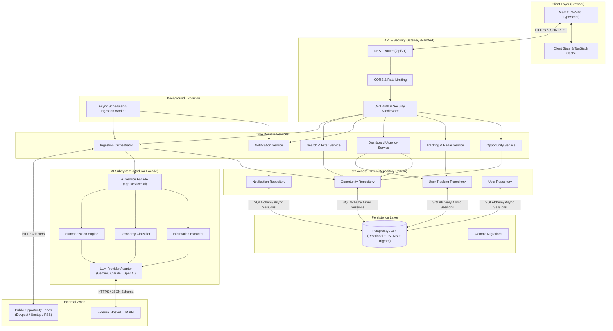
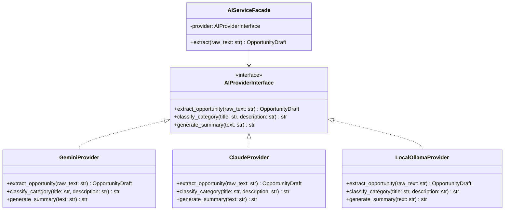
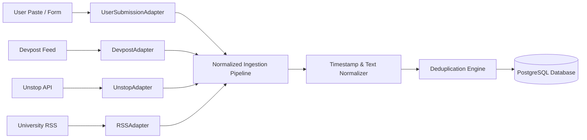
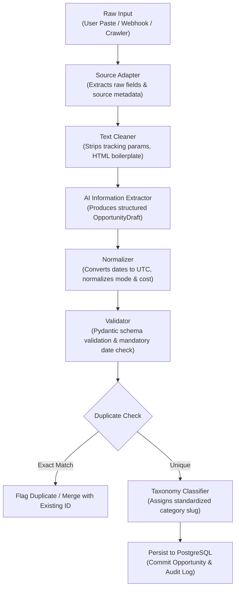
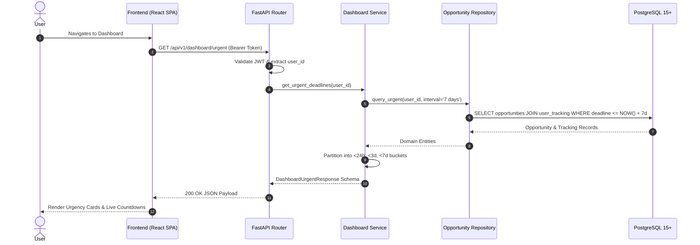
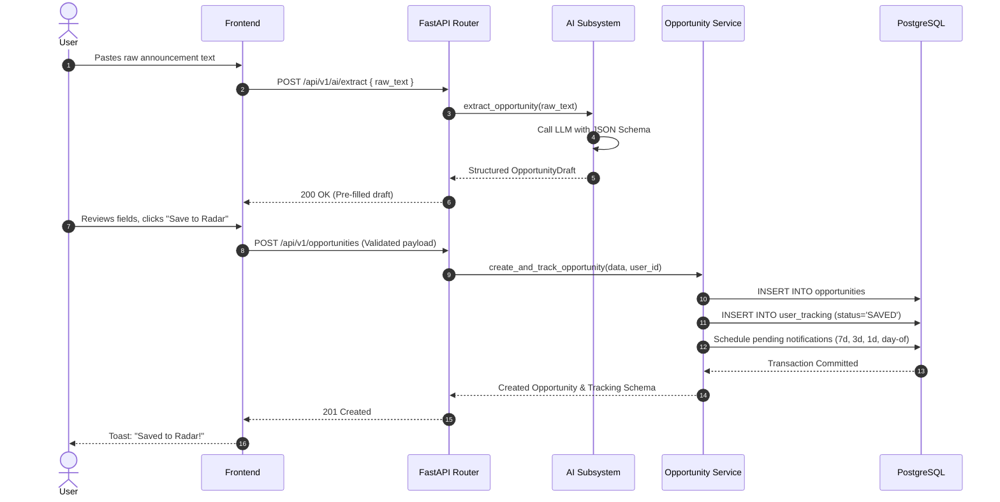
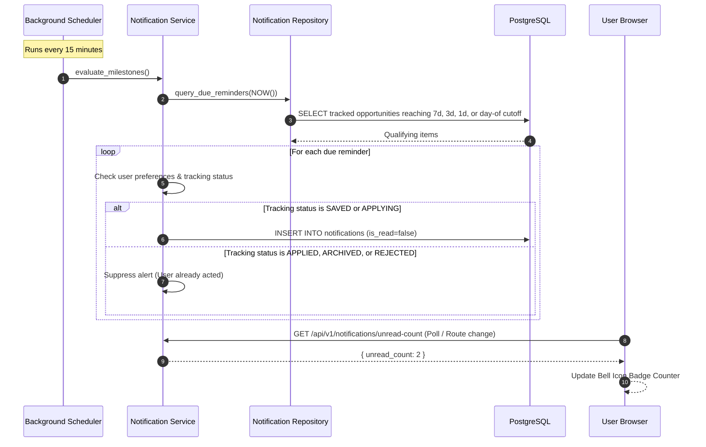
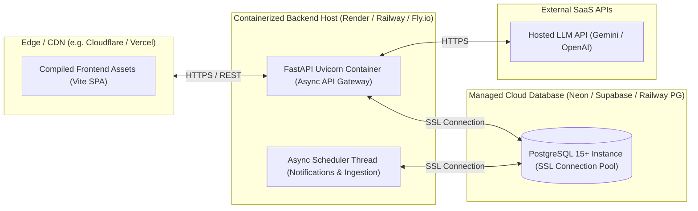

# System Architecture — Deadline Radar

## 1. Architectural Principles & Goals

**Deadline Radar** is designed as a modular, decoupled, and maintainable personal software product. Its architecture prioritizes clarity, high reliability for time-sensitive data, low operational overhead, and seamless evolution from a focused MVP to a multi-source ecosystem.

### Core Architectural Principles
1. **Separation of Concerns**: Presentation, API routing, business logic, data persistence, AI services, and background tasks occupy strict, decoupled boundaries.
2. **Defensive Reliability**: A student's deadline tracking and alerts must never fail because an external AI model or third-party web scraper experiences downtime. Core CRUD, lifecycle transitions, and notification schedules operate independently of external intelligence layers.
3. **UTC Invariance**: All dates and timestamps are stored, indexed, and processed in UTC (`TIMESTAMPTZ`). Timezone translations occur exclusively at presentation boundaries.
4. **Pluggable Modularity**: AI inference providers (Gemini, Claude, OpenAI, local models) and external data ingestion sources (Devpost, Unstop, RSS feeds) interact through standardized abstract interfaces.
5. **Pragmatic Simplicity**: Avoid premature distributed systems complexity. Use battle-tested, lightweight abstractions (in-process async workers, native PostgreSQL indexing) before introducing external queues or caching infrastructure.
6. **Agent & Developer Friendliness**: Maintain consistent directory structures, strong static typing (TypeScript on frontend, Pydantic/mypy on backend), and deterministic schema migrations.

---

## 2. Technology Stack Evaluation & Selection

### 2.1 Backend Framework
- **Selected**: **Python 3.11+ & FastAPI**
- **Rationale**: 
  - Native asynchronous I/O (`asyncio`) enables concurrent database operations, async AI API calls, and background scheduling with minimal resource consumption.
  - Pydantic v2 delivers strict, high-performance request/response validation and automatic serialization.
  - Built-in OpenAPI (Swagger) generation provides an interactive, live contract for frontend development and agent inspection.
  - Direct integration with Python's rich AI/NLP ecosystem without inter-process IPC overhead.
- **Alternatives Considered**:
  - *Django / Django REST Framework*: Heavy monolithic overhead, rigid ORM conventions, slower async support.
  - *Express / Node.js / NestJS*: Strong async runtime, but creates fragmentation when integrating Python-based AI/NLP libraries.
  - *Go (Gin/Fiber)*: Exceptional raw performance, but smaller AI/LLM ecosystem and higher implementation verbosity for a solo developer.

### 2.2 Relational Database & ORM
- **Selected**: **PostgreSQL 15+ & SQLAlchemy 2.0 (AsyncIO) with Alembic**
- **Rationale**:
  - ACID-compliant relational integrity is critical for user tracking states, foreign keys, and multi-entity associations.
  - Robust native date/time indexing (B-tree on UTC timestamps) guarantees sub-10ms deadline range queries.
  - Native JSONB support provides flexible semi-structured storage for source-specific metadata and raw extraction payloads.
  - Native full-text search (`tsvector`) and trigram similarity (`pg_trgm`) satisfy MVP search requirements without external search engines.
  - SQLAlchemy 2.0 provides type-safe async query construction; Alembic provides deterministic schema version control.
- **Alternatives Considered**:
  - *MongoDB / Document Store*: Weak relational guarantees; calculating complex multi-table deadline joins across user tracking and opportunities leads to application-level joins and data inconsistency.
  - *SQLite*: Excellent for development, but lacks native concurrent write support, native JSONB indexing, and advanced timestamp functions needed in production.

### 2.3 Frontend Client
- **Selected**: **Vite + React 18+ + TypeScript + TanStack Query + Vanilla CSS / CSS Modules**
- **Rationale**:
  - **Vite**: Sub-second Hot Module Replacement (HMR) and optimized Rollup production bundling.
  - **React 18+ & TypeScript**: Component-driven architecture, widespread ecosystem adoption, strict type contracts matching backend schemas.
  - **TanStack Query (React Query)**: Declarative server-state management, automatic background refetching, query caching, and optimistic UI updates for tracking status toggles.
  - **Vanilla CSS / CSS Modules**: Clean separation of styling without vendor framework lock-in, delivering rich custom aesthetics and full control over glassmorphism, responsive grid layouts, and urgency micro-animations.
- **Alternatives Considered**:
  - *Next.js (App Router)*: Server-Side Rendering (SSR) adds hosting complexity (Node.js runtime or serverless cold starts) for an authenticated personal dashboard that is inherently client-rendered.
  - *Vue 3 / Svelte*: Strong reactive models, but smaller ecosystem for rich calendar/data-grid components compared to React.

### 2.4 AI Layer Interface & Execution Model
- **Selected**: **In-Process Modular Service Facade calling Hosted LLM Structured APIs (e.g., Google Gemini 1.5 Flash / OpenAI GPT-4o-mini)**
- **Rationale**:
  - Near-zero infrastructure cost and zero GPU server management.
  - State-of-the-art JSON schema adherence through native structured output modes.
  - Sub-3-second extraction latency for messy text snippets.
  - Facade abstraction (`AIProvider` interface) ensures underlying models can be swapped via configuration without touching business logic or database schemas.
- **Alternatives Considered**:
  - *Local Models (Ollama / vLLM on self-hosted GPU)*: High operational complexity, dedicated GPU hosting costs ($30–$100+/month), and lower zero-shot accuracy on edge-case date formats.
  - *Separate AI Microservice (gRPC/HTTP)*: Unnecessary network hop and operational overhead at MVP scale.

---

## 3. High-Level System Architecture



---

## 4. Architectural Components

### 4.1 Frontend Architecture
- **Responsibilities**:
  - Render dynamic, high-performance catalog views with client-side filtering, sorting, and debounced search.
  - Present the primary **Deadline Radar Dashboard** with real-time countdown badges and urgency groupings (<24h, <3d, <7d).
  - Provide monthly/weekly visual deadline calendar layouts with interactive event previews.
  - Facilitate low-friction capture via "+ Add Opportunity" modal with live AI extraction review.
  - Manage user authentication state, tokens, and user preference toggles.
- **Access Boundaries**:
  - Can **ONLY** communicate with the backend via `/api/v1/` REST endpoints over HTTPS.
  - **CANNOT** connect directly to the database, AI providers, or external third-party scraping targets.
  - **CANNOT** store unencrypted sensitive user credentials.
- **State Management Strategy**:
  - **Server State**: Managed via **TanStack Query**. Handles caching, background revalidation, query invalidation on mutation, and pagination state.
  - **Client / UI State**: Managed via React Context and local state hooks (e.g., active modal states, notification drawer open/close, calendar date selections).
- **Error Handling & Resilience**:
  - Top-level React Error Boundary catches unexpected rendering exceptions.
  - API errors are parsed from the standard `{ error: { code, message, details } }` response envelope and displayed via non-intrusive toast notifications or inline field validation alerts.

### 4.2 Backend Architecture
- **Responsibilities**:
  - Expose versioned RESTful JSON endpoints adhering strictly to OpenAPI specifications.
  - Enforce authentication, session validation, and strict row-level authorization.
  - Execute business domain logic: opportunity lifecycle transitions, urgency proximity calculations, notification schedule evaluation.
  - Manage database connection pooling and atomic transactions via SQLAlchemy.
  - Orchestrate AI extraction requests, schema validation, and defensive fallbacks.
  - Run background scheduling for proximity notifications and ingestion jobs.
- **Design Pattern**: **Controller-Service-Repository Pattern**.
  - *Routers (Controllers)*: Handle HTTP requests, query params, body parsing, and status codes.
  - *Services*: Contain all business logic, state machines, and cross-domain orchestration.
  - *Repositories*: Encapsulate all database queries and ORM operations, isolating SQL/ORM logic from business rules.

### 4.3 Database Architecture
- **Responsibilities**:
  - Maintain absolute relational integrity across users, opportunities, user tracking, tags, preferences, and notifications.
  - Guarantee ACID transactional safety across multi-table operations (e.g., creating an opportunity and automatically linking a user tracking record).
  - Provide fast B-tree index lookups on UTC timestamps (`deadline`), categories (`category_id`), and tracking records (`user_id`, `status`).
  - Store full audit timestamps (`created_at`, `updated_at`) on all tables.
- **Data Ownership**:
  - Opportunities are public entities accessible to all authenticated users.
  - User Tracking records, personal notes, and notifications are strictly private to the owning `user_id`.

### 4.4 AI Layer Architecture
- **Responsibilities**:
  - Ingest unstructured text snippets (up to 10,000 characters) or webpage HTML.
  - Return a validated, typed Pydantic object (`OpportunityDraft`) conforming to the opportunity schema.
  - Classify opportunities into the 13 standardized taxonomy categories.
  - Produce concise 2-sentence summaries highlighting key perks and deadlines.
- **Defensive Design**:
  - AI calls are wrapped with a strict 6-second timeout.
  - If the LLM returns invalid JSON or times out, the backend logs a warning, falls back gracefully, and returns a partially filled or empty form to the client with the user's original text intact.

### 4.5 Data Ingestion Architecture
- **Responsibilities**:
  - Provide a pluggable adapter framework to ingest opportunities from disparate sources (user submissions, verified student feeds, Devpost, Unstop, RSS).
  - Normalize incoming data into a uniform raw schema.
  - Validate and clean dates, links, and text formatting.
  - Deduplicate entries against existing database records.
- **Isolation**:
  - Source-specific fetching logic lives in decoupled adapter modules. The core opportunity service only interacts with normalized domain models.

### 4.6 Notification Layer Architecture
- **Responsibilities**:
  - Continuously monitor upcoming deadlines for tracked opportunities.
  - Evaluate milestone thresholds: 7 days, 3 days, 1 day, and day-of (08:00 local time).
  - Generate notification records in the database for qualifying items.
  - Respect user notification preference toggles.
  - Cancel/suppress pending reminders when an opportunity is marked `APPLIED`, `ARCHIVED`, or `REJECTED`.

---

## 5. Modularity & Pluggability

To ensure Deadline Radar evolves smoothly without architectural rewrites, interfaces isolate external dependencies:

### 5.1 Pluggable AI Subsystem
The backend interacts with AI services strictly through an abstract protocol:



### 5.2 Pluggable Data Ingestion Pipeline
New opportunity sources plug in by implementing a standardized `SourceAdapter`:



---

## 6. Backend Architecture

### 6.1 Directory Structure
```text
backend/
├── app/
│   ├── api/                    # HTTP presentation layer
│   │   ├── deps.py             # FastAPI dependency injections (DB session, current_user)
│   │   └── v1/
│   │       ├── endpoints/      # Route handlers grouped by resource
│   │       │   ├── auth.py
│   │       │   ├── opportunities.py
│   │       │   ├── radar.py
│   │       │   ├── dashboard.py
│   │       │   ├── calendar.py
│   │       │   ├── notifications.py
│   │       │   ├── preferences.py
│   │       │   └── ai.py
│   │       └── router.py       # Aggregated v1 API router
│   │
│   ├── core/                   # Application configuration & security
│   │   ├── config.py           # Pydantic Settings (environment variables)
│   │   ├── security.py         # Password hashing (Argon2id/bcrypt) & JWT handling
│   │   └── exceptions.py       # Custom domain exceptions & global handlers
│   │
│   ├── db/                     # Database connection & lifecycle
│   │   ├── base.py             # SQLAlchemy DeclarativeBase
│   │   └── session.py          # AsyncEngine & async_sessionmaker setup
│   │
│   ├── models/                 # SQLAlchemy ORM declarations (database tables)
│   │   ├── user.py
│   │   ├── opportunity.py
│   │   ├── category.py
│   │   ├── tag.py
│   │   ├── user_tracking.py
│   │   ├── notification.py
│   │   └── user_preference.py
│   │
│   ├── schemas/                # Pydantic v2 schemas (validation & serialization)
│   │   ├── user.py
│   │   ├── opportunity.py
│   │   ├── tracking.py
│   │   ├── dashboard.py
│   │   ├── notification.py
│   │   ├── preference.py
│   │   └── ai.py
│   │
│   ├── repositories/           # Database access layer (SQLAlchemy queries only)
│   │   ├── base.py             # Generic CRUD repository
│   │   ├── opportunity_repo.py
│   │   ├── tracking_repo.py
│   │   ├── notification_repo.py
│   │   └── user_repo.py
│   │
│   ├── services/               # Business logic & domain state orchestration
│   │   ├── opportunity_service.py
│   │   ├── tracking_service.py
│   │   ├── dashboard_service.py
│   │   ├── notification_service.py
│   │   ├── search_service.py
│   │   └── ai/                 # AI service facade & provider implementations
│   │       ├── facade.py
│   │       ├── base.py         # AIProvider protocol
│   │       ├── gemini.py
│   │       └── prompts.py
│   │
│   ├── workers/                # Periodic async background workers
│   │   ├── scheduler.py        # Lightweight asyncio cron runner
│   │   ├── notification_job.py # Proximity notification generator
│   │   └── ingestion_job.py    # Feed fetcher & crawler runner
│   │
│   └── main.py                 # FastAPI application factory, CORS, exception handlers
│
├── alembic/                    # Database migration scripts
│   ├── versions/
│   └── env.py
│
├── tests/                      # Automated test suite
│   ├── conftest.py
│   ├── unit/
│   └── integration/
│
├── pyproject.toml
└── README.md
```

### 6.2 Directory Responsibilities & Boundaries
| Directory | Responsibility | What Belongs | What Does NOT Belong |
| :--- | :--- | :--- | :--- |
| `api/` | HTTP request/response handling | Endpoint routes, query parsing, status codes, dependency injection | Business calculations, raw SQL queries, direct ORM writes |
| `core/` | Cross-cutting system configuration | Pydantic Settings, JWT encoding/decoding, password hashing | Route handlers, database models, business logic |
| `db/` | Database connectivity lifecycle | Engine initialization, session factories, base declarative class | Schema migrations, endpoint logic |
| `models/` | Relational table schemas | SQLAlchemy column definitions, relationships, table indexes | Validation logic, HTTP schemas, API response formatting |
| `schemas/` | Request & response contracts | Pydantic models, JSON serialization rules, field validation | SQLAlchemy models, database query execution |
| `repositories/` | Data access abstraction | Raw SQLAlchemy queries, joins, filters, inserts, updates | HTTP exceptions, business rules, authorization decisions |
| `services/` | Business & domain logic | Urgency bucketing, status transitions, reminder calculations | HTTP request objects (`Request`), direct SQL strings |
| `workers/` | Asynchronous & scheduled tasks | Polling loops, reminder dispatchers, batch ingestion jobs | Synchronous route handlers |

---

## 7. Frontend Architecture

### 7.1 Directory Structure
```text
frontend/
├── src/
│   ├── app/                    # Top-level application setup
│   │   ├── App.tsx             # Root component with providers
│   │   ├── router.tsx          # Route definitions & protected route wrappers
│   │   └── providers.tsx       # TanStack Query, Auth, and Theme providers
│   │
│   ├── components/             # Reusable, domain-agnostic UI widgets
│   │   ├── ui/                 # Atomic widgets (Button, Badge, Input, Modal, Toast)
│   │   └── layout/             # Layout components (Navbar, Sidebar, Footer, PageHeader)
│   │
│   ├── features/               # Domain-specific feature modules
│   │   ├── auth/               # Login, Register, ProtectedRoute
│   │   ├── catalog/            # Discovery feed, opportunity card, filter bar
│   │   ├── dashboard/          # Urgent radar, countdown timer, active applications
│   │   ├── radar/              # Personal saved radar list, tracking status editor
│   │   ├── calendar/           # Monthly & weekly deadline grid views
│   │   ├── capture/            # "+ Add Opportunity" modal, AI paste review form
│   │   ├── notifications/      # Notification drawer, unread badge counter
│   │   └── preferences/        # Category selectors, reminder notification toggles
│   │
│   ├── hooks/                  # Shared custom React hooks
│   │   ├── useAuth.ts          # Authentication context consumer
│   │   ├── useCountdown.ts     # Live countdown calculator (days, hours, minutes, seconds)
│   │   └── useDebounce.ts      # Input debouncer for real-time search
│   │
│   ├── lib/                    # Core utilities and client instances
│   │   ├── api.ts              # Axios / Fetch client with auth interceptor
│   │   ├── dates.ts            # Timezone-aware date formatting (UTC -> Local)
│   │   └── constants.ts        # Taxonomy lists, status enums, urgency thresholds
│   │
│   ├── types/                  # TypeScript interface declarations
│   │   ├── opportunity.ts
│   │   ├── tracking.ts
│   │   ├── dashboard.ts
│   │   ├── notification.ts
│   │   └── api.ts              # Standard API response & error envelopes
│   │
│   ├── styles/                 # Global styles and design tokens
│   │   ├── reset.css
│   │   ├── variables.css       # Color palette, spacing, typography tokens
│   │   └── animations.css      # Pulse animations, fade-ins
│   │
│   └── main.tsx                # Client entry point
│
├── package.json
├── tsconfig.json
├── vite.config.ts
└── README.md
```

### 7.2 Key Architectural Patterns
1. **Feature Module Boundaries**: Each domain folder under `features/` encapsulates its own UI components, query hooks, and local state. Cross-feature data flows strictly through TanStack Query caches or shared types.
2. **API Client & Auth Interceptor**: The central HTTP client (`lib/api.ts`) automatically attaches `Authorization: Bearer <token>` to requests. If a `401 Unauthorized` is returned, the client initiates session cleanup and prompts login without state corruption.
3. **Optimistic Updates**: Toggling an opportunity's tracking status (e.g., `SAVED` -> `APPLIED`) immediately updates the UI via TanStack Query's cache mutation, rolling back only if the server responds with an error.
4. **Timezone Representation**: The UI formats all UTC timestamps from the backend into the user's localized time string using standard `Intl.DateTimeFormat` or lightweight utility functions, displaying relative urgency badges alongside absolute local timestamps.

---

## 8. AI Architecture & Execution Model

### 8.1 Module Organization (`ai-model/`)
```text
ai-model/
├── src/
│   ├── extraction/             # Structured entity extraction from text / HTML
│   │   ├── prompts.py          # Structured output prompt templates
│   │   ├── schema.py           # Pydantic extraction schema definition
│   │   └── cleaner.py          # HTML stripping & token truncator
│   ├── classification/         # Taxonomy classification prompts & logic
│   ├── summarization/          # 2-sentence executive summary generation
│   ├── deduplication/          # String similarity (Jaro-Winkler) & URL normalization
│   └── common/                 # Base provider protocol, token counter, retry logic
├── tests/
│   ├── test_extraction.py
│   └── eval_dataset.jsonl      # Benchmark evaluation records
└── README.md
```

### 8.2 Execution Model Evaluation
| Execution Model | Latency | Operational Cost | Reliability | Complexity | Evaluation & Recommendation |
| :--- | :---: | :---: | :---: | :---: | :--- |
| **In-Process Backend Facade (Hosted LLM)** | **1.5s–3.5s** | **Very Low** (Pay-per-token API) | **High** (Hosted SLA) | **Low** | **RECOMMENDED FOR MVP**: Directly invoked via async service facade. Minimal operational friction; leverages top-tier hosted models for zero-shot accuracy. |
| **Separate Microservice (Python/FastAPI)** | 2.0s–4.0s | Medium (Separate compute instance) | High | Medium | *Deferred*: Adds network hops and separate deployment pipelines with no architectural benefit at early stage. |
| **Local Self-Hosted Model (Ollama / vLLM)** | 3.0s–8.0s | High ($30–$100+/mo GPU compute) | Medium | High | *Deferred*: Costly and operationally heavy; open models struggle with inconsistent date formatting without extensive fine-tuning. |

---

## 9. Data Ingestion Architecture

Deadline Radar features a source-independent ingestion pipeline that converts noisy external announcements into clean, verified opportunities.

### 9.1 Ingestion Pipeline Sequence



### 9.2 Ingestion Operational Policies
- **Source Attribution**: Every opportunity records its provenance (`source: "User Submission"`, `source: "Devpost"`, etc.) and `created_by_user_id`.
- **Deduplication Strategy**:
  1. *Level 1 (Exact URL)*: Normalized canonical URL matching (removing `utm_*` parameters).
  2. *Level 2 (Normalized Title & Host)*: Case-insensitive exact match of `organization` + Jaro-Winkler similarity (>0.92) on `title`.
- **Failure Resilience**: If an automated feed errors, the failure is logged and the adapter retries with exponential backoff. The failure of one ingestion source never halts other sources.

---

## 10. Background Jobs & Asynchronous Execution

### 10.1 Background Tasks Matrix
| Task Name | Trigger | Frequency | Execution Model | Failure Handling |
| :--- | :--- | :--- | :--- | :--- |
| **Proximity Notification Evaluator** | Periodic Timer | Every 15 minutes | In-process Async Worker | Log error, resume next cycle; DB transaction prevents duplicate alerts |
| **User AI Text Extraction** | User Action (`POST /ai/extract`) | On-Demand | Async HTTP Request (<5s) | Catch timeout, return partial draft with manual fallback |
| **Automated Ingestion Sync** | Periodic Timer | Every 6 hours | In-process Async Worker | Exponential backoff (3 retries); alert log on failure |
| **Overdue Status Auditor** | Periodic Timer | Daily at midnight UTC | In-process Async Worker | Moves expired untracked items to `EXPIRED` status |

### 10.2 Queue Justification: In-Process Worker vs. Distributed Queue
- **Decision for MVP**: **In-Process Async Worker** (Python `asyncio` task loop inside the FastAPI application container).
- **Rationale**: For an MVP serving initial user workloads, maintaining Redis, Celery, or RabbitMQ adds significant operational overhead, infrastructure costs, and deployment complexity with zero measurable benefit. An `asyncio.create_task()` background loop running alongside Uvicorn easily manages scheduled notification evaluation and periodic ingestion.
- **Future Scale Point**: If background task execution exceeds 30 seconds or requires distributed multi-node coordination, Celery/Redis or Temporal will be introduced without changing service-layer interfaces.

---

## 11. Authentication & Authorization Architecture

### 11.1 Authentication Model
- **Token Strategy**: Stateless JWT (JSON Web Tokens) signed using HMAC-SHA256 (`HS256`).
  - **Access Token**: Short-lived (30 minutes), containing `sub` (User UUID), `email`, and `exp`.
  - **Transmission**: Transmitted via HTTP header `Authorization: Bearer <token>`.
- **Password Security**: Passwords hashed using **Argon2id** (preferred) or **bcrypt** with a minimum cost factor of 12. Plaintext passwords are never logged or stored.

### 11.2 Authorization & Data Isolation
- **Row-Level User Isolation**: Every protected resource (Radar items, personal notes, notifications, preferences) includes a mandatory foreign key to `users.id`.
- **Enforcement Layer**: The repository/service layer explicitly enforces ownership queries:
  ```sql
  SELECT * FROM user_tracking WHERE id = :tracking_id AND user_id = :current_user_id
  ```
  Attempting to access or mutate another user's tracking record immediately raises an `HTTP 403 Forbidden` or `HTTP 404 Not Found`.

---

## 12. Security Architecture

- **Secrets Management**: Configuration parameters, secret keys, database credentials, and AI tokens are loaded strictly via environment variables parsed and validated at startup using `pydantic-settings`.
- **SQL Injection Prevention**: 100% of database interactions occur through parameterized SQLAlchemy ORM queries or typed statements. Raw SQL string concatenation is strictly prohibited.
- **Cross-Origin Resource Sharing (CORS)**: FastAPI CORS middleware is configured with a strict whitelist of client origins. Wildcard `allow_origins=["*"]` is forbidden in production.
- **Rate Limiting**: Rate limiting middleware protects authentication endpoints (`/auth/login`, `/auth/register`) and the AI extraction endpoint (`/ai/extract`) against brute force and denial-of-service abuse.
- **Input Sanitization**: User-submitted markdown and raw scraped HTML are sanitized to neutralize malicious `<script>` tags, iframe injections, and Cross-Site Scripting (XSS).

---

## 13. Data Flows

### 13.1 User Request / Query Flow


### 13.2 Opportunity Ingestion Pipeline Flow


### 13.3 Notification Evaluation Flow


---

## 14. API Architecture Conventions

- **Base URL Convention**: All core endpoints are versioned: `/api/v1/...`
- **Standardized Error Envelope**: All non-2xx responses conform to:
  ```json
  {
    "error": {
      "code": "RESOURCE_NOT_FOUND",
      "message": "The requested opportunity was not found.",
      "details": []
    }
  }
  ```
- **Pagination Convention**: Listing endpoints support offset-based pagination via query parameters: `?page=1&limit=25`, returning an envelope:
  ```json
  {
    "items": [...],
    "total": 142,
    "page": 1,
    "limit": 25,
    "has_next": true
  }
  ```
- **HTTP Status Semantics**:
  - `200 OK`: Successful read or update.
  - `201 Created`: Successful entity creation.
  - `204 No Content`: Successful deletion.
  - `400 Bad Request`: Malformed syntax or illegal transition.
  - `401 Unauthorized`: Missing or invalid JWT.
  - `403 Forbidden`: Authenticated user does not own target resource.
  - `404 Not Found`: Entity does not exist.
  - `409 Conflict`: Duplicate unique key (e.g. duplicate application URL).
  - `422 Unprocessable Entity`: Pydantic field validation error.

---

## 15. Database Architecture

- **Transaction Scope**: Single atomic transaction per API mutation. If an opportunity is created and fails to link to user tracking, the entire transaction rolls back.
- **Migration Policy**: Every schema alteration (adding columns, indexes, or constraints) must be scripted as an Alembic migration with valid `upgrade()` and `downgrade()` steps.
- **Primary Keys**: UUID v4 across all entities (`gen_random_uuid()`) to eliminate enumeration attacks and simplify distributed merging.
- **Key Indexes**:
  - `CREATE INDEX idx_opportunities_deadline ON opportunities (deadline ASC);`
  - `CREATE INDEX idx_opportunities_category ON opportunities (category_id);`
  - `CREATE INDEX idx_user_tracking_user_status ON user_tracking (user_id, status);`
  - `CREATE INDEX idx_user_tracking_lookup ON user_tracking (user_id, opportunity_id);`
  - `CREATE INDEX idx_notifications_pending ON notifications (scheduled_for, sent_at) WHERE sent_at IS NULL;`

---

## 16. Caching Strategy

### Evaluation & Decision
- **Decision**: **Deferred for MVP**.
- **Rationale**: 
  - PostgreSQL indexed lookups on opportunities by deadline and user tracking take `< 5ms` for databases with up to 100,000 records.
  - Introducing Redis or Memcached introduces distributed cache invalidation risks (e.g., stale countdowns, desynchronized tracking states) and requires dedicated memory infrastructure.
  - **Client-Side Caching via TanStack Query** handles immediate cache re-use during client navigation without server round-trips.
- **Future Scale Point**: If catalog browse traffic exceeds 100 requests/second, Redis will be introduced strictly for public catalog listing queries and cached AI responses.

---

## 17. Search Architecture

### 17.1 MVP Search Design
- Utilizes **PostgreSQL Native Full-Text Search and Trigrams**:
  - Combined `tsvector` column or query indexing over `title`, `organization`, and `description`.
  - Extension `pg_trgm` enabled for fuzzy substring matching and typo tolerance on organization and title fields.
  - Sub-15ms execution time on standard relational hardware without external search dependencies.

### 17.2 Future Semantic Search Architecture
- When natural language queries (e.g., *"paid AI fellowships in Europe"*) are introduced post-MVP:
  - Enable the **`pgvector`** extension in PostgreSQL.
  - Generate 384-dimensional dense vector embeddings (via `sentence-transformers` or a hosted embedding API) during opportunity ingestion.
  - Execute cosine similarity vector searches alongside relational metadata filters within PostgreSQL, avoiding the operational complexity of a separate vector database.

---

## 18. Notification Architecture

- **Milestone Thresholds**:
  - 7 Days Prior (`T - 168h`)
  - 3 Days Prior (`T - 72h`)
  - 1 Day Prior (`T - 24h`)
  - Day-of Alert (`T - 12h` or 08:00 user local time)
- **Suppression State Machine**:
  - Reminders only generate if `user_tracking.status IN ('SAVED', 'INTERESTED', 'APPLYING')`.
  - When status updates to `APPLIED`, `SELECTED`, `REJECTED`, or `ARCHIVED`, all pending un-sent notifications for that opportunity are purged or set to inactive.
- **Deduplication Guarantee**: Unique compound constraint on `(user_id, opportunity_id, type)` guarantees at-most-once delivery per milestone.

---

## 19. Deployment Architecture

### 19.1 Development Environment
- **Local Docker Compose**:
  - Container 1: `postgres:15-alpine` (Mapped to host port 5432).
  - Container 2: `backend` (FastAPI + Uvicorn with hot-reload).
  - Container 3: `frontend` (Vite dev server with HMR on port 5173).
- **Environment**: Controlled via local `.env` file referencing placeholder API keys.

### 19.2 Production Logical Architecture


---

## 20. Architectural Decision Records (ADRs)

### ADR-001 — Backend Framework: FastAPI
- **Decision**: Adopt Python 3.11+ with FastAPI as the backend framework.
- **Reason**: Delivers asynchronous I/O performance, native Pydantic v2 data validation, automated OpenAPI contracts, and direct synergy with Python's AI/NLP libraries.
- **Alternatives Considered**: Django REST Framework (too monolithic), Express/Node.js (fragmented AI integration), Go Gin (excessive boilerplate).
- **Tradeoffs**: Requires disciplined architecture to prevent mixing database queries into endpoint handlers.

### ADR-002 — Persistence Engine: PostgreSQL 15+ & SQLAlchemy 2.0
- **Decision**: Standardize on PostgreSQL with SQLAlchemy 2.0 async sessions and Alembic migrations.
- **Reason**: Strong ACID relational integrity is mandatory for tracking lifecycles, user isolation, and multi-entity joins. Native date/time B-trees provide optimal urgency querying.
- **Alternatives Considered**: MongoDB (inconsistent joins and poor relational integrity), SQLite (insufficient concurrency).
- **Tradeoffs**: Requires formal migration scripts for schema changes.

### ADR-003 — Frontend Architecture: Vite + React + TypeScript SPA
- **Decision**: Build the client as a Single Page Application using Vite, React 18+, TypeScript, and TanStack Query with Vanilla CSS / CSS Modules.
- **Reason**: Fast build/HMR cycle, strong typing, declarative server-state management, and total control over modern UI aesthetics without vendor framework lock-in.
- **Alternatives Considered**: Next.js (unnecessary SSR complexity for an authenticated dashboard), Vue 3 (smaller ecosystem for specialized timeline components).
- **Tradeoffs**: Initial client bundle must be served before client rendering begins.

### ADR-004 — AI Architecture: In-Process Facade Calling Hosted LLM APIs
- **Decision**: Integrate AI extraction as an in-process modular service facade interfacing with hosted LLM APIs (Gemini / OpenAI) using strict JSON schema output modes.
- **Reason**: Delivers zero-infrastructure overhead, near-zero cost, state-of-the-art date parsing accuracy, and clean swappability via abstract interfaces.
- **Alternatives Considered**: Self-hosted local LLMs (excessive GPU hosting costs), separate microservice (unnecessary network hops).
- **Tradeoffs**: Requires outbound HTTPS internet access and reliance on external API uptime (mitigated via defensive manual fallbacks).

### ADR-005 — Asynchronous Task Execution: Lightweight In-Process Async Worker
- **Decision**: Execute periodic tasks (notification checks, ingestion jobs) using Python's native `asyncio` scheduler running alongside the API worker, deferring distributed message queues.
- **Reason**: Minimizes operational overhead and eliminates external message broker dependencies (Redis/RabbitMQ) for MVP scale.
- **Alternatives Considered**: Celery + Redis (premature infrastructure complexity).
- **Tradeoffs**: Scheduled tasks run within the single API instance lifecycle; will require an external broker if scaling to multiple concurrent container replicas.

### ADR-006 — Search Architecture: PostgreSQL Full-Text & Trigram Matching
- **Decision**: Implement catalog keyword search using PostgreSQL native `tsvector` indexing and `pg_trgm` similarity.
- **Reason**: Fulfills all MVP search and filtering requirements with zero additional operational infrastructure.
- **Alternatives Considered**: Dedicated vector database or Elasticsearch (overkill for MVP catalog scale).
- **Tradeoffs**: Lacks deep conceptual semantic understanding, which is deferred to post-MVP via `pgvector`.

### ADR-007 — Notification Delivery Channel for MVP: In-App Notification Center
- **Decision**: Focus exclusively on an in-app notification center for MVP milestone alerts, deferring transactional email delivery.
- **Reason**: Proves proximity calculation and notification generation logic without depending on external SMTP providers, domain DNS verification, or email deliverability issues.
- **Alternatives Considered**: Transactional Email via Resend/SES (deferred to post-MVP).
- **Tradeoffs**: Users only see notifications when actively visiting the web application.

---

## 21. Open Architecture Questions

| # | Question | Impact | Current Options | Decision / Working Assumption |
| :-: | :--- | :--- | :--- | :--- |
| **OAQ-1** | Should authentication session tokens be stored in client localStorage or HttpOnly secure cookies? | Affects XSS vs. CSRF security posture and client request setup. | (A) HttpOnly secure cookies<br>(B) Authorization Bearer header from memory/localStorage | **Working Assumption**: Bearer token via Authorization header for API simplicity during early development, with migration path to HttpOnly cookies prior to public production launch. |
| **OAQ-2** | Which managed database platform offers the best developer experience and low-cost tier for production hosting? | Affects deployment scripts and connection pooling configuration. | (A) Neon (Serverless Postgres)<br>(B) Supabase<br>(C) Railway Managed Postgres | **Working Assumption**: Neon or Railway Managed Postgres. Standard PostgreSQL connection strings work identically across all options. |
| **OAQ-3** | What is the maximum character limit for raw text pasted into the AI extraction tool? | Affects token costs, LLM processing latency, and input truncation logic. | (A) 5,000 characters<br>(B) 10,000 characters<br>(C) 25,000 characters | **Decision**: 10,000 characters. Sufficient to capture 99% of contest announcements and guidelines while bounding LLM latency to under 4 seconds. |
