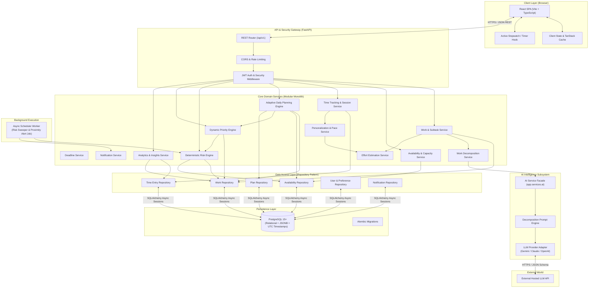
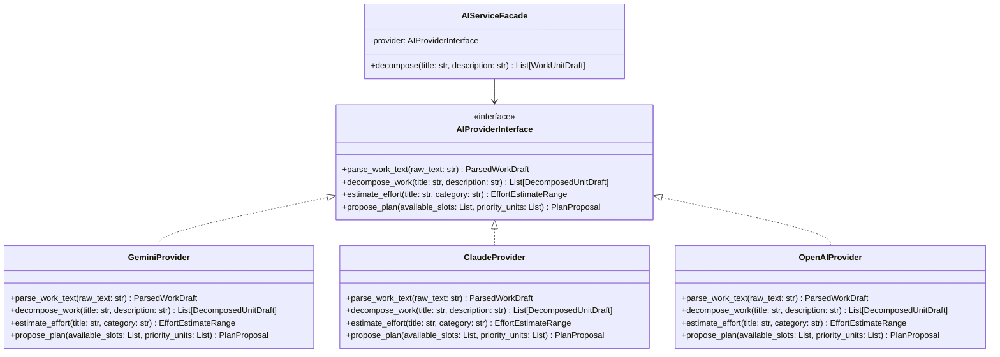
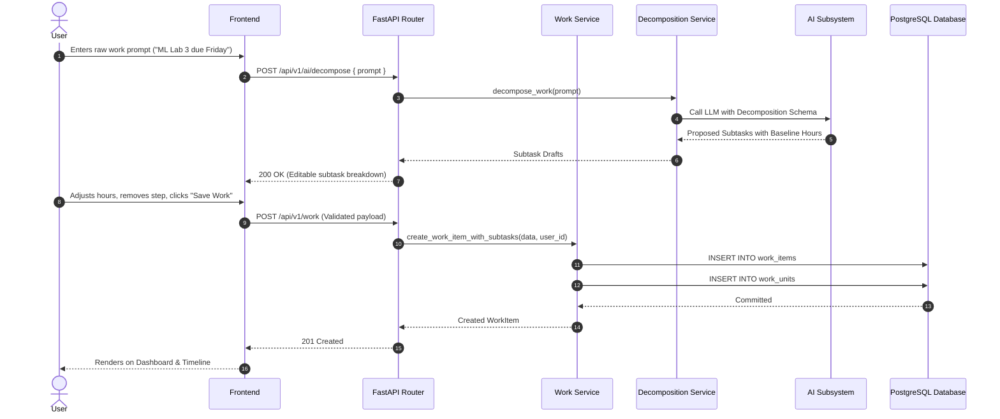
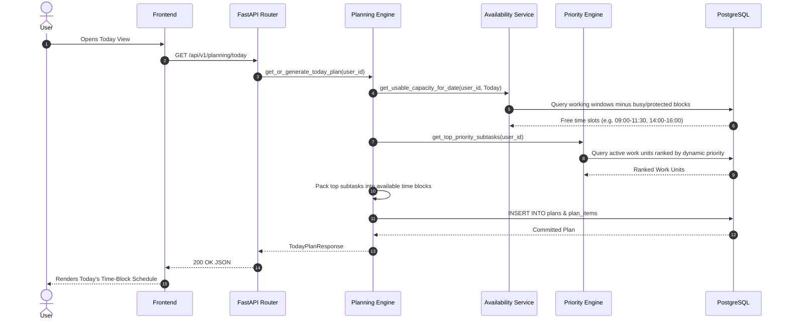
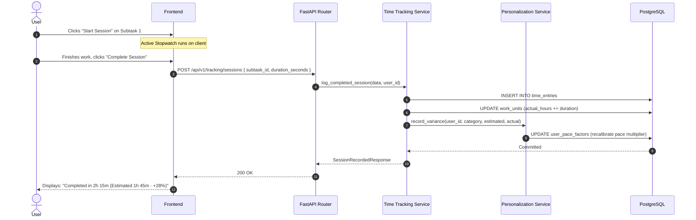

# System Architecture — Deadline Radar

## 1. Architectural Principles & Goals

**Deadline Radar** is architected as an **AI-powered personalized deadline monitoring, workload management, and adaptive time-planning platform**. The technical architecture reflects a clean, decoupled **Modular Monolith** designed for high reliability, deterministic time calculations, privacy-centric user data isolation, and low operational overhead.

### Core Architectural Principles
1. **Deterministic Math vs. Probabilistic AI**: Mathematical calculations (deadline risk ratios, usable available hours, countdowns, and dynamic priority formulas) are executed by deterministic, testable Python services. Generative AI (LLMs) is strictly isolated to natural-language work understanding, semantic work decomposition, and baseline effort suggestions.
2. **Modular Monolith Architecture**: Avoids premature microservices complexity. The entire system runs as a single, cohesive FastAPI application structured into decoupled, domain-driven services that can be extracted into standalone workers or microservices if scale demands.
3. **Pluggable AI & Model Agnosticism**: All interactions with LLMs pass through an abstract `AIProvider` interface. The underlying model (Google Gemini, Anthropic Claude, OpenAI, or local Ollama) can be swapped via configuration without touching database models or business logic.
4. **UTC Invariant Temporal Precision**: All deadlines, scheduled time blocks, session logs, and timestamps are stored, indexed, and calculated in UTC (`TIMESTAMPTZ`). Localized timezone conversions occur strictly at the presentation boundary.
5. **Continuous Personalization Feedback Loop**: The architecture couples the time-tracking engine directly to the estimation engine. When actual sessions are completed, empirical observations feed the personalization service to continuously update user-specific pace factors.
6. **Defensive Resilience & Graceful Fallback**: If an external AI provider times out or fails, the core workload management, timer tracking, risk calculations, and manual planning continue to function seamlessly without disruption.

---

## 2. Technology Stack Evaluation & Selection

### 2.1 Backend Framework
- **Selected**: **Python 3.11+ & FastAPI**
- **Rationale**:
  - Native asynchronous I/O (`asyncio`) enables concurrent database operations, async AI API calls, and background scheduling with minimal resource consumption.
  - Pydantic v2 delivers strict, high-performance request/response validation and automatic serialization.
  - Built-in OpenAPI (Swagger) generation provides an interactive, live contract for frontend development and agent inspection.
  - Direct integration with Python's rich AI, scientific, and statistical libraries (NumPy, SciPy) for historical pace factor calculations.
- **Alternatives Considered**:
  - *Django / Django REST Framework*: Heavy monolithic overhead, rigid ORM conventions, slower async support.
  - *Express / Node.js / NestJS*: Strong async runtime, but creates language fragmentation when integrating Python-based AI and mathematical models.
  - *Go (Gin/Fiber)*: Exceptional raw performance, but lacks direct access to Python's AI/NLP tooling and increases implementation verbosity.

### 2.2 Relational Database & ORM
- **Selected**: **PostgreSQL 15+ & SQLAlchemy 2.0 (AsyncIO) with Alembic**
- **Rationale**:
  - ACID-compliant relational integrity is critical for user work hierarchies, subtask dependencies, schedule blocks, and time logs.
  - Robust native date/time indexing (B-tree on UTC timestamps) guarantees sub-10ms deadline range and capacity queries.
  - Native JSONB support provides flexible semi-structured storage for AI decomposition drafts and custom schedule metadata.
  - SQLAlchemy 2.0 provides type-safe async query construction; Alembic provides deterministic schema version control.
- **Alternatives Considered**:
  - *MongoDB / Document Store*: Weak relational guarantees; calculating complex joins across work items, subtasks, and time entries leads to application-level joins and data inconsistency.
  - *SQLite*: Excellent for development, but lacks native concurrent write support, native JSONB indexing, and advanced timestamp functions needed in production.

### 2.3 Frontend Client
- **Selected**: **Vite + React 18+ + TypeScript + TanStack Query + Vanilla CSS / CSS Modules**
- **Rationale**:
  - **Vite**: Sub-second Hot Module Replacement (HMR) and optimized Rollup production bundling.
  - **React 18+ & TypeScript**: Component-driven architecture, widespread ecosystem adoption, strict type contracts matching backend schemas.
  - **TanStack Query (React Query)**: Declarative server-state management, automatic background revalidation, query caching, and optimistic UI updates for timer logs and subtask check-offs.
  - **Vanilla CSS / CSS Modules**: Clean separation of styling without vendor framework lock-in, delivering rich custom aesthetics and full control over dark editorial themes, responsive grid layouts, and urgency micro-animations.
- **Alternatives Considered**:
  - *Next.js (App Router)*: Server-Side Rendering (SSR) adds hosting complexity (Node.js runtime or serverless cold starts) for an authenticated personal dashboard that is inherently client-rendered.
  - *Vue 3 / Svelte*: Strong reactive models, but smaller ecosystem for rich timeline, calendar, and timer components compared to React.

### 2.4 AI Layer Interface & Execution Model
- **Selected**: **In-Process Modular Service Facade calling Hosted LLM Structured APIs (e.g., Google Gemini 1.5 Flash / OpenAI GPT-4o-mini)**
- **Rationale**:
  - Near-zero infrastructure cost and zero GPU server management.
  - State-of-the-art JSON schema adherence through native structured output modes.
  - Sub-3-second extraction and decomposition latency.
  - Facade abstraction (`AIProvider` interface) ensures underlying models can be swapped via configuration without touching business logic or database schemas.
- **Alternatives Considered**:
  - *Local Models (Ollama / vLLM on self-hosted GPU)*: High operational complexity, dedicated GPU hosting costs ($30–$100+/month), and lower zero-shot accuracy on edge-case task decomposition.
  - *Separate AI Microservice (gRPC/HTTP)*: Unnecessary network hop and operational overhead at MVP scale.

---

## 3. High-Level System Architecture



---

## 4. Architectural Components

### 4.1 Frontend Architecture
- **Responsibilities**:
  - Render the central **Deadline Radar Dashboard** with real-time countdown clocks, capacity gauges, and urgency tiers.
  - Provide the dedicated **Today View** execution environment with visual time-block schedules and an integrated deep-work stopwatch.
  - Provide interactive **Timeline (Gantt)** and **Calendar** views for spatial planning.
  - Provide a **Workload Capacity View** showing supply (available hours) vs. demand (estimated effort).
  - Provide an **Add Work Modal** with real-time natural language AI decomposition and editable subtask hours.
  - Display **Insights & Analytics** charts for estimation accuracy, learned pace factors, and deep-work totals.
- **Access Boundaries**:
  - Connects strictly to `/api/v1/` REST endpoints via HTTPS.
  - Zero direct access to database, AI providers, or secrets.
- **State Management**:
  - **Server State**: Managed via TanStack Query (caching, background revalidation, optimistic updates on subtask check-off).
  - **Client Timer State**: Local React Context + `localStorage` persistence to prevent timer loss across browser reloads.

### 4.2 Backend Architecture (Modular Monolith)
- **Design Pattern**: **Controller-Service-Repository Pattern**.
  - *Routers*: Validate inputs via Pydantic v2 schemas and serialize responses.
  - *Services*: Pure domain logic (calculating risk ratios, packing daily plans, adjusting pace factors).
  - *Repositories*: Database query abstraction layer using SQLAlchemy 2.0 async sessions.
- **Core Domain Modules**:
  1. **Work Management (`WorkService`)**: Handles Work Items and decomposed Work Units, status transitions, and progress percentages.
  2. **Availability & Capacity (`AvailabilityService`)**: Computes gross free time minus recurring busy blocks and protected interest blocks, applying the focus efficiency factor.
  3. **Deterministic Risk Engine (`RiskEngine`)**: Computes Risk Ratio $R = \text{RemainingEffort} / \text{AvailableHours}$ deterministically (`SAFE`, `WATCH`, `AT_RISK`, `CRITICAL`, `OVERDUE`).
  4. **Dynamic Priority Engine (`PriorityEngine`)**: Algorithmic scoring combining urgency, risk ratio, user importance, and subtask dependencies with explainable text.
  5. **Adaptive Planning Engine (`PlanningEngine`)**: Generates optimized daily time-block allocations for Today, packing high-priority work units into available free slots.
  6. **Time Tracking & Logging (`TimeTrackingService`)**: Manages active work sessions, stopwatch logs, manual duration entries, and variance computation.
  7. **Personalization & Pace Engine (`PersonalizationService`)**: Updates domain-specific pace factors ($\text{Actual} / \text{Estimated}$) based on completed work logs.
  8. **Notification Service (`NotificationService`)**: Dispatches capacity deficit warnings, risk escalation alerts, proximity reminders, and morning plan briefings.
  9. **AI Service Facade (`AIServiceFacade`)**: Wraps LLM prompt generation, structured JSON output validation, and fallback handling.

### 4.3 Database Architecture
- **Responsibilities**:
  - Enforce relational integrity across users, work items, work units, schedule blocks, time entries, and plans.
  - Maintain absolute row-level user data isolation (`user_id` foreign keys).
  - B-tree indexing on deadlines, user tracking, and time entries for low-latency queries.
  - Store all datetime values strictly in UTC (`TIMESTAMPTZ`).

---

## 5. Pluggable AI Subsystem Architecture

The AI layer is encapsulated behind a strict interface to ensure underlying models can be swapped effortlessly:



---

## 6. Backend Directory Architecture

```text
backend/
├── app/
│   ├── api/                    # HTTP presentation layer
│   │   ├── deps.py             # Dependency injections (DB session, current_user)
│   │   └── v1/
│   │       ├── endpoints/      # Route controllers grouped by domain
│   │       │   ├── auth.py
│   │       │   ├── users.py
│   │       │   ├── work.py             # Work Items & Work Units
│   │       │   ├── availability.py     # Working windows & protected blocks
│   │       │   ├── tracking.py         # Timer sessions & time logs
│   │       │   ├── planning.py         # Daily Today plans & allocations
│   │       │   ├── dashboard.py        # Urgency radar & capacity overview
│   │       │   ├── timeline.py         # Gantt timeline & calendar endpoints
│   │       │   ├── workload.py         # Capacity vs demand analytics
│   │       │   ├── insights.py         # Accuracy & pace metrics
│   │       │   ├── notifications.py    # In-app alerts & reminders
│   │       │   └── ai.py               # AI decomposition & parsing
│   │       └── router.py       # Aggregated API router
│   │
│   ├── core/                   # System configuration & security
│   │   ├── config.py           # Pydantic Settings (env variables)
│   │   ├── security.py         # Password hashing (Argon2id) & JWT tokens
│   │   └── exceptions.py       # Custom domain exceptions & HTTP error envelopes
│   │
│   ├── db/                     # Database connection & lifecycle
│   │   ├── base.py             # DeclarativeBase class
│   │   └── session.py          # AsyncEngine & async_sessionmaker
│   │
│   ├── models/                 # SQLAlchemy ORM database models
│   │   ├── user.py
│   │   ├── user_preference.py
│   │   ├── work_item.py
│   │   ├── work_unit.py
│   │   ├── time_availability.py
│   │   ├── schedule_block.py
│   │   ├── time_entry.py
│   │   ├── plan.py
│   │   ├── plan_item.py
│   │   ├── user_interest.py
│   │   └── notification.py
│   │
│   ├── schemas/                # Pydantic v2 validation & response schemas
│   │   ├── user.py
│   │   ├── work.py
│   │   ├── availability.py
│   │   ├── tracking.py
│   │   ├── planning.py
│   │   ├── dashboard.py
│   │   ├── insights.py
│   │   └── ai.py
│   │
│   ├── repositories/           # Data access layer (SQLAlchemy queries only)
│   │   ├── work_repo.py
│   │   ├── availability_repo.py
│   │   ├── tracking_repo.py
│   │   ├── plan_repo.py
│   │   └── user_repo.py
│   │
│   ├── services/               # Pure business & calculation logic
│   │   ├── work_service.py
│   │   ├── availability_service.py
│   │   ├── tracking_service.py
│   │   ├── risk_engine.py      # Deterministic risk ratio math
│   │   ├── priority_engine.py  # Dynamic priority scoring algorithm
│   │   ├── planning_engine.py  # Today time-block allocation packing
│   │   ├── personalization.py  # Personal pace factor learning
│   │   ├── notification_service.py
│   │   └── ai/                 # AI service facade & provider adapters
│   │       ├── facade.py
│   │       ├── base.py
│   │       ├── gemini.py
│   │       └── prompts.py
│   │
│   ├── workers/                # Periodic async background tasks
│   │   ├── scheduler.py        # Asyncio periodic loop runner
│   │   ├── risk_sweeper.py     # Background risk evaluator
│   │   └── proximity_alerts.py # Approaching deadline notification generator
│   │
│   └── main.py                 # FastAPI application factory, CORS, error handlers
│
├── alembic/                    # Database migrations
│   ├── versions/
│   └── env.py
│
├── tests/                      # Automated test suite
│   ├── unit/
│   └── integration/
│
├── pyproject.toml
└── README.md
```

---

## 7. Frontend Directory Architecture

```text
frontend/
├── src/
│   ├── app/                    # Top-level application setup
│   │   ├── App.tsx             # Root component with providers
│   │   ├── router.tsx          # Route definitions & protected route guards
│   │   └── providers.tsx       # TanStack Query, Auth, Theme providers
│   │
│   ├── components/             # Reusable UI widgets
│   │   ├── ui/                 # Atomic design widgets (Button, Badge, Input, Modal, Toast)
│   │   └── layout/             # Layout structure (Navbar, Sidebar, PageHeader)
│   │
│   ├── features/               # Domain-specific feature modules
│   │   ├── auth/               # Sign In, Sign Up, Onboarding
│   │   ├── dashboard/          # Urgency radar, capacity summary, quick progress
│   │   ├── today/              # Time-block schedule, active deep-work stopwatch
│   │   ├── work/               # Work Items list, subtask checklist, Add Work modal
│   │   ├── planning/           # Daily plan generator, time allocation adjuster
│   │   ├── timeline/           # Gantt-style horizontal project timeline
│   │   ├── calendar/           # Month & week deadline grid view
│   │   ├── workload/           # Capacity vs. demand charts & heatmaps
│   │   ├── insights/           # Estimation accuracy & learned pace factor trends
│   │   ├── notifications/      # In-app notification center & badge counter
│   │   └── settings/           # Schedule windows, protected blocks, preferences
│   │
│   ├── hooks/                  # Custom React hooks
│   │   ├── useAuth.ts          # Auth context consumer
│   │   ├── useTimer.ts         # Distraction-free active stopwatch timer
│   │   ├── useCountdown.ts     # Live deadline countdown
│   │   └── useDebounce.ts      # Search & input debouncing
│   │
│   ├── lib/                    # Core utilities & client instances
│   │   ├── api.ts              # Axios / Fetch HTTP client with Bearer interceptor
│   │   ├── dates.ts            # UTC to localized date/time formatters
│   │   └── math.ts             # Risk ratios and progress calculations
│   │
│   ├── types/                  # TypeScript interface definitions
│   │   ├── work.ts
│   │   ├── schedule.ts
│   │   ├── tracking.ts
│   │   ├── planning.ts
│   │   ├── dashboard.ts
│   │   └── api.ts
│   │
│   ├── styles/                 # Editorial design system tokens
│   │   ├── reset.css
│   │   ├── tokens.css          # Dark editorial color palette, fonts, spacing
│   │   └── typography.css
│   │
│   └── main.tsx                # Client entry point
│
├── package.json
├── tsconfig.json
├── vite.config.ts
└── README.md
```

---

## 8. Data Flows

### 8.1 Work Addition & AI Decomposition Flow


### 8.2 Daily Plan Generation Flow ("Today" View)


### 8.3 Time Tracking & Personal Pace Learning Loop


---

## 9. Background Jobs & Asynchronous Execution

| Job Name | Trigger | Frequency | Execution Model | Responsibility |
| :--- | :--- | :--- | :--- | :--- |
| **Risk Sweeper** | Periodic Timer | Every 15 minutes | In-process Async Worker | Recalculates risk ratios for all active work items as available time elapses; triggers escalation notifications if an item moves to `AT_RISK` or `CRITICAL`. |
| **Proximity Reminder Job** | Periodic Timer | Hourly | In-process Async Worker | Checks for deadlines crossing 7d, 3d, 1d, and 6h thresholds and schedules in-app alerts. |
| **Daily Plan Morning Briefing** | Scheduled Daily | 08:00 user local time | In-process Async Worker | Evaluates Today's available capacity, generates proposed daily plan, and dispatches morning briefing alert. |
| **Overdue Status Auditor** | Periodic Timer | Daily at midnight UTC | In-process Async Worker | Updates uncompleted past-deadline work items to `OVERDUE` state. |

---

## 10. Security & Privacy Architecture

- **Stateless Bearer JWT Authentication**: Signed using HMAC-SHA256 (`HS256`) with 30-minute token expiration.
- **Row-Level User Data Isolation**: Every query accessing work items, subtasks, schedule blocks, time entries, and plans enforces `WHERE user_id = :current_user_id`.
- **Secrets Management**: Configuration, DB credentials, and AI API keys loaded via environment variables validated at startup by `pydantic-settings`. Zero secrets committed to git.
- **Input Sanitization**: User-submitted markdown and task prompts sanitized against XSS and script injections.
- **Rate Limiting**: Applied to auth endpoints (10 req/min) and AI decomposition endpoints (15 req/min).

---

## 11. Architectural Decision Records (ADRs)

### ADR-001 — Backend Framework: FastAPI
- **Decision**: Python 3.11+ with FastAPI.
- **Reason**: Asynchronous I/O performance, native Pydantic v2 schemas, auto-generated OpenAPI documentation, and seamless access to Python mathematical and AI libraries.
- **Alternatives Considered**: Django (too monolithic), Express/Node.js (fragmented AI/math integration), Go Gin (excessive boilerplate).
- **Tradeoffs**: Requires disciplined separation between endpoints, business services, and database queries.

### ADR-002 — Persistence Engine: PostgreSQL 15+ & SQLAlchemy 2.0 AsyncIO
- **Decision**: PostgreSQL 15+ with SQLAlchemy 2.0 async sessions and Alembic migrations.
- **Reason**: ACID-compliant relational integrity is mandatory for work hierarchies, schedule blocks, and time logs. Native date/time B-trees provide optimal urgency querying.
- **Alternatives Considered**: MongoDB (inconsistent joins), SQLite (insufficient concurrency).
- **Tradeoffs**: Requires formal Alembic migration scripts for all schema changes.

### ADR-003 — Frontend Client: Vite + React 18+ + TypeScript SPA
- **Decision**: Single Page Application built with Vite, React 18+, TypeScript, TanStack Query, and Vanilla CSS / CSS Modules.
- **Reason**: Instant HMR, static bundle serving, declarative server-state management, and total control over dark editorial design aesthetics.
- **Alternatives Considered**: Next.js (unnecessary SSR complexity for an authenticated personal dashboard), Vue 3 (smaller ecosystem for timeline/timer widgets).
- **Tradeoffs**: Client bundle must be loaded before initial rendering begins.

### ADR-004 — AI Delivery Model: Decoupled Service Facade Calling Hosted LLM APIs
- **Decision**: In-process modular service facade interfacing with hosted LLMs (Gemini / Claude / OpenAI) via strict JSON schema outputs.
- **Reason**: Near-zero operational cost, zero GPU server maintenance, state-of-the-art task decomposition quality, and clean swappability.
- **Alternatives Considered**: Self-hosted local models (expensive GPU compute), standalone microservice (unnecessary network latency).
- **Tradeoffs**: Requires outbound HTTPS internet access; mitigated by defensive fallbacks to manual entry.

### ADR-005 — Architecture Style: Modular Monolith over Microservices
- **Decision**: Build the application as a modular monolith within a single codebase and deployment container.
- **Reason**: Eliminates network latency between services, distributed transaction overhead, and multi-service deployment complexity while maintaining strict domain separation.
- **Alternatives Considered**: Microservices architecture (premature distributed complexity).
- **Tradeoffs**: All domain modules share the same application lifecycle.

### ADR-006 — Risk & Estimation Engine: Deterministic Mathematical Algorithms
- **Decision**: All risk ratios, available hours, dynamic priorities, and pace multipliers are computed using deterministic Python code, never by asking an LLM for a numeric score.
- **Reason**: Guarantees mathematical accuracy, 100% reproducibility, zero hallucinations, and sub-millisecond calculation latency.
- **Alternatives Considered**: Prompting an LLM to "estimate risk from 1 to 10" (unreliable, non-reproducible, slow, expensive).
- **Tradeoffs**: Requires formal mathematical models and heuristic formulas to be defined and maintained in code.

### ADR-007 — Background Task Execution: In-Process Async Worker
- **Decision**: Run periodic scheduled jobs using Python's native `asyncio` task loop inside the FastAPI application container.
- **Reason**: Eliminates the operational complexity of managing external Redis, Celery, or RabbitMQ brokers for MVP scale.
- **Alternatives Considered**: Celery + Redis (premature infrastructure complexity).
- **Tradeoffs**: Tasks execute within the single API container lifecycle; will require an external broker if scaling to multi-replica deployments.

---

## 12. Open Architecture Questions

| # | Question | Impact | Current Options | Working Assumption |
| :-: | :--- | :--- | :--- | :--- |
| **OAQ-1** | How should subtask time tracking handle interruptions when the user steps away? | Affects accuracy of empirical time logs. | (A) Automatic idle detection via client activity<br>(B) Prompt user on timer stop to confirm duration | **Assumption**: Client prompts user upon stopping timer if elapsed duration $>2$ hours to confirm whether time was active focus. |
| **OAQ-2** | Should calendar events from external providers be cached in the database or fetched on-demand? | Affects available capacity calculation speed. | (A) Synchronized into local `schedule_blocks` table<br>(B) On-demand API query to Google Calendar | **Assumption**: Synchronized periodically into local `schedule_blocks` to ensure sub-100ms capacity queries. |
| **OAQ-3** | What rate-limiting threshold is appropriate for AI work decomposition? | Affects LLM token spend and API abuse prevention. | (A) 10 requests / minute<br>(B) 25 requests / minute | **Decision**: 15 requests / minute per authenticated user. |
