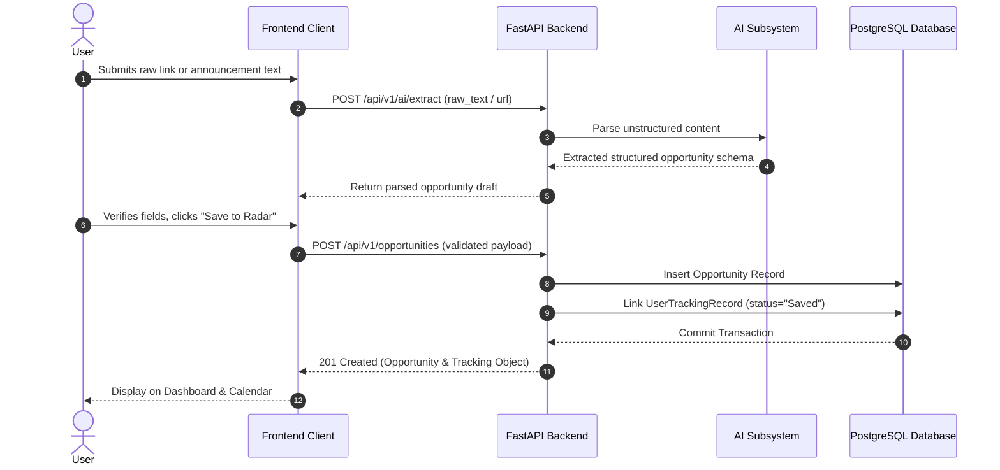
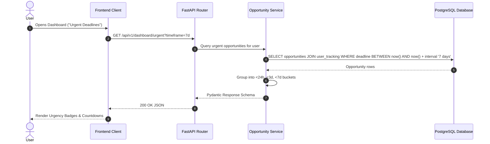
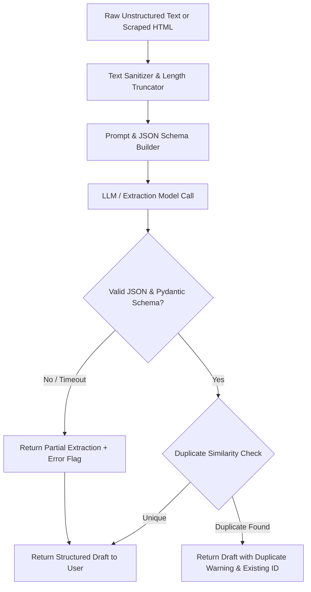
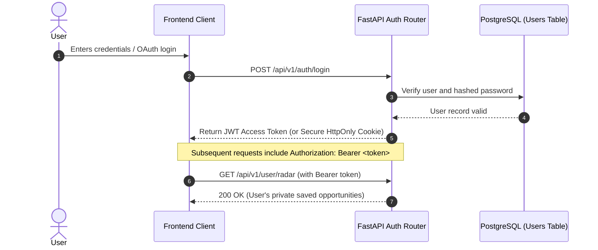
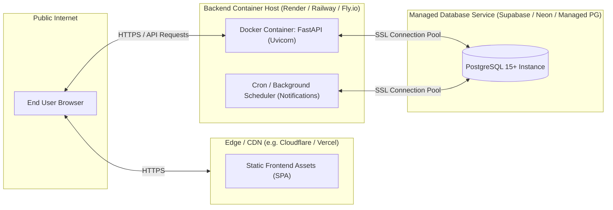

# System Architecture — Deadline Radar

## Architecture Overview
**Deadline Radar** is architected as a modular, decoupled, multi-tier system designed for reliability, maintainability, and clean separation of concerns.

The core system consists of:
1. **Frontend Client**: A modern Single Page Application (SPA) offering real-time filtering, responsive dashboards, and interactive calendar/tracking views.
2. **FastAPI Backend Core**: An asynchronous Python web service managing business logic, CRUD operations, lifecycle tracking, notifications, and schema enforcement.
3. **PostgreSQL Database**: Relational storage enforcing strict foreign key constraints, indexes on deadline timestamps, and migration versioning via Alembic.
4. **Decoupled AI Subsystem**: Modular intelligence services (extraction, classification, summarization, semantic search) communicating via clean internal contracts or external asynchronous jobs.
5. **Data Ingestion Boundary**: A standardized ingestion adapter layer designed to accept inputs from manual user submissions, AI extraction, and future automated scrapers or public APIs.

```mermaid
flowchart TD
    subgraph ClientLayer ["Client Layer"]
        UI["Web Frontend (Vite / React / TypeScript)"]
    end

    subgraph APILayer ["Backend API Gateway (FastAPI)"]
        Router["API Routers (/api/v1)"]
        AuthMid["Auth & Request Middleware"]
        Controllers["Domain Services & Controllers"]
        TaskQueue["Background Tasks Worker"]
    end

    subgraph DataLayer ["Persistence Layer"]
        PG[("PostgreSQL 15+")]
        Alembic["Alembic Migrations"]
    end

    subgraph AISubsystem ["AI & Intelligence Engine"]
        AIEngine["AI Service Facade (backend/app/services/ai)"]
        ExtractModule["Information Extraction Pipeline"]
        ClassifyModule["Taxonomy Classifier"]
        DedupeModule["Deduplication Engine"]
        LLMProvider["LLM / Embedding Provider (Gemini / Claude / Local)"]
    end

    subgraph ExternalServices ["External Systems"]
        NotificationService["Notification Delivery (Email / Webhooks)"]
        ExternalDataSources["External Data Feeds (APIs / RSS / Web)"]
    end

    UI <-->|HTTPS / JSON REST API| Router
    Router --> AuthMid
    AuthMid --> Controllers
    Controllers <-->|SQLAlchemy ORM (Async)| PG
    Controllers --> AIEngine
    Controllers --> TaskQueue
    TaskQueue --> NotificationService
    AIEngine --> ExtractModule & ClassifyModule & DedupeModule
    ExtractModule & ClassifyModule & DedupeModule <--> LLMProvider
    ExternalDataSources -.->|Normalized Ingestion| Controllers
```

---

## Components

### 1. Frontend
- **Technology Recommendation**: Single Page Application built with TypeScript and a component-driven framework (Vite + React with TanStack Query).
- **Responsibilities**:
  - Render high-performance opportunity catalogs with client-side filtering and sorting.
  - Interactive personal radar dashboard showing urgency tiers (<24h, <3d, <7d).
  - Monthly and weekly deadline calendar grids.
  - Form validation and dynamic parsing preview for user-submitted opportunity text/URLs.
  - User preferences for notifications and categories.
- **Boundaries**: Pure client-side consumer of the REST API; maintains no direct database or AI provider connections.

### 2. Backend
- **Technology**: Python 3.11+, FastAPI, Pydantic v2, SQLAlchemy (asyncio), Uvicorn.
- **Responsibilities**:
  - Exposes standard RESTful JSON endpoints under `/api/v1/`.
  - Enforces domain models, validation, and status transitions.
  - Computes deadline urgency buckets dynamically and efficiently.
  - Executes background tasks (e.g. reminder checks, async AI parsing) without blocking HTTP responses.
  - Implements database transactions, pagination, and query optimizations.

### 3. Database
- **Technology**: PostgreSQL 15+.
- **Responsibilities**:
  - Relational integrity with foreign keys between users, opportunities, categories, user tracking records, and reminders.
  - B-tree indexing on `deadline`, `status`, `category_id`, and `user_id` for low-latency range and filter queries.
  - UTC timestamp storage (`TIMESTAMP WITH TIME ZONE`).
  - Schema migrations tracked deterministically with Alembic.

### 4. AI/ML Subsystem
- **Technology**: Modular Python services interfacing with LLM APIs or local models.
- **Responsibilities**:
  - **Information Extraction**: Ingests raw text or parsed HTML and populates a typed `OpportunityCreate` schema.
  - **Classification**: Maps opportunity text to predefined taxonomy categories.
  - **Summarization**: Generates brief 2-sentence overviews highlighting eligibility, prizes, and application requirements.
  - **Deduplication**: Computes similarity scores between incoming opportunities and existing records to prevent redundant entries.
- **Design Rule**: The AI subsystem is wrapped by a service facade in the backend (`app.services.ai`). If an AI service fails, times out, or returns invalid JSON, the backend degrades gracefully and falls back to manual entry.

### 5. External Services
- **Transactional Notification Engine**: Dispatches reminder notifications via email (e.g., Resend / AWS SES) or Webhooks.
- **External Data Providers**: Future ingestion targets (public APIs, RSS feeds).

---

## Data Flow

### Opportunity Lifecycle & Ingestion Data Flow


---

## Request Flow

### Standard CRUD / Listing Request Flow


---

## AI Inference Flow

The AI pipeline is designed with defensive programming and fail-safe defaults:



---

## Authentication Flow

Authentication will protect private user radar records, personal notes, and preferences.



---

## Deployment Architecture



---

## Architecture Decisions

| Decision | Selection | Rationale | Alternatives Considered |
| :--- | :--- | :--- | :--- |
| **Backend Framework** | FastAPI (Python) | High async I/O performance, native Pydantic validation, auto-generated OpenAPI docs, seamless integration with Python AI/ML ecosystem. | Django, Flask, Express/Node.js |
| **Database** | PostgreSQL 15+ | Robust relational model, native JSONB support, powerful date/time indexing and range queries, wide ecosystem support. | MongoDB, SQLite (insufficient for concurrent multi-user production) |
| **ORM & Migrations** | SQLAlchemy 2.0 + Alembic | Mature async ORM, type safety, deterministic schema versioning. | Tortoise ORM, raw SQL |
| **API Protocol** | RESTful JSON over HTTPS | High interoperability, simplicity, cacheability, straightforward debugging and client SDK generation. | GraphQL, gRPC |
| **AI Isolation** | Service Facade / Decoupled Module | Protects core CRUD from external AI latency and outages; allows model swapping without touching DB models. | Tight coupling in API route handlers |

---

## Tradeoffs

1. **Monorepo vs. Multirepo**:
   - *Choice*: Decoupled Monorepo (`frontend/`, `backend/`, `ai-model/`, `docs/`).
   - *Tradeoff*: All components live in one repository for unified context and atomic documentation updates, but requires clean directory boundaries to prevent code cross-contamination.
2. **Synchronous vs. Asynchronous AI Extraction**:
   - *Choice*: Synchronous for fast user text snippets (<5 seconds), background worker for long batch ingestion or URL scraping.
   - *Tradeoff*: Keeps UX responsive while avoiding long HTTP timeout risks.
3. **Relational Schema vs. NoSQL Document Store**:
   - *Choice*: Relational PostgreSQL with strict schemas.
   - *Tradeoff*: Requires disciplined migrations when adding fields, but guarantees data consistency across deadlines, statuses, and user associations.

---

## Architecture Constraints
- **Zero Hardcoded Secrets**: All configuration, DB credentials, and API keys must be loaded via environment variables (`pydantic-settings`).
- **Stateless API**: The FastAPI backend must remain stateless to allow horizontal scaling behind a load balancer.
- **Timezone Invariance**: The database and API must exclusively store and compute timestamps in UTC. Local time conversions occur strictly at the client presentation layer.
- **Graceful Degradation**: Core tracking and CRUD functionality must continue operating seamlessly even if AI services are down.
