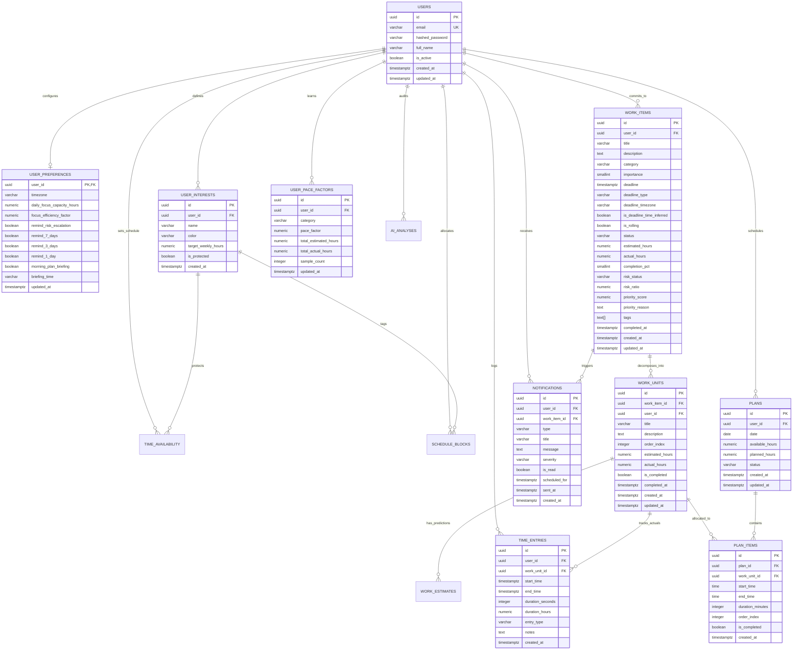
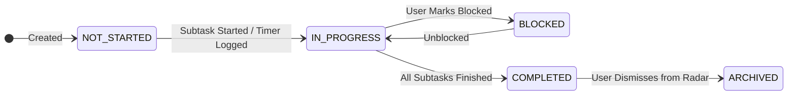

# Database Schema Specification — Deadline Radar

## 1. Database Overview

This document defines the production-grade relational database design for **Deadline Radar**. It establishes the authoritative data architecture supporting personalized deadline monitoring, cognitive workload management, dynamic prioritization, empirical time tracking, and adaptive daily planning as specified in [docs/prd.md](file:///Users/kunalsuryanshi/Documents/Projectsnew/deadline-radar/docs/prd.md) and [docs/architecture.md](file:///Users/kunalsuryanshi/Documents/Projectsnew/deadline-radar/docs/architecture.md).

The database is designed around two foundational pillars:
- **WORK**: Hierarchical modeling of commitments from overarching `work_items` down to atomic, measurable `work_units`.
- **TIME & CAPACITY**: Accurate modeling of finite usable capacity (`time_availability`, `schedule_blocks`), empirical focus execution (`time_entries`), learned estimation personalization (`user_pace_factors`), and deterministic temporal risk (`work_items.risk_ratio`).

---

## 2. Database Technology

### 2.1 Engine & Configuration
- **Database Engine**: **PostgreSQL 15+**
- **Connection Driver**: Asynchronous I/O via `asyncpg` in Python.
- **ORM**: **SQLAlchemy 2.0** utilizing `AsyncSession` and Declarative 2.0 mapped columns.
- **Migration Framework**: **Alembic** managing deterministic, version-controlled schema revisions.

### 2.2 Core Conventions
- **Primary Keys**: **UUID v4** (`id UUID PRIMARY KEY DEFAULT gen_random_uuid()`) across all core entities. Prevents enumeration attacks, enables safe client-side ID generation, and avoids ID collisions.
- **Timestamp Strategy**: **UTC Invariant Storage**. All datetime columns strictly utilize `TIMESTAMP WITH TIME ZONE` (`TIMESTAMPTZ`), defaulting to `NOW()` / `timezone('utc', now())`.
- **Naming Conventions**:
  - Table names: Plural, lowercase `snake_case` (e.g., `work_items`, `work_units`, `time_entries`).
  - Column names: Lowercase `snake_case` (e.g., `estimated_hours`, `actual_hours`, `risk_ratio`).
  - Foreign key columns: `<singular_table>_id` (e.g., `user_id`, `work_item_id`, `work_unit_id`).
  - Indexes: `idx_<table_name>_<column_names>` or `uq_<table_name>_<column_names>`.

---

## 3. Design Principles

1. **Strict Distinction Between Authoritative, AI-Derived, and Observed Data**:
   - `Authoritative Source Data`: User-provided titles, hard deadlines, importance ratings.
   - `AI-Derived Data`: Baseline effort guesses and subtask suggestions (stored with confidence, always editable).
   - `System-Calculated Data`: Deterministic risk ratios, dynamic priority scores, and available capacity.
   - `Actual Observed Data`: Empirical timer timestamps, logged durations, and completion timestamps.
2. **First-Class Time Availability & Protected Interests**: Time is not assumed to be an infinite void. Finite capacity is explicitly modeled by subtracting busy blocks and protected personal interests (gym, sleep, family) from raw clock time.
3. **The Empirical Personalization Loop**: Actual execution durations logged in `time_entries` directly feed `user_pace_factors`, ensuring historical pacing calibration is recorded and queryable over time.
4. **Row-Level User Data Isolation**: Every entity contains an indexed, cascading foreign key to `users.id`.
5. **Deterministic Auditability**: Every major calculation is backed by explicit fields and audit timestamps (`created_at`, `updated_at`), avoiding black-box hidden states.

---

## 4. Entities

| Entity | Purpose | Why It Exists | Lifecycle & Ownership |
| :--- | :--- | :--- | :--- |
| **`users`** | Core user identity & authentication credentials | Manages authentication and account status | User-owned; deleted on account termination |
| **`user_preferences`** | Schedule constraints, capacity limits, and alert toggles | 1-to-1 extension of user profile for personalized settings | Created on registration; deleted with user |
| **`user_interests`** | Designated categories for protected personal time | Reserves time for gym, gaming, reading, rest, and well-being | User-owned; managed in settings |
| **`time_availability`** | Weekly recurring schedule template | Defines normal working windows, classes, and recurring busy blocks | User-owned; weekly template |
| **`schedule_blocks`** | Date-specific concrete calendar blocks | Stores concrete free, busy, and protected slots for specific dates | Generated from template / synced from calendar |
| **`work_items`** | Overarching projects, assignments, and goals | The primary unit of commitments carrying deadlines and importance | User-owned; deleted or archived on completion |
| **`work_units`** | Atomic decomposed subtasks within a work item | Overcomes task paralysis by breaking work into 30m–3h pieces | Child of work item; cascades on delete |
| **`work_estimates`** | Explicit effort predictions (baseline, user, calibrated) | Records estimation variance and uncertainty ranges | Historical estimation log per work unit |
| **`time_entries`** | Empirical logs of actual focused time spent | Records stopwatch sessions and manual time logs | Permanent empirical history for pace factor calibration |
| **`user_pace_factors`** | Learned pace multiplier ($\text{Actual} / \text{Estimated}$) | Personalizes future estimates per category/domain | Calibrated continuously from completed work |
| **`plans`** | Daily schedule plan container (e.g. for Today) | Manages proposed allocations of time blocks for a specific date | User-owned; 1 plan per user per date |
| **`plan_items`** | Specific scheduled work unit time slot in a daily plan | Connects an available time block with a priority work unit | Child of plan; cascades on delete |
| **`notifications`** | Alerts for capacity deficit, risk escalation, and deadlines | Alerts user to upcoming crunches, milestones, and morning plans | User-owned; marked read or dismissed |
| **`ai_analyses`** | Audit logs of AI decomposition and estimation outputs | Separates raw LLM prompts and responses from active work data | System diagnostic log linked to user |

---

## 5. Relationships



---

## 6. Entity Specifications

### 6.1 `users`
Stores registered user credentials, profile basics, and account status.

| Column | Type | Constraints | Default | Description |
| :--- | :--- | :--- | :--- | :--- |
| `id` | UUID | PRIMARY KEY | `gen_random_uuid()` | Unique user identifier |
| `email` | VARCHAR(255) | UNIQUE, NOT NULL | — | Case-insensitive login email |
| `hashed_password` | VARCHAR(255) | NOT NULL | — | Argon2id / bcrypt hashed secret |
| `full_name` | VARCHAR(255) | NOT NULL | — | Display name of the user |
| `is_active` | BOOLEAN | NOT NULL | `TRUE` | Account active / suspended status |
| `created_at` | TIMESTAMPTZ | NOT NULL | `NOW()` | Registration timestamp |
| `updated_at` | TIMESTAMPTZ | NOT NULL | `NOW()` | Profile update timestamp |

---

### 6.2 `user_preferences`
1-to-1 profile extension storing working capacity limits, focus efficiency, and alert toggles.

| Column | Type | Constraints | Default | Description |
| :--- | :--- | :--- | :--- | :--- |
| `user_id` | UUID | PRIMARY KEY, REFERENCES `users(id)` ON DELETE CASCADE | — | Owning user reference |
| `timezone` | VARCHAR(64) | NOT NULL | `'UTC'` | User local IANA timezone (e.g. `'America/New_York'`) |
| `daily_focus_capacity_hours`| NUMERIC(4, 2)| NOT NULL | `6.00` | Max realistic deep work focus hours per day |
| `focus_efficiency_factor` | NUMERIC(3, 2)| NOT NULL | `0.75` | Focus discount ratio on gross open calendar time (0.50–0.90) |
| `remind_risk_escalation` | BOOLEAN | NOT NULL | `TRUE` | Alert when a task escalates to `AT_RISK` or `CRITICAL` |
| `remind_7_days` | BOOLEAN | NOT NULL | `TRUE` | 7-day proximity alert toggle |
| `remind_3_days` | BOOLEAN | NOT NULL | `TRUE` | 3-day proximity alert toggle |
| `remind_1_day` | BOOLEAN | NOT NULL | `TRUE` | 1-day proximity alert toggle |
| `morning_plan_briefing` | BOOLEAN | NOT NULL | `TRUE` | Daily morning schedule briefing alert |
| `briefing_time` | VARCHAR(5) | NOT NULL | `'08:00'` | Local time of day to deliver morning briefing (`HH:MM`) |
| `updated_at` | TIMESTAMPTZ | NOT NULL | `NOW()` | Last preference change timestamp |

---

### 6.3 `user_interests`
Designated categories for non-work commitments and protected personal well-being.

| Column | Type | Constraints | Default | Description |
| :--- | :--- | :--- | :--- | :--- |
| `id` | UUID | PRIMARY KEY | `gen_random_uuid()` | Interest identifier |
| `user_id` | UUID | NOT NULL, REFERENCES `users(id)` ON DELETE CASCADE | — | Owning user reference |
| `name` | VARCHAR(100) | NOT NULL | — | Label (e.g. `'Gym & Fitness'`, `'Reading'`, `'Family'`) |
| `color` | VARCHAR(20) | NOT NULL | `'#10B981'` | Hex color token for UI rendering |
| `target_weekly_hours`| NUMERIC(4, 2)| NOT NULL | `5.00` | Target hours per week to protect |
| `is_protected` | BOOLEAN | NOT NULL | `TRUE` | If true, planner refuses to schedule work during this time |
| `created_at` | TIMESTAMPTZ | NOT NULL | `NOW()` | Creation timestamp |

---

### 6.4 `time_availability`
Weekly recurring schedule template establishing working windows and recurring busy blocks.

| Column | Type | Constraints | Default | Description |
| :--- | :--- | :--- | :--- | :--- |
| `id` | UUID | PRIMARY KEY | `gen_random_uuid()` | Availability slot identifier |
| `user_id` | UUID | NOT NULL, REFERENCES `users(id)` ON DELETE CASCADE | — | Owning user reference |
| `day_of_week` | SMALLINT | NOT NULL CHECK (`day_of_week` BETWEEN 0 AND 6) | — | 0 = Sunday, 1 = Monday, ..., 6 = Saturday |
| `start_time` | TIME | NOT NULL | — | Start time of block (e.g. `09:00:00`) |
| `end_time` | TIME | NOT NULL | — | End time of block (e.g. `12:00:00`) |
| `slot_type` | VARCHAR(50) | NOT NULL | `'work_window'` | `'work_window'`, `'busy_block'`, `'protected_interest'` |
| `title` | VARCHAR(255) | NOT NULL | — | Description (e.g. `'Morning Focus'`, `'Algorithms Lecture'`) |
| `interest_id` | UUID | NULLABLE, REFERENCES `user_interests(id)` ON DELETE SET NULL | `NULL` | Associated interest if slot is protected |
| `created_at` | TIMESTAMPTZ | NOT NULL | `NOW()` | Creation timestamp |
| `updated_at` | TIMESTAMPTZ | NOT NULL | `NOW()` | Update timestamp |

---

### 6.5 `schedule_blocks`
Concrete date-specific calendar blocks (working windows, busy slots, protected interests).

| Column | Type | Constraints | Default | Description |
| :--- | :--- | :--- | :--- | :--- |
| `id` | UUID | PRIMARY KEY | `gen_random_uuid()` | Block identifier |
| `user_id` | UUID | NOT NULL, REFERENCES `users(id)` ON DELETE CASCADE | — | Owning user reference |
| `date` | DATE | NOT NULL | — | Concrete calendar date |
| `start_time` | TIMESTAMPTZ | NOT NULL | — | Absolute start moment in UTC |
| `end_time` | TIMESTAMPTZ | NOT NULL | — | Absolute end moment in UTC |
| `duration_minutes` | INTEGER | NOT NULL | — | Block duration in minutes |
| `block_type` | VARCHAR(50) | NOT NULL | `'work_window'` | `'work_window'`, `'busy_block'`, `'protected_interest'` |
| `title` | VARCHAR(255) | NOT NULL | — | Title of calendar block |
| `is_fixed` | BOOLEAN | NOT NULL | `TRUE` | True if immovable (e.g. lecture, job shift, flight) |
| `external_event_id`| VARCHAR(255) | NULLABLE | `NULL` | Future Google/Apple Calendar event ID |
| `created_at` | TIMESTAMPTZ | NOT NULL | `NOW()` | Creation timestamp |
| `updated_at` | TIMESTAMPTZ | NOT NULL | `NOW()` | Modification timestamp |

---

### 6.6 `work_items`
The primary commitment/project entity carrying temporal constraints, importance, and risk metrics.

| Column | Type | Constraints | Default | Description |
| :--- | :--- | :--- | :--- | :--- |
| `id` | UUID | PRIMARY KEY | `gen_random_uuid()` | Work Item identifier |
| `user_id` | UUID | NOT NULL, REFERENCES `users(id)` ON DELETE CASCADE | — | Owning user reference |
| `title` | VARCHAR(255) | NOT NULL | — | Clear title (e.g. `'Distributed Systems Lab 3'`) |
| `description` | TEXT | NULLABLE | `NULL` | Detailed notes, guidelines, or prompt |
| `category` | VARCHAR(50) | NOT NULL | `'academic'` | `'academic'`, `'engineering'`, `'writing'`, `'career'`, `'research'`, `'personal'` |
| `importance` | SMALLINT | NOT NULL CHECK (`importance` BETWEEN 1 AND 5) | `3` | Importance rating (1=Low to 5=Critical) |
| `deadline` | TIMESTAMPTZ | NOT NULL | — | Target completion cutoff in UTC |
| `deadline_type` | VARCHAR(20) | NOT NULL DEFAULT `'hard'` | `'hard'` | `'hard'` (strict cutoff) or `'soft'` (self-target) |
| `deadline_timezone`| VARCHAR(64) | NOT NULL DEFAULT `'UTC'` | `'UTC'` | Source announcement timezone (e.g. `'EST'`, `'AoE'`) |
| `is_deadline_time_inferred`| BOOLEAN | NOT NULL | `FALSE` | True if deadline specified date only (time defaulted to 23:59:59) |
| `is_rolling` | BOOLEAN | NOT NULL | `FALSE` | True if open-ended / no strict calendar cutoff |
| `status` | VARCHAR(50) | NOT NULL | `'not_started'` | `'not_started'`, `'in_progress'`, `'blocked'`, `'completed'`, `'archived'` |
| `estimated_hours` | NUMERIC(6, 2)| NOT NULL | `0.00` | Aggregate estimated hours across all subtasks |
| `actual_hours` | NUMERIC(6, 2)| NOT NULL | `0.00` | Cumulative actual hours logged in time entries |
| `completion_pct` | SMALLINT | NOT NULL CHECK (`completion_pct` BETWEEN 0 AND 100) | `0` | Percentage of subtask effort completed |
| `risk_status` | VARCHAR(50) | NOT NULL | `'safe'` | Dynamic state: `'safe'`, `'watch'`, `'at_risk'`, `'critical'`, `'overdue'` |
| `risk_ratio` | NUMERIC(6, 3)| NULLABLE | `NULL` | Ratio: $\text{RemainingEffort} / \text{AvailableHours}$ |
| `priority_score` | NUMERIC(5, 2)| NOT NULL | `0.00` | Dynamic priority ranking score (0.00 to 100.00) |
| `priority_reason` | TEXT | NULLABLE | `NULL` | Human-readable explanation of current priority |
| `tags` | TEXT[] | NOT NULL | `ARRAY[]::TEXT[]` | Keyword labels (e.g. `['python', 'systems']`) |
| `completed_at` | TIMESTAMPTZ | NULLABLE | `NULL` | Final completion timestamp |
| `created_at` | TIMESTAMPTZ | NOT NULL | `NOW()` | Creation timestamp |
| `updated_at` | TIMESTAMPTZ | NOT NULL | `NOW()` | Modification timestamp |

---

### 6.7 `work_units`
Atomic, measurable subtasks decomposed from a work item (30m–3h execution units).

| Column | Type | Constraints | Default | Description |
| :--- | :--- | :--- | :--- | :--- |
| `id` | UUID | PRIMARY KEY | `gen_random_uuid()` | Work Unit identifier |
| `work_item_id` | UUID | NOT NULL, REFERENCES `work_items(id)` ON DELETE CASCADE | — | Parent work item reference |
| `user_id` | UUID | NOT NULL, REFERENCES `users(id)` ON DELETE CASCADE | — | Denormalized user ID for fast row isolation |
| `title` | VARCHAR(255) | NOT NULL | — | Actionable title (e.g. `'Implement Raft election timer'`) |
| `description` | TEXT | NULLABLE | `NULL` | Subtask details or acceptance criteria |
| `order_index` | INTEGER | NOT NULL | `0` | Logical execution sequence |
| `estimated_hours` | NUMERIC(5, 2)| NOT NULL | — | Estimated hours required for this subtask |
| `actual_hours` | NUMERIC(5, 2)| NOT NULL | `0.00` | Cumulative actual logged hours |
| `is_completed` | BOOLEAN | NOT NULL | `FALSE` | Completion status toggle |
| `completed_at` | TIMESTAMPTZ | NULLABLE | `NULL` | Timestamp of completion |
| `created_at` | TIMESTAMPTZ | NOT NULL | `NOW()` | Creation timestamp |
| `updated_at` | TIMESTAMPTZ | NOT NULL | `NOW()` | Modification timestamp |

---

### 6.8 `work_estimates`
Historical log of estimate predictions (AI baseline, user override, and personalized calibration).

| Column | Type | Constraints | Default | Description |
| :--- | :--- | :--- | :--- | :--- |
| `id` | UUID | PRIMARY KEY | `gen_random_uuid()` | Estimate identifier |
| `work_unit_id` | UUID | NOT NULL, REFERENCES `work_units(id)` ON DELETE CASCADE | — | Target subtask reference |
| `estimated_by` | VARCHAR(50) | NOT NULL | `'ai_baseline'` | `'ai_baseline'`, `'user_override'`, `'personalized_calibrated'` |
| `optimistic_hours` | NUMERIC(5, 2)| NULLABLE | `NULL` | Optimistic duration estimate |
| `most_likely_hours`| NUMERIC(5, 2)| NOT NULL | — | Most likely point estimate |
| `pessimistic_hours`| NUMERIC(5, 2)| NULLABLE | `NULL` | Pessimistic duration estimate |
| `applied_pace_factor`| NUMERIC(4, 3)| NOT NULL | `1.000` | Pace multiplier applied during calculation |
| `created_at` | TIMESTAMPTZ | NOT NULL | `NOW()` | Snapshot timestamp |

---

### 6.9 `time_entries`
Empirical records of focused work sessions logged by the user (the ground truth for learning).

| Column | Type | Constraints | Default | Description |
| :--- | :--- | :--- | :--- | :--- |
| `id` | UUID | PRIMARY KEY | `gen_random_uuid()` | Time entry identifier |
| `user_id` | UUID | NOT NULL, REFERENCES `users(id)` ON DELETE CASCADE | — | Owning user reference |
| `work_unit_id` | UUID | NOT NULL, REFERENCES `work_units(id)` ON DELETE CASCADE | — | Associated subtask |
| `start_time` | TIMESTAMPTZ | NOT NULL | — | Start moment in UTC |
| `end_time` | TIMESTAMPTZ | NOT NULL | — | End moment in UTC |
| `duration_seconds`| INTEGER | NOT NULL CHECK (`duration_seconds` > 0) | — | Net duration in seconds |
| `duration_hours` | NUMERIC(5, 2)| NOT NULL | — | Duration in decimal hours |
| `entry_type` | VARCHAR(50) | NOT NULL | `'active_timer'` | `'active_timer'` (live stopwatch) or `'manual_log'` |
| `notes` | TEXT | NULLABLE | `NULL` | Session accomplishments or blockers |
| `created_at` | TIMESTAMPTZ | NOT NULL | `NOW()` | Record creation timestamp |

---

### 6.10 `user_pace_factors`
Personalized performance model maintaining domain-specific pace multipliers ($\text{Actual} / \text{Estimated}$).

| Column | Type | Constraints | Default | Description |
| :--- | :--- | :--- | :--- | :--- |
| `id` | UUID | PRIMARY KEY | `gen_random_uuid()` | Pace factor identifier |
| `user_id` | UUID | NOT NULL, REFERENCES `users(id)` ON DELETE CASCADE | — | Owning user reference |
| `category` | VARCHAR(50) | NOT NULL | — | Domain slug (e.g. `'academic'`, `'engineering'`, `'writing'`) |
| `pace_factor` | NUMERIC(5, 3)| NOT NULL | `1.000` | Multiplier: $\sum \text{Actual} / \sum \text{Estimated}$ |
| `total_estimated_hours`| NUMERIC(8, 2)| NOT NULL | `0.00` | Cumulative estimated hours across completed tasks |
| `total_actual_hours`| NUMERIC(8, 2)| NOT NULL | `0.00` | Cumulative actual hours logged |
| `sample_count` | INTEGER | NOT NULL | `0` | Number of completed subtasks informing this multiplier |
| `updated_at` | TIMESTAMPTZ | NOT NULL | `NOW()` | Last recalibration timestamp |

*Unique Constraint*: `UNIQUE (user_id, category)`.

---

### 6.11 `plans` & `plan_items`
Containers for daily adaptive schedules ("Today" View).

**`plans`**:
| Column | Type | Constraints | Default | Description |
| :--- | :--- | :--- | :--- | :--- |
| `id` | UUID | PRIMARY KEY | `gen_random_uuid()` | Plan identifier |
| `user_id` | UUID | NOT NULL, REFERENCES `users(id)` ON DELETE CASCADE | — | Owning user reference |
| `date` | DATE | NOT NULL | — | Schedule date |
| `available_hours`| NUMERIC(4, 2)| NOT NULL | — | Usable deep work focus hours available on this date |
| `planned_hours` | NUMERIC(4, 2)| NOT NULL | `0.00` | Sum of hours allocated in plan items |
| `status` | VARCHAR(50) | NOT NULL | `'draft'` | `'draft'`, `'active'`, `'completed'` |
| `created_at` | TIMESTAMPTZ | NOT NULL | `NOW()` | Creation timestamp |
| `updated_at` | TIMESTAMPTZ | NOT NULL | `NOW()` | Modification timestamp |

*Unique Constraint*: `UNIQUE (user_id, date)` — A user has at most one plan per date.

**`plan_items`**:
| Column | Type | Constraints | Default | Description |
| :--- | :--- | :--- | :--- | :--- |
| `id` | UUID | PRIMARY KEY | `gen_random_uuid()` | Plan item identifier |
| `plan_id` | UUID | NOT NULL, REFERENCES `plans(id)` ON DELETE CASCADE | — | Parent plan reference |
| `work_unit_id` | UUID | NOT NULL, REFERENCES `work_units(id)` ON DELETE CASCADE | — | Assigned subtask reference |
| `start_time` | TIME | NOT NULL | — | Scheduled start time (e.g. `09:30:00`) |
| `end_time` | TIME | NOT NULL | — | Scheduled end time (e.g. `11:00:00`) |
| `duration_minutes`| INTEGER | NOT NULL | — | Scheduled block duration |
| `order_index` | INTEGER | NOT NULL | `0` | Chronological sort order |
| `is_completed` | BOOLEAN | NOT NULL | `FALSE` | Whether this planned block was executed |
| `created_at` | TIMESTAMPTZ | NOT NULL | `NOW()` | Item creation timestamp |

---

### 6.12 `notifications`
Alerts generated for capacity deficits, risk escalations, deadline proximity, and morning briefings.

| Column | Type | Constraints | Default | Description |
| :--- | :--- | :--- | :--- | :--- |
| `id` | UUID | PRIMARY KEY | `gen_random_uuid()` | Notification identifier |
| `user_id` | UUID | NOT NULL, REFERENCES `users(id)` ON DELETE CASCADE | — | Recipient user |
| `work_item_id` | UUID | NULLABLE, REFERENCES `work_items(id)` ON DELETE CASCADE | `NULL` | Associated work item if applicable |
| `type` | VARCHAR(50) | NOT NULL | — | `'capacity_deficit'`, `'risk_escalation'`, `'proximity_reminder'`, `'morning_briefing'` |
| `title` | VARCHAR(255) | NOT NULL | — | Alert heading |
| `message` | TEXT | NOT NULL | — | Actionable notification body |
| `severity` | VARCHAR(20) | NOT NULL | `'info'` | Severity token: `'info'`, `'warning'`, `'critical'` |
| `is_read` | BOOLEAN | NOT NULL | `FALSE` | Read / unread toggle |
| `scheduled_for` | TIMESTAMPTZ | NOT NULL | — | Intended delivery timestamp |
| `sent_at` | TIMESTAMPTZ | NULLABLE | `NULL` | Actual dispatch timestamp |
| `created_at` | TIMESTAMPTZ | NOT NULL | `NOW()` | Generation timestamp |

---

### 6.13 `ai_analyses`
Diagnostic audit logs capturing raw user prompts, model responses, and execution latency.

| Column | Type | Constraints | Default | Description |
| :--- | :--- | :--- | :--- | :--- |
| `id` | UUID | PRIMARY KEY | `gen_random_uuid()` | Analysis log identifier |
| `user_id` | UUID | NOT NULL, REFERENCES `users(id)` ON DELETE CASCADE | — | User requesting analysis |
| `work_item_id` | UUID | NULLABLE, REFERENCES `work_items(id)` ON DELETE CASCADE | `NULL` | Associated work item if applicable |
| `analysis_type` | VARCHAR(50) | NOT NULL | — | `'decomposition'`, `'work_parsing'`, `'plan_proposal'` |
| `prompt_text` | TEXT | NOT NULL | — | Raw prompt text submitted to model |
| `raw_response_payload`| JSONB | NOT NULL | — | Full raw JSON output from model |
| `model_provider`| VARCHAR(100) | NOT NULL | — | Model ID (e.g. `'gemini-1.5-flash'`) |
| `latency_ms` | INTEGER | NOT NULL | — | Inference round-trip latency |
| `created_at` | TIMESTAMPTZ | NOT NULL | `NOW()` | Execution timestamp |

---

## 7. Constraints & Data Integrity

### 7.1 Check Constraints
- `work_items.importance`: `CHECK (importance BETWEEN 1 AND 5)`
- `work_items.completion_pct`: `CHECK (completion_pct BETWEEN 0 AND 100)`
- `work_items.category`: `CHECK (category IN ('academic', 'engineering', 'writing', 'career', 'research', 'personal'))`
- `work_items.status`: `CHECK (status IN ('not_started', 'in_progress', 'blocked', 'completed', 'archived'))`
- `work_items.risk_status`: `CHECK (risk_status IN ('safe', 'watch', 'at_risk', 'critical', 'overdue'))`
- `time_availability.day_of_week`: `CHECK (day_of_week BETWEEN 0 AND 6)`
- `time_entries.duration_seconds`: `CHECK (duration_seconds > 0)`
- `time_entries.start_time`: `CHECK (end_time >= start_time)`

### 7.2 Unique Constraints
- `users`: `UNIQUE (email)` (enforced case-insensitively via `LOWER(email)` index).
- `user_pace_factors`: `UNIQUE (user_id, category)` — One pace factor per domain per user.
- `plans`: `UNIQUE (user_id, date)` — One daily plan per user per calendar day.

---

## 8. Indexing Strategy

```sql
-- 1. Fast lookup of user's active work items ordered by deadline (Primary Dashboard Radar)
CREATE INDEX idx_work_items_user_deadline 
ON work_items (user_id, deadline ASC) 
WHERE status NOT IN ('completed', 'archived');

-- 2. Fast retrieval of critical and high-risk work items
CREATE INDEX idx_work_items_risk 
ON work_items (user_id, risk_status, priority_score DESC) 
WHERE status NOT IN ('completed', 'archived');

-- 3. Subtask retrieval and ordering for work detail view
CREATE INDEX idx_work_units_parent_order 
ON work_units (work_item_id, order_index ASC);

-- 4. User schedule blocks by date range (Daily Planning & Timeline)
CREATE INDEX idx_schedule_blocks_user_date 
ON schedule_blocks (user_id, date ASC, start_time ASC);

-- 5. Time entry aggregation for pace factor calibration and insights
CREATE INDEX idx_time_entries_user_workunit 
ON time_entries (user_id, work_unit_id, start_time DESC);

-- 6. Notification polling for pending and unread alerts
CREATE INDEX idx_notifications_pending 
ON notifications (scheduled_for, sent_at) 
WHERE sent_at IS NULL;

CREATE INDEX idx_notifications_unread 
ON notifications (user_id, is_read) 
WHERE is_read = FALSE;
```

---

## 9. Search Strategy

- **Work Item Keyword Matching**:
  - PostgreSQL full-text search indexing on `title` and `description`:
    ```sql
    ALTER TABLE work_items 
    ADD COLUMN search_vector tsvector 
    GENERATED ALWAYS AS (
        setweight(to_tsvector('english', coalesce(title, '')), 'A') ||
        setweight(to_tsvector('english', coalesce(description, '')), 'B')
    ) STORED;

    CREATE INDEX idx_work_items_search_vector 
    ON work_items USING GIN (search_vector);
    ```
- **Fuzzy Tag and Title Matching**:
  - `pg_trgm` extension enabled for fast typo-tolerant filtering on `work_items.title`.

---

## 10. Time & Timezone Strategy

1. **Universal UTC Persistence**:
   - All columns representing moments in time (`deadline`, `start_time`, `end_time`, `created_at`) are stored as `TIMESTAMPTZ` in UTC.
2. **Timezone Provenance**:
   - `deadline_timezone` stores the source string (e.g. `'America/Los_Angeles'`, `'AoE'`).
3. **Inferred Date-Only Deadlines**:
   - When a user inputs an assignment due on a specific day without an hour, `is_deadline_time_inferred = TRUE` and the timestamp defaults to `23:59:59` in the user's local timezone.
4. **Anywhere on Earth (AoE)**:
   - Converted deterministically as `UTC-12:00` (e.g. 23:59:59 AoE on Day $D \rightarrow$ 11:59:59 UTC on Day $D+1$).

---

## 11. Data Lifecycle



---

## 12. Migration Strategy

- **Tooling**: Alembic async migrations in `backend/alembic/`.
- **Naming**: `<timestamp>_<action>.py` (e.g. `20260919_001_work_and_time_schema.py`).
- **Reversibility**: Every migration file must contain tested, symmetric `upgrade()` and `downgrade()` functions.

---

## 13. Seed Data Strategy

Upon database initialization, the following defaults are deterministically seeded:
1. **Default User Preferences**: Default 6.0h focus capacity, 0.75 focus efficiency, and standard notification flags.
2. **Default User Interests**:
   - `Gym & Fitness` (`#10B981`, target: 4h/week, protected: true)
   - `Rest & Recovery` (`#6366F1`, target: 7h/week, protected: true)
   - `Reading & Learning` (`#F59E0B`, target: 3h/week, protected: false)
3. **Default Weekly Schedule Template**: Mon–Fri 09:00–12:00 and 14:00–17:00 work windows.

---

## 14. Future Schema Extensions

- **Calendar Integration**: `external_sync_tokens` table for OAuth refresh tokens for Google Calendar and Apple Calendar.
- **Collaborative Accountability**: `work_item_shares` table allowing users to share read-only progress on specific deadlines with an advisor or friend.
- **Energy-Level Curves**: `hourly_energy_profiles` table mapping a user's peak focus windows across the day (0–100 scale).

---

## 15. Open Database Questions

| # | Question | Impact | Options | Working Assumption |
| :-: | :--- | :--- | :--- | :--- |
| **ODQ-1** | Should `work_items.completion_pct` be maintained by a trigger or computed dynamically in queries? | Affects query latency vs. write overhead. | (A) Trigger on `work_units` updates<br>(B) Application-level service update | **Assumption**: Application-level service updates `completion_pct` atomically whenever subtasks change. |
| **ODQ-2** | How many historical time entries should inform a category's `user_pace_factors`? | Affects responsiveness to user improvement vs. noise. | (A) All-time cumulative average<br>(B) Rolling 30-day exponential moving average | **Assumption**: All-time weighted average initially, moving to an exponential moving average (EMA) post-MVP. |
