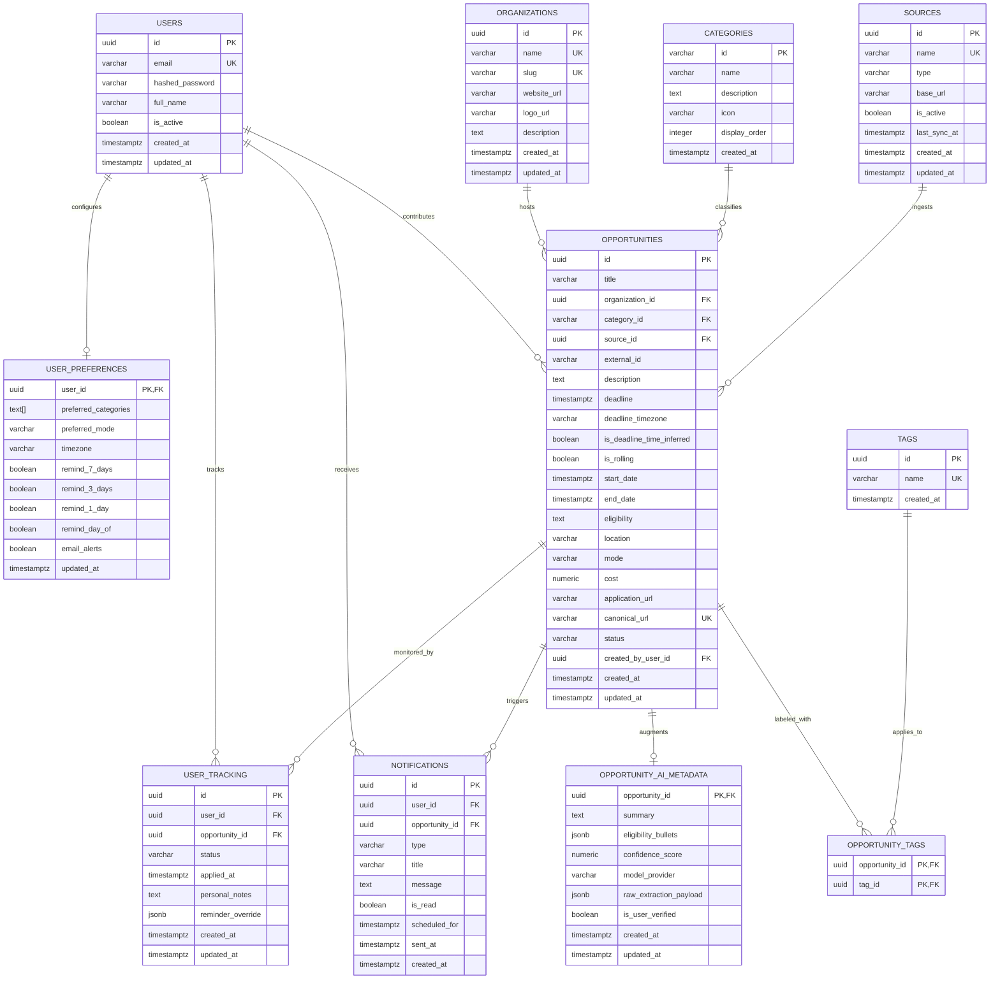
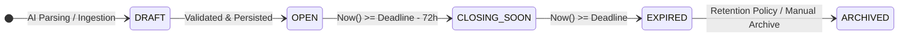

# Database Schema Specification — Deadline Radar

## 1. Database Overview

This document defines the production-grade relational database design for **Deadline Radar**. It translates the product requirements from [docs/prd.md](file:///Users/kunalsuryanshi/Documents/Projectsnew/deadline-radar/docs/prd.md) and the system architecture from [docs/architecture.md](file:///Users/kunalsuryanshi/Documents/Projectsnew/deadline-radar/docs/architecture.md) into an authoritative, normalized, and performant data architecture.

The database is designed to:
- Enforce strict relational integrity and user data isolation across multi-stage application lifecycles.
- Enable high-efficiency range indexing for time-critical proximity queries (`<24h`, `<3d`, `<7d`).
- Cleanly separate authoritative opportunity source data from AI-derived metadata and extraction artifacts.
- Provide a robust foundation for automated ingestion deduplication across multiple external platforms.
- Support seed taxonomies and user preferences while remaining easily extensible for future phases (e.g. vector search, calendar subscriptions).

---

## 2. Database Technology

### 2.1 Engine & Configuration
- **Database Engine**: **PostgreSQL 15+**
- **Connection Model**: Asynchronous I/O via `asyncpg` driver in Python.
- **ORM**: **SQLAlchemy 2.0** utilizing `AsyncSession` and Declarative 2.0 typed mappings.
- **Migration Framework**: **Alembic** managing deterministic, version-controlled schema revisions.

### 2.2 Core Conventions
- **Identifier Strategy**: **UUID v4** (`id UUID PRIMARY KEY DEFAULT gen_random_uuid()`) across all entities (except lookup taxonomy slugs). This prevents sequential enumeration attacks, supports distributed data ingestion, and enables client-side UUID generation.
- **Timestamp Strategy**: **UTC Invariant Storage**. All datetime columns strictly utilize `TIMESTAMP WITH TIME ZONE` (`TIMESTAMPTZ`), defaulting to `NOW()` / `timezone('utc', now())`.
- **Naming Conventions**:
  - Table names: Plural, lowercase `snake_case` (e.g., `opportunities`, `user_tracking`, `organizations`).
  - Column names: Lowercase `snake_case` (e.g., `application_url`, `canonical_url`, `created_at`).
  - Foreign key columns: `<singular_table>_id` (e.g., `user_id`, `opportunity_id`, `organization_id`).
  - Index naming: `idx_<table_name>_<column_names>` or `uq_<table_name>_<column_names>`.

---

## 3. Design Principles

1. **Strict Separation of Authoritative Source Data vs. AI Metadata**: Core opportunity attributes (title, host organization, deadline, application URL) are persisted in the core `opportunities` table, while AI-generated summaries, confidence ratings, and extraction payloads reside in a dedicated 1-to-1 extension table (`opportunity_ai_metadata`).
2. **Unified Application Lifecycle (No Duplicate Tracking Tables)**: Rather than maintaining fragmented `saved_opportunities` and `applications` tables, a single normalized `user_tracking` table manages the complete lifecycle state machine (`SAVED` through `ARCHIVED`), eliminating record deletion/re-insertion and broken foreign keys.
3. **Normalized Organizations & Sources**: Entities hosting opportunities (`organizations`) and origin ingestion channels (`sources`) are normalized to prevent string duplication, track provenance, and enable platform-wide deduplication.
4. **Row-Level User Isolation**: Every private record (user tracking, personal notes, notifications, preferences) contains an indexed, cascading foreign key to `users.id`.
5. **No Premature Complexity**: Utilizes PostgreSQL's native capabilities (`tsvector`, `pg_trgm`, JSONB) for search, deduplication, and flexible metadata before considering external search clusters or vector databases.

---

## 4. Entities

| Entity | Purpose | Why It Exists | Lifecycle & Ownership |
| :--- | :--- | :--- | :--- |
| **`users`** | Core user identity & authentication credentials | Manages authentication and account status | User-owned; deleted on account termination |
| **`user_preferences`** | Notification thresholds and feed filters | 1-to-1 extension of user profile for personalized settings | Created on registration; deleted with user |
| **`organizations`** | Hosts, companies, and universities sponsoring opportunities | Eliminates duplicate strings (e.g., "Google", "MIT") and enables org-level opportunity filtering | System/catalog-wide; persists across opportunities |
| **`categories`** | Standardized domain taxonomy (13 categories) | Slug-based classification for fast browsing and filtering | Static seed taxonomy; managed by system admins |
| **`sources`** | Provenance channels (Devpost, Unstop, RSS, User) | Tracks data origin, crawler sync state, and attribution | System-wide ingestion metadata registry |
| **`opportunities`** | Authoritative catalog of time-sensitive events | Central entity storing validated dates, links, and criteria | Public catalog entity; system or user-contributed |
| **`opportunity_ai_metadata`** | AI-generated summaries, extraction confidence, and logs | Separates AI outputs and models from source facts | 1-to-1 extension of opportunity; cascades on delete |
| **`tags`** | Keywords and technology labels | Provides multi-attribute tag filtering (e.g. `python`, `ai`) | Reusable global keywords |
| **`opportunity_tags`** | Many-to-many junction between opportunities and tags | Associates opportunities with multiple keyword tags | Composite junction table |
| **`user_tracking`** | Personal radar & application lifecycle states | Tracks user status (`SAVED` -> `APPLIED` -> `COMPLETED`) and private notes | Private to `user_id`; cascades on user or opportunity delete |
| **`notifications`** | Scheduled and delivered proximity alerts | Dispatches milestone reminders (7d, 3d, 1d, day-of) | Private to `user_id`; scheduled and marked read/sent |

---

## 5. Relationships



---

## 6. Entity Specifications

### 6.1 `users`
Stores registered user credentials, profile basics, and account status.

| Column | Type | Constraints | Default | Description |
| :--- | :--- | :--- | :--- | :--- |
| `id` | UUID | PRIMARY KEY | `gen_random_uuid()` | Unique user identifier |
| `email` | VARCHAR(255) | UNIQUE, NOT NULL | — | Case-insensitive user email |
| `hashed_password` | VARCHAR(255) | NOT NULL | — | Argon2id or bcrypt hashed secret |
| `full_name` | VARCHAR(255) | NOT NULL | — | Display name of the user |
| `is_active` | BOOLEAN | NOT NULL | `TRUE` | Account active / suspended flag |
| `created_at` | TIMESTAMPTZ | NOT NULL | `NOW()` | Account creation timestamp |
| `updated_at` | TIMESTAMPTZ | NOT NULL | `NOW()` | Profile modification timestamp |

---

### 6.2 `user_preferences`
1-to-1 profile extension storing notification preferences and discovery feed filter configurations.

| Column | Type | Constraints | Default | Description |
| :--- | :--- | :--- | :--- | :--- |
| `user_id` | UUID | PRIMARY KEY, REFERENCES `users(id)` ON DELETE CASCADE | — | Owning user reference |
| `preferred_categories`| TEXT[] | NOT NULL | `ARRAY[]::TEXT[]` | Preferred category slugs for feed pre-filtering |
| `preferred_mode` | VARCHAR(50) | NULLABLE | `NULL` | Preferred participation mode (`online`, `in_person`, `any`) |
| `timezone` | VARCHAR(64) | NOT NULL | `'UTC'` | User local IANA timezone (e.g., `'Asia/Kolkata'`) |
| `remind_7_days` | BOOLEAN | NOT NULL | `TRUE` | Milestone alert toggle (168h prior) |
| `remind_3_days` | BOOLEAN | NOT NULL | `TRUE` | Milestone alert toggle (72h prior) |
| `remind_1_day` | BOOLEAN | NOT NULL | `TRUE` | Milestone alert toggle (24h prior) |
| `remind_day_of` | BOOLEAN | NOT NULL | `TRUE` | Milestone alert toggle (08:00 local time) |
| `email_alerts` | BOOLEAN | NOT NULL | `FALSE` | Transactional email opt-in (post-MVP) |
| `updated_at` | TIMESTAMPTZ | NOT NULL | `NOW()` | Last preference update timestamp |

---

### 6.3 `organizations`
Normalized entity representing companies, institutions, universities, and communities hosting opportunities.

| Column | Type | Constraints | Default | Description |
| :--- | :--- | :--- | :--- | :--- |
| `id` | UUID | PRIMARY KEY | `gen_random_uuid()` | Organization identifier |
| `name` | VARCHAR(255) | UNIQUE, NOT NULL | — | Clean display name (e.g., `'Google'`, `'MIT'`) |
| `slug` | VARCHAR(255) | UNIQUE, NOT NULL | — | URL-safe identifier (e.g., `'google'`, `'mit'`) |
| `website_url` | VARCHAR(2048) | NULLABLE | `NULL` | Official organization website |
| `logo_url` | VARCHAR(2048) | NULLABLE | `NULL` | CDN URL for organization logo icon |
| `description` | TEXT | NULLABLE | `NULL` | Brief overview of the organization |
| `created_at` | TIMESTAMPTZ | NOT NULL | `NOW()` | Record creation timestamp |
| `updated_at` | TIMESTAMPTZ | NOT NULL | `NOW()` | Record modification timestamp |

---

### 6.4 `categories`
Standardized slug-based taxonomy table for opportunity domains.

| Column | Type | Constraints | Default | Description |
| :--- | :--- | :--- | :--- | :--- |
| `id` | VARCHAR(50) | PRIMARY KEY | — | Slug (e.g. `'hackathon'`, `'internship'`) |
| `name` | VARCHAR(100) | NOT NULL | — | Human-readable name (e.g. `'Hackathon'`) |
| `description` | TEXT | NULLABLE | `NULL` | Detailed domain scope description |
| `icon` | VARCHAR(50) | NULLABLE | `NULL` | UI icon identifier |
| `display_order` | INTEGER | NOT NULL | `0` | Order in category selector carousels |
| `created_at` | TIMESTAMPTZ | NOT NULL | `NOW()` | Category registration timestamp |

*Standard Seed Slugs*: `hackathon`, `internship`, `scholarship`, `competition`, `coding_contest`, `fellowship`, `workshop`, `conference`, `certification`, `course`, `research_opportunity`, `job`, `event`.

---

### 6.5 `sources`
Catalog of external ingestion channels, scrapers, and platform providers.

| Column | Type | Constraints | Default | Description |
| :--- | :--- | :--- | :--- | :--- |
| `id` | UUID | PRIMARY KEY | `gen_random_uuid()` | Source identifier |
| `name` | VARCHAR(100) | UNIQUE, NOT NULL | — | Source slug (e.g. `'devpost'`, `'unstop'`, `'user_submission'`) |
| `type` | VARCHAR(50) | NOT NULL | — | Ingestion mechanism (`'api'`, `'crawler'`, `'rss'`, `'user'`) |
| `base_url` | VARCHAR(2048) | NULLABLE | `NULL` | Source root website URL |
| `is_active` | BOOLEAN | NOT NULL | `TRUE` | Whether automatic ingestion is enabled |
| `last_sync_at` | TIMESTAMPTZ | NULLABLE | `NULL` | Timestamp of last successful ingestion crawl |
| `created_at` | TIMESTAMPTZ | NOT NULL | `NOW()` | Record creation timestamp |
| `updated_at` | TIMESTAMPTZ | NOT NULL | `NOW()` | Record modification timestamp |

---

### 6.6 `opportunities`
Core catalog entity storing authoritative source facts, deadlines, eligibility, and links.

| Column | Type | Constraints | Default | Description |
| :--- | :--- | :--- | :--- | :--- |
| `id` | UUID | PRIMARY KEY | `gen_random_uuid()` | Opportunity identifier |
| `title` | VARCHAR(255) | NOT NULL | — | Opportunity title |
| `organization_id` | UUID | NOT NULL, REFERENCES `organizations(id)` ON DELETE RESTRICT | — | Host organization reference |
| `category_id` | VARCHAR(50) | NOT NULL, REFERENCES `categories(id)` ON DELETE RESTRICT | — | Taxonomy domain reference |
| `source_id` | UUID | NULLABLE, REFERENCES `sources(id)` ON DELETE SET NULL | `NULL` | Provenance source reference |
| `external_id` | VARCHAR(255) | NULLABLE | `NULL` | ID or slug in external source (e.g. Devpost slug) |
| `description` | TEXT | NULLABLE | `NULL` | Full opportunity description |
| `deadline` | TIMESTAMPTZ | NOT NULL | — | Application cutoff timestamp stored in UTC |
| `deadline_timezone` | VARCHAR(64) | NULLABLE | `'UTC'` | Stated timezone in source announcement (e.g. `'EST'`) |
| `is_deadline_time_inferred`| BOOLEAN | NOT NULL | `FALSE` | True if date lacked explicit time and defaulted to 23:59:59 |
| `is_rolling` | BOOLEAN | NOT NULL | `FALSE` | Rolling admission indicator |
| `start_date` | TIMESTAMPTZ | NULLABLE | `NULL` | Program or event start date |
| `end_date` | TIMESTAMPTZ | NULLABLE | `NULL` | Program or event end date |
| `eligibility` | TEXT | NULLABLE | `NULL` | Candidate restrictions, grade levels, prerequisites |
| `location` | VARCHAR(255) | NULLABLE | `NULL` | City/region or "Remote" |
| `mode` | VARCHAR(50) | NOT NULL | `'online'` | Format: `'online'`, `'in_person'`, `'hybrid'` |
| `cost` | NUMERIC(10, 2)| NOT NULL | `0.00` | Registration/application fee in USD (0 for free) |
| `application_url` | VARCHAR(2048)| NOT NULL | — | Official direct application link |
| `canonical_url` | VARCHAR(2048)| UNIQUE, NOT NULL | — | Stripped URL (no query params) for deduplication |
| `status` | VARCHAR(50) | NOT NULL | `'open'` | Global status: `'open'`, `'closing_soon'`, `'expired'` |
| `created_by_user_id`| UUID | NULLABLE, REFERENCES `users(id)` ON DELETE SET NULL | `NULL` | Contributor user ID (null for system seeded) |
| `created_at` | TIMESTAMPTZ | NOT NULL | `NOW()` | Catalog creation timestamp |
| `updated_at` | TIMESTAMPTZ | NOT NULL | `NOW()` | Catalog update timestamp |

---

### 6.7 `opportunity_ai_metadata`
1-to-1 extension table isolating AI-generated artifacts, models, and confidence scores from source facts.

| Column | Type | Constraints | Default | Description |
| :--- | :--- | :--- | :--- | :--- |
| `opportunity_id` | UUID | PRIMARY KEY, REFERENCES `opportunities(id)` ON DELETE CASCADE | — | Opportunity reference |
| `summary` | TEXT | NULLABLE | `NULL` | AI-generated 2-sentence executive summary |
| `eligibility_bullets` | JSONB | NULLABLE | `NULL` | Array of extracted requirement checklist strings |
| `confidence_score` | NUMERIC(4, 3)| NULLABLE | `NULL` | Extraction model confidence score (0.000 to 1.000) |
| `model_provider` | VARCHAR(100) | NULLABLE | `NULL` | Model identifier (e.g. `'gemini-1.5-flash'`) |
| `raw_extraction_payload`| JSONB | NULLABLE | `NULL` | Full raw JSON output for diagnostic auditing |
| `is_user_verified` | BOOLEAN | NOT NULL | `FALSE` | Whether user confirmed/corrected draft before save |
| `created_at` | TIMESTAMPTZ | NOT NULL | `NOW()` | Extraction execution timestamp |
| `updated_at` | TIMESTAMPTZ | NOT NULL | `NOW()` | Metadata update timestamp |

---

### 6.8 `tags` & `opportunity_tags`
Many-to-many keyword taxonomy for granular skill and topic filtering.

**`tags`**:
| Column | Type | Constraints | Default | Description |
| :--- | :--- | :--- | :--- | :--- |
| `id` | UUID | PRIMARY KEY | `gen_random_uuid()` | Tag identifier |
| `name` | VARCHAR(50) | UNIQUE, NOT NULL | — | Lowercase keyword label (e.g. `'python'`, `'women-in-tech'`) |
| `created_at` | TIMESTAMPTZ | NOT NULL | `NOW()` | Tag creation timestamp |

**`opportunity_tags`**:
| Column | Type | Constraints | Default | Description |
| :--- | :--- | :--- | :--- | :--- |
| `opportunity_id` | UUID | REFERENCES `opportunities(id)` ON DELETE CASCADE | — | Opportunity reference |
| `tag_id` | UUID | REFERENCES `tags(id)` ON DELETE CASCADE | — | Tag reference |

*Primary Key*: `(opportunity_id, tag_id)`.

---

### 6.9 `user_tracking`
Unified personal radar table tracking user application lifecycle states, application timestamps, and private notes.

| Column | Type | Constraints | Default | Description |
| :--- | :--- | :--- | :--- | :--- |
| `id` | UUID | PRIMARY KEY | `gen_random_uuid()` | Tracking record identifier |
| `user_id` | UUID | NOT NULL, REFERENCES `users(id)` ON DELETE CASCADE | — | Tracking user reference |
| `opportunity_id` | UUID | NOT NULL, REFERENCES `opportunities(id)` ON DELETE CASCADE | — | Target opportunity reference |
| `status` | VARCHAR(50) | NOT NULL | `'saved'` | Personal stage: `'saved'`, `'interested'`, `'applying'`, `'applied'`, `'selected'`, `'rejected'`, `'completed'`, `'archived'` |
| `applied_at` | TIMESTAMPTZ | NULLABLE | `NULL` | Timestamp when user marked status as `'applied'` |
| `personal_notes` | TEXT | NULLABLE | `NULL` | User's private markdown notes and checklist |
| `reminder_override`| JSONB | NULLABLE | `NULL` | Optional per-item notification toggle overrides |
| `created_at` | TIMESTAMPTZ | NOT NULL | `NOW()` | Timestamp added to personal radar |
| `updated_at` | TIMESTAMPTZ | NOT NULL | `NOW()` | Timestamp of last status change or note edit |

*Unique Constraint*: `UNIQUE (user_id, opportunity_id)` — A user cannot track the same opportunity multiple times.

---

### 6.10 `notifications`
Dispatched and pending in-app alerts generated for approaching deadlines.

| Column | Type | Constraints | Default | Description |
| :--- | :--- | :--- | :--- | :--- |
| `id` | UUID | PRIMARY KEY | `gen_random_uuid()` | Notification identifier |
| `user_id` | UUID | NOT NULL, REFERENCES `users(id)` ON DELETE CASCADE | — | Recipient user |
| `opportunity_id` | UUID | NOT NULL, REFERENCES `opportunities(id)` ON DELETE CASCADE | — | Associated opportunity |
| `type` | VARCHAR(50) | NOT NULL | — | Milestone: `'7_days'`, `'3_days'`, `'1_day'`, `'day_of'`, `'custom'` |
| `title` | VARCHAR(255) | NOT NULL | — | Notification heading |
| `message` | TEXT | NOT NULL | — | Actionable notification body |
| `is_read` | BOOLEAN | NOT NULL | `FALSE` | Read/unread flag |
| `scheduled_for` | TIMESTAMPTZ | NOT NULL | — | Target dispatch timestamp |
| `sent_at` | TIMESTAMPTZ | NULLABLE | `NULL` | Actual delivery execution timestamp |
| `created_at` | TIMESTAMPTZ | NOT NULL | `NOW()` | Alert generation timestamp |

*Unique Constraint*: `UNIQUE (user_id, opportunity_id, type)` — Guarantees duplicate alerts cannot be scheduled or sent for the same milestone.

---

## 7. Constraints

### 7.1 Primary & Unique Constraints
- `users`: `PRIMARY KEY (id)`, `UNIQUE (email)` (case-insensitive via unique index on `LOWER(email)`).
- `organizations`: `PRIMARY KEY (id)`, `UNIQUE (name)`, `UNIQUE (slug)`.
- `categories`: `PRIMARY KEY (id)`.
- `sources`: `PRIMARY KEY (id)`, `UNIQUE (name)`.
- `opportunities`: `PRIMARY KEY (id)`, `UNIQUE (canonical_url)`.
- `tags`: `PRIMARY KEY (id)`, `UNIQUE (name)`.
- `opportunity_tags`: `PRIMARY KEY (opportunity_id, tag_id)`.
- `user_tracking`: `PRIMARY KEY (id)`, `UNIQUE (user_id, opportunity_id)`.
- `notifications`: `PRIMARY KEY (id)`, `UNIQUE (user_id, opportunity_id, type)`.
- `user_preferences`: `PRIMARY KEY (user_id)`.
- `opportunity_ai_metadata`: `PRIMARY KEY (opportunity_id)`.

### 7.2 Check Constraints
- `opportunities.cost`: `CHECK (cost >= 0.00)`
- `opportunities.mode`: `CHECK (mode IN ('online', 'in_person', 'hybrid'))`
- `opportunities.status`: `CHECK (status IN ('open', 'closing_soon', 'expired'))`
- `user_tracking.status`: `CHECK (status IN ('saved', 'interested', 'applying', 'applied', 'selected', 'rejected', 'completed', 'archived'))`
- `notifications.type`: `CHECK (type IN ('7_days', '3_days', '1_day', 'day_of', 'custom'))`
- `opportunity_ai_metadata.confidence_score`: `CHECK (confidence_score IS NULL OR (confidence_score >= 0.000 AND confidence_score <= 1.000))`

### 7.3 Foreign Key Cascades & Deletions
- When a `user` is deleted: Cascades delete to `user_preferences`, `user_tracking`, and `notifications`. Setting `opportunities.created_by_user_id` to `NULL` preserves public opportunities submitted by that user.
- When an `opportunity` is deleted: Cascades delete to `opportunity_ai_metadata`, `opportunity_tags`, `user_tracking`, and `notifications`.
- When an `organization` has opportunities: Deletion is `RESTRICT`ed to prevent orphaned opportunities.
- When a `category` has opportunities: Deletion is `RESTRICT`ed.

---

## 8. Indexing Strategy

Indexes are tailored to high-frequency query access patterns defined in the PRD and Architecture:

### 8.1 Opportunity Discovery & Catalog Indexes
```sql
-- 1. Fast lookup of active, future deadlines sorted by urgency (Primary Discovery Query)
CREATE INDEX idx_opportunities_deadline_open 
ON opportunities (deadline ASC) 
WHERE status = 'open' OR status = 'closing_soon';

-- 2. Category filtering with urgency ordering
CREATE INDEX idx_opportunities_category_deadline 
ON opportunities (category_id, deadline ASC);

-- 3. Mode and cost multi-attribute filtering
CREATE INDEX idx_opportunities_mode_cost 
ON opportunities (mode, cost, deadline ASC);

-- 4. Organization profile listing
CREATE INDEX idx_opportunities_org 
ON opportunities (organization_id);

-- 5. Canonical URL lookup for fast ingestion deduplication
CREATE UNIQUE INDEX idx_opportunities_canonical_url 
ON opportunities (canonical_url);

-- 6. External source ID lookup for scraper sync
CREATE INDEX idx_opportunities_source_external 
ON opportunities (source_id, external_id) 
WHERE external_id IS NOT NULL;
```

### 8.2 User Radar & Dashboard Urgency Indexes
```sql
-- 7. Fetch user's tracking records by status (Dashboard 'Active Applications' & 'Saved')
CREATE INDEX idx_user_tracking_user_status 
ON user_tracking (user_id, status);

-- 8. Composite lookup for checking if user is already tracking an opportunity
CREATE UNIQUE INDEX idx_user_tracking_lookup 
ON user_tracking (user_id, opportunity_id);

-- 9. Dashboard urgent deadline join optimization
CREATE INDEX idx_user_tracking_urgent_join 
ON user_tracking (user_id, opportunity_id, status);
```

### 8.3 Notification Scheduler Indexes
```sql
-- 10. Background worker index: Fast polling of pending alerts scheduled for dispatch
CREATE INDEX idx_notifications_pending 
ON notifications (scheduled_for, sent_at) 
WHERE sent_at IS NULL;

-- 11. User unread notification badge counter
CREATE INDEX idx_notifications_user_unread 
ON notifications (user_id, is_read) 
WHERE is_read = FALSE;
```

---

## 9. Search Strategy

### 9.1 PostgreSQL Native Full-Text Search (FTS)
To avoid the operational overhead of external search clusters (Elasticsearch) during MVP, PostgreSQL's built-in `tsvector` and `tsquery` engine powers keyword search:

```sql
-- Generated tsvector column combining title and description
ALTER TABLE opportunities 
ADD COLUMN search_vector tsvector 
GENERATED ALWAYS AS (
    setweight(to_tsvector('english', coalesce(title, '')), 'A') ||
    setweight(to_tsvector('english', coalesce(description, '')), 'B')
) STORED;

-- GIN index for high-speed full-text matching
CREATE INDEX idx_opportunities_search_vector 
ON opportunities USING GIN (search_vector);
```

### 9.2 Trigram Fuzzy Substring Search
To support typo-tolerant substring matching on organization names and contest titles:
```sql
CREATE EXTENSION IF NOT EXISTS pg_trgm;

CREATE INDEX idx_opportunities_title_trgm 
ON opportunities USING GIN (title gin_trgm_ops);

CREATE INDEX idx_organizations_name_trgm 
ON organizations USING GIN (name gin_trgm_ops);
```

### 9.3 Roadmap: Future Semantic Search via `pgvector`
When natural language semantic queries are introduced post-MVP:
1. Enable `CREATE EXTENSION IF NOT EXISTS vector;`
2. Add column `embedding vector(384)` to `opportunity_ai_metadata`.
3. Create an HNSW index:
   ```sql
   CREATE INDEX idx_ai_metadata_embedding 
   ON opportunity_ai_metadata USING hnsw (embedding vector_cosine_ops);
   ```
This integrates semantic embeddings directly into PostgreSQL without requiring a separate vector database.

---

## 10. Time & Timezone Strategy

Deadline Radar's core value is eliminating missed deadlines, making timezone precision paramount:

### 10.1 Invariant UTC Storage
- All timestamp columns (`deadline`, `start_date`, `end_date`, `scheduled_for`, `sent_at`, `created_at`, `updated_at`) strictly use `TIMESTAMPTZ`.
- When an API receives a deadline string, the backend parses the ISO 8601 string, applies the stated timezone offset, and commits the resulting UTC moment.

### 10.2 Storing Provenance & Inferred Flags
- `deadline_timezone`: Records the original timezone string published by the host (e.g. `'PST'`, `'Europe/London'`, `'AoE'`).
- `is_deadline_time_inferred`: Boolean flag indicating whether the announcement provided an exact cutoff time or just a date.
  - *Rule*: If an announcement states *"Deadline: November 15, 2026"* with no time specified, the system defaults the time to `23:59:59` in the host's local timezone (or UTC if unknown) and sets `is_deadline_time_inferred = TRUE`. This alerts the user that the exact hour was inferred.

### 10.3 Anywhere on Earth (AoE) Handling
- AoE is a standard academic/hackathon cutoff definition corresponding to `UTC-12:00`.
- 23:59:59 AoE on Day $D$ translates deterministically to `11:59:59 UTC` on Day $D+1$. The ingestion pipeline converts AoE into this exact UTC timestamp.

### 10.4 Rolling Admissions Handling
- If an internship or grant has rolling admissions with no fixed closing date:
  - `is_rolling` is set to `TRUE`.
  - `deadline` is assigned a sentinel date far in the future (e.g. 1 year from creation) or filtered via `WHERE is_rolling = TRUE`.
  - Rolling opportunities are excluded from false urgent countdowns and displayed under a distinct "Rolling / Open" shelf.

---

## 11. Data Lifecycle



### 11.1 Global Opportunity Lifecycle
1. **DRAFT**: Temporary Pydantic schema in memory during user review of AI extraction.
2. **OPEN**: Stored in `opportunities` with `status = 'open'`. Visible in general discovery catalog.
3. **CLOSING_SOON**: Evaluated dynamically or updated by scheduled background job when `deadline <= NOW() + INTERVAL '72 hours'`.
4. **EXPIRED**: Reached when `NOW() >= deadline`. Excluded from default discovery feeds but preserved in historical tracking.

### 11.2 User Application Lifecycle
1. **SAVED**: Initial bookmark for consideration.
2. **INTERESTED**: Prioritized by user.
3. **APPLYING**: User actively drafting essays or gathering materials.
4. **APPLIED**: User completed submission. `applied_at` recorded; pending notifications canceled.
5. **SELECTED / REJECTED / COMPLETED**: Terminal outcome recorded by user.
6. **ARCHIVED**: Dismissed from active dashboard views.

---

## 12. Data Integrity

- **No Dangling Foreign Keys**: All relationship paths enforce explicit cascading or restriction rules (`ON DELETE CASCADE` on child records, `ON DELETE RESTRICT` on reference taxonomies).
- **Atomic Mutations**: Opportunities and user tracking associations are committed in single ACID transactions.
- **Auditing**: `created_at` and `updated_at` timestamps are automatically populated via database defaults (`DEFAULT NOW()`) and updated via SQLAlchemy triggers or ORM listeners.

---

## 13. Migration Strategy

- **Tooling**: Alembic async migrations configured in `backend/alembic/`.
- **Revision Conventions**:
  - Migration file names: `<timestamp>_<descriptive_action>.py` (e.g. `20260919_001_initial_schema.py`).
  - Strict pair rule: Every migration file must contain matching, tested `upgrade()` and `downgrade()` functions.
- **Zero-Downtime Principles**:
  - Add new columns as `NULLABLE` or with safe defaults.
  - Never drop columns directly in active production; use a multi-phase deprecate-and-remove cycle.
  - Run database migrations before deploying new backend containers.

---

## 14. Seed Data Strategy

Upon database initialization, the following seeds are deterministically populated via an idempotent seed script (`backend/app/db/seed.py`):

1. **Categories Taxonomy**:
   - `hackathon` ("Hackathons & Sprints")
   - `internship` ("Internships & Apprenticeships")
   - `scholarship` ("Scholarships & Grants")
   - `competition` ("Competitions & Challenges")
   - `coding_contest` ("Competitive Programming & Code Contests")
   - `fellowship` ("Fellowships & Residencies")
   - `workshop` ("Workshops & Masterclasses")
   - `conference` ("Academic & Tech Conferences")
   - `certification` ("Professional Certifications")
   - `course` ("Cohort Courses & Bootcamps")
   - `research_opportunity` ("Undergrad/Graduate Research Positions")
   - `job` ("Entry-Level & Graduate Roles")
   - `event` ("Networking & Career Events")
2. **Sources Registry**:
   - `manual_seed` ("Internal Curated Seed Catalog")
   - `user_submission` ("User Contributed Opportunities")
   - `devpost` ("Devpost Hackathon Feed")
   - `unstop` ("Unstop Opportunities Feed")
3. **Core Organizations**:
   - Initial seed of well-known organizations (e.g. `Google`, `Microsoft`, `MIT`, `MLH`).

---

## 15. Future Schema Extensions

The schema accommodates future roadmap requirements without destructive table alterations:
- **Calendar Subscription Feed**: Add `calendar_token UUID UNIQUE` to `users` to authenticate private `.ics` iCal feed URLs.
- **Semantic Vector Search**: Add `embedding vector(384)` to `opportunity_ai_metadata` with zero changes to `opportunities`.
- **Transactional Email Logs**: Add `delivery_channel VARCHAR(50) DEFAULT 'in_app'` and `email_message_id` to `notifications`.
- **Collaborative Team Tracking**: Create `teams` and `team_members` tables, adding `team_id UUID NULLABLE FK` to `user_tracking`.

---

## 16. Open Database Questions

| # | Question | Impact | Current Options | Decision / Working Assumption |
| :-: | :--- | :--- | :--- | :--- |
| **ODQ-1** | Should `opportunities.status` be maintained by a periodic cron worker or computed dynamically via a generated virtual column? | Affects query performance vs. background worker overhead. | (A) Materialized column updated by cron<br>(B) Dynamic SQL calculation `CASE WHEN deadline < NOW() THEN 'expired' ...` | **Decision**: Hybrid approach. Materialized column indexed for fast catalog filtering, with a lightweight background task running hourly to sweep elapsed deadlines. |
| **ODQ-2** | Should canonical URLs be strictly unique across the entire table, or unique per active opportunity? | Affects whether a recurring annual contest (e.g. HackMIT with the same URL every year) can be re-created in subsequent years. | (A) Globally unique `canonical_url`<br>(B) Unique on `(canonical_url, EXTRACT(YEAR FROM deadline))` | **Decision**: Composite uniqueness on `(canonical_url, EXTRACT(YEAR FROM deadline))` to allow annual recurring events sharing a static domain. |
| **ODQ-3** | How should soft deletions be handled for user tracking? | Affects storage growth vs. recovery capability. | (A) Soft delete column `deleted_at`<br>(B) Hard delete cascade | **Decision**: Hard delete cascade for MVP. `status = 'archived'` covers users wanting to hide items without deleting history. |
