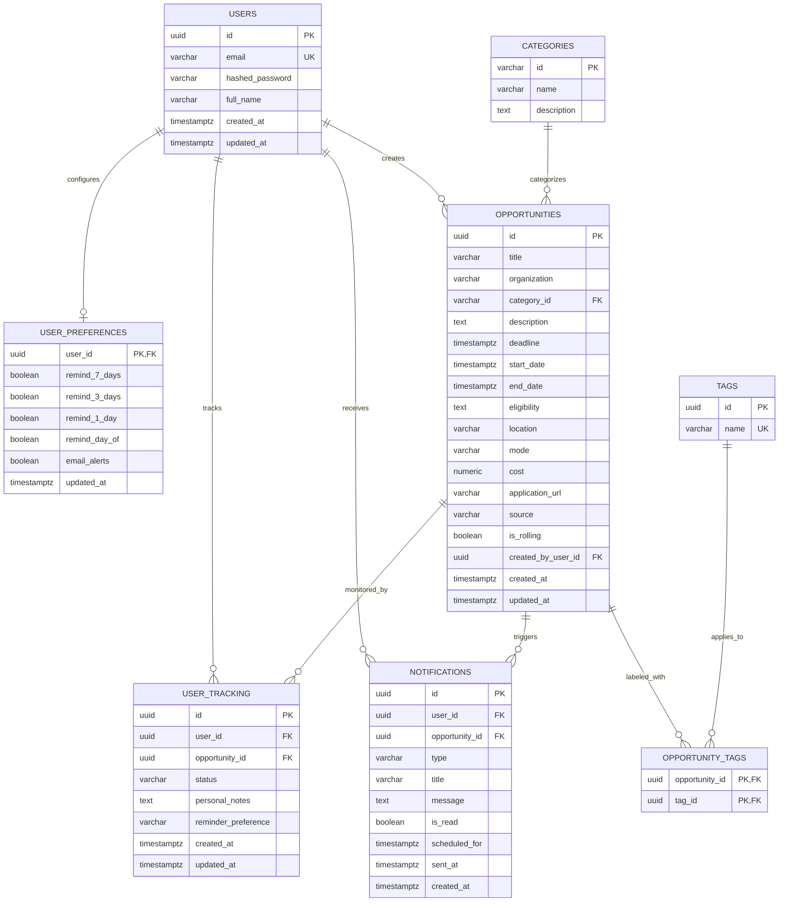

# Database Schema Specification — Deadline Radar

## Technology
- **Database Engine**: PostgreSQL 15+
- **ORM**: SQLAlchemy 2.0 (AsyncIO)
- **Migration Framework**: Alembic
- **Conventions**:
  - Table names: lowercase snake_case plural (e.g., `opportunities`, `user_tracking`).
  - Primary keys: UUID v4 (`id UUID PRIMARY KEY DEFAULT gen_random_uuid()`).
  - Timestamps: UTC (`TIMESTAMP WITH TIME ZONE NOT NULL DEFAULT timezone('utc', now())`).

---

## Entity Relationship (ER) Diagram



---

## Table Specifications

### 1. `users`
Stores registered user credentials and profiles.

| Column | Type | Constraints | Description |
| :--- | :--- | :--- | :--- |
| `id` | UUID | PRIMARY KEY, DEFAULT `gen_random_uuid()` | Unique user identifier |
| `email` | VARCHAR(255) | UNIQUE, NOT NULL | User login email |
| `hashed_password` | VARCHAR(255) | NOT NULL | Argon2id / bcrypt hashed password |
| `full_name` | VARCHAR(255) | NULLABLE | Display name of the user |
| `created_at` | TIMESTAMPTZ | NOT NULL, DEFAULT `NOW()` | Registration timestamp |
| `updated_at` | TIMESTAMPTZ | NOT NULL, DEFAULT `NOW()` | Profile update timestamp |

---

### 2. `categories`
Standardized taxonomy for opportunities.

| Column | Type | Constraints | Description |
| :--- | :--- | :--- | :--- |
| `id` | VARCHAR(50) | PRIMARY KEY | Slug (e.g., `hackathon`, `internship`) |
| `name` | VARCHAR(100) | NOT NULL | Human-readable name |
| `description` | TEXT | NULLABLE | Description of the category |

*Seed Categories*: `hackathon`, `internship`, `scholarship`, `competition`, `coding_contest`, `event`, `course`, `fellowship`.

---

### 3. `opportunities`
Core catalog of all opportunities.

| Column | Type | Constraints | Description |
| :--- | :--- | :--- | :--- |
| `id` | UUID | PRIMARY KEY, DEFAULT `gen_random_uuid()` | Opportunity identifier |
| `title` | VARCHAR(255) | NOT NULL | Opportunity title |
| `organization` | VARCHAR(255) | NOT NULL | Host entity/company |
| `category_id` | VARCHAR(50) | NOT NULL, REFERENCES `categories(id)` | Opportunity domain |
| `description` | TEXT | NULLABLE | Detailed description |
| `deadline` | TIMESTAMPTZ | NOT NULL | Application deadline (UTC) |
| `start_date` | TIMESTAMPTZ | NULLABLE | Event/internship start |
| `end_date` | TIMESTAMPTZ | NULLABLE | Event/internship end |
| `eligibility` | TEXT | NULLABLE | Criteria and restrictions |
| `location` | VARCHAR(255) | NULLABLE | City/region or "Remote" |
| `mode` | VARCHAR(50) | NOT NULL, DEFAULT `'online'` | `online`, `in_person`, `hybrid` |
| `cost` | NUMERIC(10, 2) | NOT NULL, DEFAULT `0.00` | Application or event fee |
| `application_url` | VARCHAR(2048) | NOT NULL | Link to official application page |
| `source` | VARCHAR(255) | NULLABLE | Provenance (e.g. `Devpost`, `Manual`) |
| `is_rolling` | BOOLEAN | NOT NULL, DEFAULT `FALSE` | Rolling deadline indicator |
| `created_by_user_id`| UUID | NULLABLE, REFERENCES `users(id)` | User who added the record |
| `created_at` | TIMESTAMPTZ | NOT NULL, DEFAULT `NOW()` | Creation timestamp |
| `updated_at` | TIMESTAMPTZ | NOT NULL, DEFAULT `NOW()` | Update timestamp |

---

### 4. `tags` and `opportunity_tags`
Taxonomy tags for flexible keyword filtering.

**`tags`**:
| Column | Type | Constraints | Description |
| :--- | :--- | :--- | :--- |
| `id` | UUID | PRIMARY KEY, DEFAULT `gen_random_uuid()` | Tag identifier |
| `name` | VARCHAR(50) | UNIQUE, NOT NULL | Tag label (lowercase) |

**`opportunity_tags`**:
| Column | Type | Constraints | Description |
| :--- | :--- | :--- | :--- |
| `opportunity_id` | UUID | REFERENCES `opportunities(id)` ON DELETE CASCADE | Opportunity reference |
| `tag_id` | UUID | REFERENCES `tags(id)` ON DELETE CASCADE | Tag reference |

*Primary Key*: `(opportunity_id, tag_id)`.

---

### 5. `user_tracking`
Personal radar: tracks an opportunity lifecycle for a specific user.

| Column | Type | Constraints | Description |
| :--- | :--- | :--- | :--- |
| `id` | UUID | PRIMARY KEY, DEFAULT `gen_random_uuid()` | Tracking record identifier |
| `user_id` | UUID | NOT NULL, REFERENCES `users(id)` ON DELETE CASCADE | Owner user |
| `opportunity_id` | UUID | NOT NULL, REFERENCES `opportunities(id)` ON DELETE CASCADE | Opportunity being tracked |
| `status` | VARCHAR(50) | NOT NULL, DEFAULT `'saved'` | Status enum string |
| `personal_notes` | TEXT | NULLABLE | Private notes by user |
| `reminder_preference` | VARCHAR(50) | NOT NULL, DEFAULT `'default'` | Custom reminder frequency |
| `created_at` | TIMESTAMPTZ | NOT NULL, DEFAULT `NOW()` | Time added to radar |
| `updated_at` | TIMESTAMPTZ | NOT NULL, DEFAULT `NOW()` | Time status was updated |

*Unique Constraint*: `UNIQUE (user_id, opportunity_id)`.
*Status Allowed Values*: `'saved'`, `'interested'`, `'applied'`, `'interviewing'`, `'offered'`, `'rejected'`, `'completed'`, `'archived'`.

---

### 6. `notifications`
Alerts generated for upcoming deadlines.

| Column | Type | Constraints | Description |
| :--- | :--- | :--- | :--- |
| `id` | UUID | PRIMARY KEY, DEFAULT `gen_random_uuid()` | Notification ID |
| `user_id` | UUID | NOT NULL, REFERENCES `users(id)` ON DELETE CASCADE | Recipient user |
| `opportunity_id` | UUID | NOT NULL, REFERENCES `opportunities(id)` ON DELETE CASCADE | Related opportunity |
| `type` | VARCHAR(50) | NOT NULL | Milestone (e.g. `'7_days'`, `'3_days'`, `'1_day'`, `'day_of'`) |
| `title` | VARCHAR(255) | NOT NULL | Alert title |
| `message` | TEXT | NOT NULL | Alert description |
| `is_read` | BOOLEAN | NOT NULL, DEFAULT `FALSE` | Read flag |
| `scheduled_for` | TIMESTAMPTZ | NOT NULL | Intended dispatch timestamp |
| `sent_at` | TIMESTAMPTZ | NULLABLE | Execution timestamp |
| `created_at` | TIMESTAMPTZ | NOT NULL, DEFAULT `NOW()` | Log creation |

---

### 7. `user_preferences`
User notification preferences.

| Column | Type | Constraints | Description |
| :--- | :--- | :--- | :--- |
| `user_id` | UUID | PRIMARY KEY, REFERENCES `users(id)` ON DELETE CASCADE | User reference |
| `remind_7_days` | BOOLEAN | NOT NULL, DEFAULT `TRUE` | Enable 7-day alert |
| `remind_3_days` | BOOLEAN | NOT NULL, DEFAULT `TRUE` | Enable 3-day alert |
| `remind_1_day` | BOOLEAN | NOT NULL, DEFAULT `TRUE` | Enable 1-day alert |
| `remind_day_of` | BOOLEAN | NOT NULL, DEFAULT `TRUE` | Enable day-of alert |
| `email_alerts` | BOOLEAN | NOT NULL, DEFAULT `FALSE` | Enable transactional email |
| `updated_at` | TIMESTAMPTZ | NOT NULL, DEFAULT `NOW()` | Last preference change |

---

## Indexes & Performance Tuning

```sql
-- Fast lookup on deadlines for urgency calculations and sorting
CREATE INDEX idx_opportunities_deadline ON opportunities (deadline ASC);

-- Efficient category filtering
CREATE INDEX idx_opportunities_category ON opportunities (category_id);

-- Speed up user radar queries
CREATE INDEX idx_user_tracking_user_status ON user_tracking (user_id, status);

-- Composite index for fast checking of whether user is tracking an opportunity
CREATE INDEX idx_user_tracking_lookup ON user_tracking (user_id, opportunity_id);

-- Scheduled notification polling index
CREATE INDEX idx_notifications_pending ON notifications (scheduled_for, sent_at) WHERE sent_at IS NULL;
```

---

## Important Queries

### 1. Fetch User's Urgent Deadlines (Expiring within 7 days)
```sql
SELECT 
    o.id,
    o.title,
    o.category_id,
    o.deadline,
    ut.status,
    EXTRACT(EPOCH FROM (o.deadline - NOW())) AS seconds_remaining
FROM opportunities o
JOIN user_tracking ut ON o.id = ut.opportunity_id
WHERE ut.user_id = :user_id
  AND ut.status NOT IN ('completed', 'archived', 'rejected')
  AND o.deadline BETWEEN NOW() AND (NOW() + INTERVAL '7 days')
ORDER BY o.deadline ASC;
```

### 2. Search & Filter Active Opportunities
```sql
SELECT 
    o.id, o.title, o.organization, o.category_id, o.deadline, o.mode, o.cost
FROM opportunities o
WHERE (:category IS NULL OR o.category_id = :category)
  AND (:mode IS NULL OR o.mode = :mode)
  AND (o.deadline >= NOW() OR o.is_rolling = TRUE)
ORDER BY o.deadline ASC
LIMIT :limit OFFSET :offset;
```
