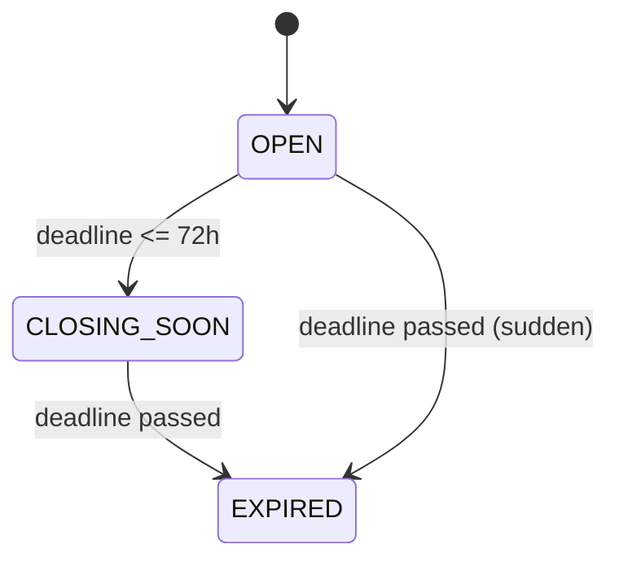
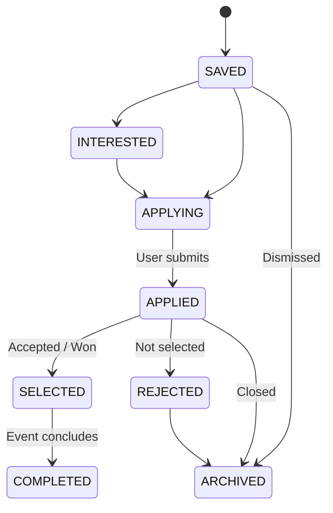

# Deadline Radar — Product Requirements Document

## 1. Product Overview

**Deadline Radar** is a centralized opportunity discovery and deadline management platform designed specifically for students, recent graduates, and early-career professionals. It solves the chronic problem of scattered, missed, and disorganized deadlines across hackathons, internships, scholarships, coding contests, fellowships, research grants, and career milestones.

The platform provides a focused, noise-free "radar" that aggregates opportunities into a unified space, tracks their end-to-end application lifecycle, highlights imminent deadlines through urgency-ranked dashboards and visual calendars, delivers proactive notifications, and leverages modular AI assistance to extract structured details from messy announcements with near-zero friction.

### Core Value Proposition
> **"Never miss a career-defining deadline again."**
> Deadline Radar transforms unstructured, overwhelming opportunity announcements into an actionable, prioritized execution pipeline so users discover, prepare for, and submit applications before time runs out.

---

## 2. Problem Statement

Ambitious students and young professionals face a barrage of high-stakes, time-sensitive opportunities distributed across dozens of uncoordinated channels:
- University bulletin boards and departmental email lists
- Student Discord servers, Slack workspaces, and WhatsApp groups
- Social media networks (LinkedIn, X/Twitter, Reddit)
- Specialized hackathon platforms (Devpost, Unstop, MLH)
- Scholarship directories, grant portals, and company career pages

While discovering opportunities is challenging, the catastrophic failure point is **execution**: remembering when submissions close, organizing requirements, prioritizing imminent deadlines, and tracking submission statuses.

### Key Pain Points
1. **Information Fragmentation**: Critical dates and application links are scattered across browser bookmarks, chat threads, and emails, leading to mental exhaustion and lost links.
2. **The "11:59 PM Blindspot"**: Users regularly remember an opportunity on the final day, only to find they lack the time needed to prepare essays, letters of recommendation, or team submissions.
3. **Status Amnesia**: When applying to dozens of opportunities, users lose track of where each application stands—whether it is bookmarked, actively being drafted, submitted, or waiting on results.
4. **Spreadsheet & Notes Fatigue**: Manual tracking in spreadsheets or generic notes apps requires high maintenance, lacks automated countdowns, and fails to alert users when a deadline approaches.
5. **High Friction Ingestion**: Copying and pasting multiple fields (deadlines, eligibility, rules, links) from lengthy announcements creates friction, leading users to abandon tracking.

---

## 3. Product Vision

Deadline Radar aspires to be the definitive **intelligent command center for career and academic milestones**.

### Guiding Product Principles
- **Signal Over Noise**: No distracting social feeds, influencer vanity metrics, or algorithmically bloated timelines. Every element serves the single goal of timely execution.
- **Action-Oriented Hierarchy**: The interface is strictly organized by urgency and actionable next steps. Imminent deadlines command attention; distant dates stay organized in the background.
- **Frictionless Capture**: Capturing an opportunity from any external source must take under 15 seconds through AI-assisted parsing and minimal manual entry.
- **Defensive Reliability**: Proximity alerts and countdowns must be infallible. System downtime or AI failures must never cause missed deadlines.
- **Applicant-Centric Privacy**: A user's application pipeline, private notes, and saved opportunities remain completely confidential and personal.

---

## 4. Target Users

### Primary Audience: College & University Students
- **Context**: Undergraduate and graduate students in STEM, business, design, and humanities.
- **Activities**: Applying for summer internships, collegiate hackathons, competitive programming contests, academic scholarships, and project showcases.
- **Behavior**: Context-switch frequently between coursework, exams, and extracurriculars; active on Discord, Telegram, and mobile devices; prone to last-minute submissions.

### Secondary Audience: Recent Graduates & Early-Career Professionals
- **Context**: Individuals within 0–3 years of university graduation or career switchers from bootcamps.
- **Activities**: Pursuing entry-level software/analyst roles, specialized fellowships, post-graduate grants, and industry certifications.
- **Behavior**: Managing structured career transitions while balancing full-time or part-time work; value high-signal organization and advance planning.

---

## 5. User Personas

### Persona A — "Aarav" (The Ambitious College Student)
- **Demographics**: 20 years old, 3rd-year Computer Science undergraduate.
- **Goals**: Secure a competitive tech internship for the upcoming summer; participate in 3 hackathons per semester; build open-source credentials.
- **Current Workflow**: Keeps 30+ browser tabs open, saves links to a messy "Starred" Slack channel, and writes reminder dates on sticky notes.
- **Critical Pain Point**: Missed the submission cutoff for a major regional hackathon by 20 minutes because he forgot the deadline was in UTC, not his local time.
- **Needs from Deadline Radar**:
  - Filter opportunities strictly by `Hackathon` and `Internship`.
  - Urgency badges highlighting deadlines closing in `<24 Hours` and `<3 Days`.
  - 1-click status update from `Saved` to `Applied`.
  - Automatic timezone conversion to local time.

### Persona B — "Maya" (The Scholarship & Fellowship Hunter)
- **Demographics**: 22 years old, final-year undergraduate applying for international master's fellowships and research grants.
- **Goals**: Win prestigious academic scholarships (e.g., Rhodes, Fulbright, DAAD) and attend academic conferences.
- **Current Workflow**: Maintains a massive Excel spreadsheet with columns for criteria, essay topics, recommendation letter contacts, and due dates.
- **Critical Pain Point**: Overwhelmed by dense 15-page PDF guidelines; struggles to extract the exact eligibility requirements and early nomination cutoffs.
- **Needs from Deadline Radar**:
  - AI extraction that pulls eligibility criteria and deadlines from unstructured grant announcements.
  - Private notes field on each saved opportunity to track essay drafts and professor recommendations.
  - Configurable notification milestones (7 days, 3 days, and 1 day prior).
  - Monthly calendar view to balance multiple application deadlines across academic quarters.

### Persona C — "Rohan" (The Minimalist Occasional User)
- **Demographics**: 24 years old, junior frontend developer seeking professional cloud certifications and selective design workshops.
- **Goals**: Track 2–3 high-priority certification exam vouchers and conference early-bird tickets per year.
- **Current Workflow**: Relies on memory and occasional Google Calendar events.
- **Critical Pain Point**: Hates bloated productivity software (Notion/Jira) that requires complex setup and recurring configuration.
- **Needs from Deadline Radar**:
  - Quick paste of an announcement link or text to auto-populate the record.
  - Simple, clean dashboard with zero required onboarding overhead.
  - Reliable reminder alerts before voucher expiry.

---

## 6. User Problems

| Problem Code | Problem Name | Description | User Impact |
| :--- | :--- | :--- | :--- |
| **UP-01** | Multi-Platform Fragmentation | Opportunities originate across unlinked platforms (Discord, Slack, LinkedIn, email, college portals). | High cognitive switching costs, forgotten URLs, missed opportunities. |
| **UP-02** | Timezone Confusion | Contests publish deadlines in UTC, PST, EST, or AoE (Anywhere on Earth) without clarity. | Submissions attempted after the window has closed; disqualification. |
| **UP-03** | Data Entry Friction | Manually typing title, host, deadline, eligibility, cost, and links takes minutes per item. | Users give up on tracking and fall back to fragile browser tabs. |
| **UP-04** | Lack of Pipeline Tracking | No clear visibility into whether an application has been submitted, shortlisted, or rejected. | Duplicate submissions, neglected followup steps, and lost momentum. |
| **UP-05** | Sudden Expiry Surprises | Spreadsheets lack active, scheduled proximity alerts. | Users realize a deadline has arrived only hours before closing with insufficient time to complete materials. |

---

## 7. Product Goals

1. **Centralized Visibility**: Provide a single, consolidated radar for discovering, tracking, and prioritizing all time-sensitive opportunities.
2. **Zero Missed Deadlines**: Reduce the incidence of forgotten or missed deadlines for tracked opportunities to zero through automated urgency bucketing and timely proximity alerts.
3. **Frictionless Ingestion**: Enable users to capture any raw opportunity announcement via AI-assisted extraction in under 15 seconds.
4. **Actionable Prioritization**: Present an intuitive urgency hierarchy on the dashboard (<24 hours, <3 days, <7 days) that immediately answers: *"What do I need to work on today?"*
5. **Complete Lifecycle Management**: Support seamless status transitions from initial bookmark (`Saved`) to active preparation (`Applying`), submission (`Applied`), and final resolution (`Selected` / `Completed` / `Archived`).

---

## 8. Non-Goals

To maintain discipline and deliver a focused, high-value product, the following features are explicitly **out of scope**:
- **Not an Applicant Tracking System (ATS) for Employers**: Deadline Radar is strictly candidate-centric. It will not provide recruiter dashboards, candidate evaluation scoring, or employer job posting management.
- **Not a Social Network**: No public profiles, followers, likes, comments, or activity feeds. The platform is a personal productivity tool, not a social forum.
- **Not a General-Purpose Calendar**: Deadline Radar provides dedicated deadline timelines, but will not seek to replace Google Calendar, Apple Calendar, or Outlook for daily meeting scheduling.
- **No Automated Application Submission**: The platform will not auto-fill external application forms, bypass captchas, or submit applications on behalf of the user.
- **No Unvetted Web-Wide Web Scraping Engine**: The system will not perform brute-force scraping of arbitrary websites. Discovery will rely on curated seed listings, verified feeds, and user-initiated inputs.
- **No Native Mobile App in Initial Release**: A responsive web application (SPA) optimized for mobile browsers is sufficient for initial launch.

---

## 9. MVP Scope

The Minimum Viable Product (MVP) is strictly scoped to deliver the core value proposition: **discovering, organizing, prioritizing, and acting on opportunities before their deadlines**.

### Feature Prioritization Table

| Feature Area | Feature Description | MVP | Later | Reason for Prioritization |
| :--- | :--- | :---: | :---: | :--- |
| **Authentication** | Email/Password Registration & Login | **Yes** | — | Required to maintain private user radar and tracking records. |
| **Authentication** | OAuth2 Social Login (Google / GitHub) | — | **Later** | Email/password is sufficient for MVP; OAuth adds provider setup complexity. |
| **User Preferences** | Category interests & notification flags | **Yes** | — | Essential for pre-filtering feeds and configuring alert triggers. |
| **Opportunity Catalog** | Browse active public opportunities | **Yes** | — | Core discovery mechanism. |
| **Opportunity Details** | Full detail view (title, org, deadline, eligibility, URL) | **Yes** | — | Users need complete context before saving or applying. |
| **Opportunity Ingestion** | Manual creation form | **Yes** | — | Baseline fail-safe capture mechanism. |
| **Opportunity Ingestion** | AI-assisted extraction (paste raw text/URL) | **Yes** | — | Dramatically lowers capture friction; core competitive differentiator. |
| **Search** | Keyword & tag multi-attribute search | **Yes** | — | Fast lookup of relevant opportunities. |
| **Search** | Semantic / Vector Natural Language Search | — | **Later** | Keyword search handles the catalog size efficiently; semantic search requires vector DB. |
| **Filtering & Sorting** | Filter by Category, Mode, Cost, Deadline Proximity | **Yes** | — | Critical for eliminating irrelevant noise. |
| **Personal Radar** | Save / Bookmark opportunity | **Yes** | — | Primary user interaction. |
| **Application Tracking** | Lifecycle statuses (`Saved` through `Archived`) | **Yes** | — | Core tracking value proposition. |
| **Personal Notes** | Private checklist / notes per tracked item | **Yes** | — | Critical for tracking requirements like essays and recommendation letters. |
| **Deadline Dashboard** | Urgency buckets (<24h, <3d, <7d, Overdue) | **Yes** | — | Core prioritization interface answering "what's next". |
| **Calendar View** | Monthly & weekly deadline grid | **Yes** | — | High-value spatial planning visualization. |
| **Calendar Sync** | iCal / Google Calendar `.ics` subscription feed | — | **Later** | In-app calendar satisfies MVP; export feed is a fast follow-up. |
| **Notifications** | In-app notification center & badge alerts | **Yes** | — | Eliminates external email infrastructure dependency while proving alert logic. |
| **Notifications** | Transactional Email alerts (Resend / SES) | — | **Later** | Requires email reputation, bounce management, and SMTP infrastructure. |
| **Notifications** | Discord / Telegram / WhatsApp bots | — | **Later** | Third-party bot integration deferred to ecosystem phase. |
| **AI Features** | Structured entity extraction from messy text | **Yes** | — | Core MVP requirement for low-friction ingestion. |
| **AI Features** | Taxonomy classification & 2-sentence summary | **Yes** | — | Delivers immediate structured readability for user submissions. |
| **AI Features** | Resume matching & personalized recommendation scoring | — | **Later** | Requires comprehensive user profile data and ML scoring models. |
| **Data Ingestion** | Automated crawlers for student platforms (Devpost, Unstop) | — | **Later** | Initial catalog will be seeded manually and grow through user submissions. |
| **Data Ingestion** | Browser capture extension | — | **Later** | Web app quick-paste modal is sufficient for MVP. |
| **Deduplication** | URL exact-match and normalized title matching | **Yes** | — | Prevents obvious duplicate records in the catalog. |
| **Deduplication** | Fuzzy embedding-based semantic entity resolution | — | **Later** | Exact matching is sufficient for MVP scale. |

---

## 10. Feature Requirements

### 10.1 Authentication & User Session
- **FR-AUTH-1**: Users must be able to register with email, password (minimum 8 characters with complexity checks), and full name.
- **FR-AUTH-2**: Users must be able to log in and receive an authenticated session token.
- **FR-AUTH-3**: The system must secure all private user endpoints (Radar, Tracking, Notes, Preferences, Notifications) behind authentication.
- **FR-AUTH-4**: Users must be able to log out, terminating their authenticated session.

### 10.2 Public Opportunity Catalog & Discovery
- **FR-CAT-1**: The system must display a catalog of all public, non-expired opportunities.
- **FR-CAT-2**: Each opportunity card in the catalog must display Title, Organization, Category badge, Delivery Mode, Cost badge, Application Deadline (converted to user local timezone), and Time Remaining countdown.
- **FR-CAT-3**: Users must be able to filter the catalog by Category, Delivery Mode (`Online`, `In-Person`, `Hybrid`), Cost (`Free`, `Paid`), and Deadline Range (`<24 Hours`, `<3 Days`, `<7 Days`, `<30 Days`).
- **FR-CAT-4**: Users must be able to sort the catalog by Deadline (Urgent First - default), Recently Added, or Title.
- **FR-CAT-5**: The catalog must paginate results (20–30 items per page) with low-latency response.

### 10.3 Opportunity Details
- **FR-DET-1**: Clicking an opportunity card must open a detailed profile showing all structured attributes:
  - Full title and organization
  - Category and keyword tags
  - Exact deadline timestamp in both UTC and user local timezone
  - Start and end dates (if applicable)
  - Full description and eligibility criteria
  - Delivery mode and physical location (or "Remote")
  - Cost / Registration fee (or "Free")
  - Source attribution (e.g. "Devpost", "User Submission")
  - Direct "Apply Now" button launching official URL in a new browser tab
  - 1-click "Save to Radar" toggle button

### 10.4 Personal Radar & Lifecycle Tracking
- **FR-TRK-1**: Authenticated users can save any opportunity to their personal radar with a single click.
- **FR-TRK-2**: Saved opportunities default to status `SAVED`.
- **FR-TRK-3**: Users must be able to update their tracking status at any time through a dropdown selector:
  - `SAVED`: Bookmarked for evaluation.
  - `INTERESTED`: Prioritized; intending to submit.
  - `APPLYING`: Actively preparing application materials.
  - `APPLIED`: Application officially submitted.
  - `SELECTED`: Accepted, offered, or won.
  - `REJECTED`: Application denied or not shortlisted.
  - `COMPLETED`: Participation concluded.
  - `ARCHIVED`: Dismissed or hidden from active views.
- **FR-TRK-4**: Users can add, edit, and delete private markdown notes on any tracked opportunity.
- **FR-TRK-5**: Users can remove an opportunity from their personal radar (deletes tracking record and private notes).

### 10.5 Deadline Dashboard
- **FR-DSH-1**: The dashboard must serve as the user's primary landing view after authentication.
- **FR-DSH-2**: The dashboard must display an **Urgent Radar** section categorizing tracked opportunities into three distinct urgency tiers:
  - `Immediate (<24 Hours)`: Red highlight with live countdown clock.
  - `Imminent (<3 Days)`: Amber highlight with remaining hours/days.
  - `Upcoming (<7 Days)`: Yellow highlight.
- **FR-DSH-3**: The dashboard must display an **In-Progress Applications** section listing opportunities currently marked as `APPLYING` or `APPLIED`.
- **FR-DSH-4**: The dashboard must display an **Overdue Reconciliation** section for opportunities whose deadline has passed while still marked as `SAVED`, `INTERESTED`, or `APPLYING`, prompting the user to update their status.
- **FR-DSH-5**: Quick actions must allow users to update status or launch the application URL directly from the dashboard cards.

### 10.6 Calendar View
- **FR-CAL-1**: The system must provide a monthly and weekly grid calendar displaying deadlines.
- **FR-CAL-2**: Calendar event chips must display the opportunity title, category color code, and user tracking status indicator.
- **FR-CAL-3**: Clicking an event chip on the calendar must open a quick-preview modal with full details and direct action buttons.
- **FR-CAL-4**: Users can navigate forward and backward between months/weeks and jump to "Today".

### 10.7 AI-Assisted Quick Capture
- **FR-AI-1**: The system must provide a "+ Add Opportunity" modal allowing users to paste raw announcement text (up to 10,000 characters) or a target URL.
- **FR-AI-2**: The AI extraction pipeline must parse the unstructured input and return a validated structured draft containing: Title, Organization, Category, Deadline (UTC), Start/End Dates, Eligibility, Location, Delivery Mode, Cost, Official URL, Tags, and a 2-sentence Summary.
- **FR-AI-3**: The user must be presented with the parsed fields in an editable verification form before persisting.
- **FR-AI-4**: If the AI cannot detect a deadline with high confidence, it must leave `deadline` empty and require the user to input a date manually before saving.
- **FR-AI-5**: If the AI service fails or times out, the system must gracefully switch to a clean manual entry form with the user's pasted text preserved.

### 10.8 In-App Notification Center
- **FR-NOT-1**: The system must schedule notifications for tracked opportunities at 4 milestone triggers:
  - 7 days before deadline (168 hours prior)
  - 3 days before deadline (72 hours prior)
  - 1 day before deadline (24 hours prior)
  - Day-of deadline (morning at 08:00 user local time or 12 hours prior)
- **FR-NOT-2**: Notifications must be delivered to an in-app notification drawer with an unread badge counter.
- **FR-NOT-3**: Clicking a notification must mark it as read and navigate directly to the target opportunity.
- **FR-NOT-4**: Users can "Mark All as Read".
- **FR-NOT-5**: If a user updates an opportunity's status to `APPLIED`, `ARCHIVED`, or `REJECTED`, future pending deadline reminders for that opportunity must be automatically suppressed.

---

## 11. User Stories

| ID | As a... | I want to... | So that... | Acceptance Reference |
| :--- | :--- | :--- | :--- | :--- |
| **US-01** | Student | Filter the catalog by category (`Hackathon`) and mode (`Online`) | I can find hackathons I can attend from home without travel costs. | AC-02 |
| **US-02** | Student | Save an opportunity to my personal radar | I don't lose the link or forget to apply. | AC-04 |
| **US-03** | Applicant | Update an opportunity's status to `APPLIED` | My dashboard reflects that I have finished my submission. | AC-05 |
| **US-04** | User | View all my upcoming deadlines on a monthly calendar grid | I can visualize clusters of deadlines and plan my study/project schedule. | AC-07 |
| **US-05** | Busy Student | See an urgency section with countdowns for deadlines closing in `<3 Days` | I know exactly what needs my immediate attention today. | AC-06 |
| **US-06** | User | Paste a raw Discord/Slack announcement into the AI capture box | The system automatically fills out the deadline, title, and link without manual typing. | AC-08 |
| **US-07** | Scholarship Hunter | Record private notes and checklist items on a saved scholarship | I can track my essay drafts, required transcripts, and recommendation requests. | AC-04 |
| **US-08** | User | Receive an in-app reminder 3 days and 1 day before a deadline | I have sufficient notice to complete my submission before the portal closes. | AC-09, AC-10 |
| **US-09** | User | Search for opportunities by keywords like "Python" or "Sustainability" | I can discover contests specifically aligned with my skills and interests. | AC-11 |
| **US-10** | User | View deadlines in my local timezone regardless of how they were announced | I never miss an 11:59 PM deadline due to UTC or EST confusion. | AC-12 |
| **US-11** | User | Configure my notification preferences to disable 7-day alerts | I only receive urgent 3-day, 1-day, and day-of reminders. | AC-09 |
| **US-12** | User | Reconcile overdue opportunities on my dashboard | My radar stays clean and I can mark whether I applied or missed it. | AC-05, AC-06 |

---

## 12. User Flows

### Flow 1: New User Onboarding & First Save
```text
[ Visit Landing Page ]
         │
         ▼
[ Register: Email, Password, Name ]
         │
         ▼
[ Initial Preference Modal: Select 3+ Categories of Interest ]
         │
         ▼
[ Browse Filtered Discovery Feed ]
         │
         ▼
[ Click Opportunity Card -> Review Profile ]
         │
         ▼
[ Click "Save to Radar" ]
         │
         ▼
[ Toast: "Saved to Radar! Added to your Dashboard & Calendar" ]
         │
         ▼
[ Navigate to Dashboard -> Opportunity visible under Urgency Tier ]
```

### Flow 2: Quick Capture via AI Ingestion
```text
[ User finds contest announcement on Discord/X ]
         │
         ▼
[ Opens Deadline Radar -> Clicks "+ Add Opportunity" ]
         │
         ▼
[ Pastes raw text snippet or announcement URL ]
         │
         ▼
[ Clicks "Extract with AI" ]
         │
         ▼
[ Loading Spinner (2-5s) with progress message ]
         │
         ▼
[ Verification Form Opens with Pre-filled Fields:
  - Title, Org, Category, Deadline (UTC), URL, Eligibility, Summary ]
         │
         ▼
[ User reviews & makes any minor corrections (e.g. adjusts category) ]
         │
         ▼
[ Clicks "Confirm & Save to Radar" ]
         │
         ▼
[ Opportunity Persisted -> Tracked as "Saved" -> Reminders Scheduled ]
```

### Flow 3: Daily Radar Review & Application Execution
```text
[ User opens Dashboard ]
         │
         ▼
[ Inspects "Urgent Radar (<24h / <3d)" ]
         │
         ▼
[ Identifies high-priority opportunity: "Closing in 18 Hours" ]
         │
         ▼
[ Clicks "Apply Now" -> Official application portal opens in new tab ]
         │
         ▼
[ User completes and submits application externally ]
         │
         ▼
[ Returns to Deadline Radar tab ]
         │
         ▼
[ Changes Status dropdown to "APPLIED" ]
         │
         ▼
[ Opportunity moves from "Urgent Radar" to "Active Applications" ]
         │
         ▼
[ Pending urgent reminders for this opportunity are canceled ]
```

### Flow 4: Overdue Opportunity Reconciliation
```text
[ Deadline elapses while Opportunity is still in "SAVED" or "APPLYING" ]
         │
         ▼
[ System flags record in "Overdue Reconciliation" on Dashboard ]
         │
         ▼
[ User sees prompt: "Deadline for [Title] has passed. Did you submit?" ]
         │
    ┌────┴──────────────────────────┐
    ▼                               ▼
[ Clicks "Yes, I Applied" ]     [ Clicks "Did Not Apply / Archive" ]
    │                               │
    ▼                               ▼
[ Status -> "APPLIED" ]         [ Status -> "ARCHIVED" ]
    │                               │
    └───────────────┬───────────────┘
                    ▼
[ Dashboard counts update; item removed from urgent view ]
```

---

## 13. Opportunity Data Model

The following conceptual specification defines every attribute of an Opportunity entity. *(Note: This represents product domain modeling, not raw database SQL).*

| Attribute | Purpose | Required / Optional | Expected Format / Type | Example Value |
| :--- | :--- | :---: | :--- | :--- |
| **`id`** | Unique entity identifier | **Required** | UUID v4 string | `"d3b07384-d113-496e-a3ba-87b64a4b1234"` |
| **`title`** | Clear, concise name of the opportunity | **Required** | String (3 to 255 chars) | `"HackMIT 2026"` |
| **`organization`** | Entity hosting or sponsoring the opportunity | **Required** | String (2 to 255 chars) | `"Massachusetts Institute of Technology"` |
| **`category`** | Standardized taxonomy classification | **Required** | String (enum slug) | `"hackathon"` |
| **`description`** | Detailed overview and objectives | Optional | Markdown / Plain text | `"Premier 24-hour undergraduate hackathon..."` |
| **`deadline`** | Final cutoff for applications or submissions | **Required** | ISO 8601 UTC timestamp | `"2026-10-15T23:59:59Z"` |
| **`start_date`** | Event commencement or program start date | Optional | ISO 8601 UTC timestamp | `"2026-11-05T09:00:00Z"` |
| **`end_date`** | Event conclusion or program end date | Optional | ISO 8601 UTC timestamp | `"2026-11-07T18:00:00Z"` |
| **`eligibility`** | Candidate criteria, grade levels, restrictions | Optional | Text / Markdown bullets | `"Enrolled undergraduates worldwide; 18+ years"` |
| **`location`** | Physical city/country or "Remote" | Optional | String | `"Cambridge, MA, USA"` or `"Remote"` |
| **`mode`** | Format of participation | **Required** | Enum: `online`, `in_person`, `hybrid` | `"in_person"` |
| **`cost`** | Registration or application fee (0 if free) | **Required** | Decimal numeric (`0.00` if free) | `0.00` |
| **`application_url`** | Official direct link to apply or register | **Required** | Valid HTTPS URL (max 2048 chars) | `"https://hackmit.org/apply"` |
| **`source`** | Provenance of the listing | Optional | String | `"Devpost"`, `"Manual"`, `"AI-Parser"` |
| **`is_rolling`** | Indicates rolling deadline / no hard cutoff | **Required** | Boolean (`true` / `false`) | `false` |
| **`tags`** | Keyword tags for filtering and indexing | Optional | Array of lowercase strings | `["hackathon", "ai", "hardware", "mit"]` |
| **`summary`** | AI-generated 2-sentence executive summary | Optional | String (max 500 chars) | `"Flagship MIT hackathon for student builders..."` |
| **`created_by_user_id`** | User who contributed this opportunity | Optional | UUID v4 (null if system-seeded) | `"usr_9b1deb4d-3b7d-4bad-9bdd-2b0d7b3dcb6d"` |
| **`created_at`** | Entity creation audit timestamp | **Required** | ISO 8601 UTC timestamp | `"2026-09-19T14:30:00Z"` |
| **`updated_at`** | Last update audit timestamp | **Required** | ISO 8601 UTC timestamp | `"2026-09-19T14:30:00Z"` |

---

## 14. Dashboard Requirements

The dashboard is the nerve center of Deadline Radar. It answers the fundamental question: **"What must I prioritize and act on right now?"**

### Information Hierarchy & Layout Structure

```text
┌────────────────────────────────────────────────────────────────────────┐
│  METRICS BAR: [ 2 Closing <24h ] [ 5 Closing <3d ] [ 8 In Progress ]   │
├────────────────────────────────────────────────────────────────────────┤
│  URGENT RADAR (Prioritized by ascending deadline)                     │
│  ┌─────────────────────────┐  ┌─────────────────────────┐              │
│  │ HackMIT 2026            │  │ Jane Street Fellowship  │              │
│  │ [Hackathon] [In-Person] │  │ [Fellowship] [Remote]   │              │
│  │ ⏳ Closes in: 14h 22m    │  │ ⏳ Closes in: 2d 11h    │              │
│  │ Status: APPLYING        │  │ Status: SAVED           │              │
│  │ [Apply Now] [Update]    │  │ [Apply Now] [Update]    │              │
│  └─────────────────────────┘  └─────────────────────────┘              │
├────────────────────────────────────────────────────────────────────────┤
│  OVERDUE RECONCILIATION (Actions requiring user status update)         │
│  ⚠️ Google Summer of Code (Deadline was yesterday) -> [Applied?] [Archive]│
├────────────────────────────────────────────────────────────────────────┤
│  ACTIVE APPLICATIONS PIPELINE (Status = Applying | Applied)            │
│  - Meta University Internship (Applied on Sep 12) -> [Interviewing?]   │
│  - Palantir Women in Tech Grant (Applying) -> Due Oct 1                │
├────────────────────────────────────────────────────────────────────────┤
│  RECOMMENDED FOR YOU (Based on preferred categories)                  │
│  - ETHGlobal Hackathon (New) · Due Oct 24                              │
└────────────────────────────────────────────────────────────────────────┘
```

### Dashboard Capabilities
1. **Urgency Badges & Visual Signals**:
   - `<24 Hours`: Pulse animation, high-contrast critical red badge with live countdown.
   - `<3 Days`: High-visibility amber warning badge.
   - `<7 Days`: Noticeable yellow proximity badge.
2. **One-Click Quick Actions**:
   - `Apply Now`: Directly opens the official URL in a new tab without opening modals.
   - `Status Quick-Select`: Change status directly from the card (e.g. move to `Applied`).
   - `Notes Drawer`: Expandable mini-tray to jot down quick notes without navigating away.
3. **Filter Toggle on Dashboard**: Filter dashboard cards by category or search term to isolate specific domains.

---

## 15. Discovery Requirements

The Discovery Feed allows users to explore active, curated opportunities across the entire platform ecosystem.

### Discovery Feed Specifications
- **Default View**: Public, open opportunities whose `deadline >= NOW()` or `is_rolling == true`, ordered by urgency (`deadline ASC`).
- **Personalized Default**: For logged-in users with saved preferences, the feed defaults to opportunities matching their selected preferred categories.
- **Card Anatomy**:
  - Title and Host Organization
  - Category Badge (color-coded by domain)
  - Participation Mode (`Online`, `In-Person`, `Hybrid`)
  - Cost Badge (`Free` or `$XX.XX`)
  - Deadline Badge with relative countdown (e.g., `"in 5 days"`) and absolute local date
  - 2-Sentence AI Summary preview
  - Keyword tag pills
  - Primary Action: `Save to Radar` (toggles to `Saved` with icon fill)
- **Pagination**: 24 items per page with smooth cursor/offset pagination.

---

## 16. Saved Opportunities (Personal Radar)

The **My Radar** page provides complete management over all opportunities saved or tracked by the authenticated user.

### Radar Management Specifications
- **View Tabs**:
  - `All Tracked` (Complete list of non-archived saved items)
  - `Saved / Considering` (`status == SAVED` or `INTERESTED`)
  - `Applying / Drafting` (`status == APPLYING`)
  - `Submitted` (`status == APPLIED` or `INTERVIEWING`)
  - `Outcomes` (`status == SELECTED` or `REJECTED` or `COMPLETED`)
  - `Archive` (`status == ARCHIVED`)
- **Card & Table Views**: User can toggle between high-density Table View and visual Card Grid.
- **Inline Editing**: Users can edit personal notes, update status, or adjust reminder preferences inline without page reloads.
- **Bulk Operations**: Multi-select opportunities to batch update status or bulk-archive.

---

## 17. Application Tracking

A critical architectural distinction is maintained between an **Opportunity's Global Lifecycle** and a **User's Personal Application Lifecycle**.

### 17.1 Opportunity Status (System / Global)
Represents the objective, public state of the opportunity itself:
- `OPEN`: Deadline is in the future (`deadline > NOW() + 72h`).
- `CLOSING_SOON`: Deadline is within 72 hours (`NOW() < deadline <= NOW() + 72h`).
- `EXPIRED`: Deadline timestamp has elapsed (`deadline <= NOW()`).



### 17.2 User Application Status (Personal Radar)
Represents the user's subjective, personal pipeline stage:
- `SAVED`: Bookmarked for later review.
- `INTERESTED`: Qualified; high intent to submit.
- `APPLYING`: Actively working on submission materials.
- `APPLIED`: Application officially submitted.
- `SELECTED`: Accepted, awarded, or offered.
- `REJECTED`: Application denied or rejected.
- `COMPLETED`: Event attended or project completed.
- `ARCHIVED`: Dismissed or hidden from active dashboard.



---

## 18. Notifications

Deadline Radar provides proactive proximity alerts to ensure users take action before submission cutoffs.

### 18.1 Notification Milestones
1. **7 Days Prior (168 Hours)**: *Early Warning* — Prompts user to begin drafting essays or forming teams.
2. **3 Days Prior (72 Hours)**: *Action Required* — Reminds user to finalize drafts and request letters.
3. **1 Day Prior (24 Hours)**: *Urgent Cutoff* — Warns user that only 24 hours remain.
4. **Day-of (Morning Alert)**: *Final Call* — Fired at 08:00 user local time (or 6 hours prior if deadline is noon) to ensure submission before the portal closes.

### 18.2 Delivery Channels
- **MVP Channel**: **In-App Notification Center**.
  - Dropdown bell icon with unread badge counter.
  - Notification items contain: Opportunity Title, Urgency Indicator, Time Remaining, and a 1-click button to view/apply.
  - Mark as read / Mark all as read.
- **Post-MVP Channels**:
  - Transactional Email (Resend / AWS SES) with customizable daily digest or instant alert.
  - Web Push notifications for desktop and mobile browsers.
  - Third-party webhooks (Discord channel, Telegram bot).

### 18.3 Notification Intelligence & Rules
- **Automatic Suppression**: If an opportunity is moved to `APPLIED`, `SELECTED`, `REJECTED`, or `ARCHIVED`, all pending future notifications for that opportunity are canceled immediately.
- **Duplicate Prevention**: The notification scheduler guarantees at-most-once delivery per milestone per user per opportunity.
- **Deadline Modification**: If an opportunity deadline is extended or updated, pending notification timestamps are recomputed automatically.

---

## 19. AI Features

Deadline Radar integrates modular AI to solve the hardest friction point in opportunity tracking: **converting chaotic, unstructured text into structured, actionable records**.

### 19.1 MVP AI Capabilities

#### Feature A: Unstructured Information Extraction
- **User Problem**: Manually typing title, host, deadline, eligibility, cost, and links from announcements is tedious.
- **Input**: Raw text snippet (e.g., copied from Discord, Slack, email) or target URL HTML.
- **Output**: Typed, structured JSON payload:
  - `title`, `organization`, `category`, `deadline` (ISO 8601 UTC), `start_date`, `end_date`, `eligibility`, `location`, `mode`, `cost`, `application_url`, `tags`, `summary`.
- **Why AI is Useful**: Announcements have no uniform format. Only an LLM can reliably parse ambiguous date expressions like *"Submissions close next Sunday at 11:59 PM EST"*.
- **Expected Behavior**: Extracts fields with >90% accuracy; identifies timezone offsets and converts to UTC.
- **Failure Cases**: Ambiguous dates (e.g., "Deadline: End of month"), missing organization names.
- **Graceful Fallback**: Sets uncertain fields to `null`, presents draft to user in an editable form, and flags `deadline` as required before saving.
- **Scope**: **Included in MVP**.

#### Feature B: Taxonomy Classification
- **User Problem**: Announcements rarely use consistent category names (e.g., "Code Jam", "Sprint", "Championship").
- **Input**: Extracted opportunity title and description.
- **Output**: Best-fit category from the 13 defined taxonomy categories.
- **Why AI is Useful**: Normalizes arbitrary naming conventions into a clean taxonomy.
- **Scope**: **Included in MVP**.

#### Feature C: Executive Summarization
- **User Problem**: Users do not have time to read 2,000 words of contest guidelines just to determine relevance.
- **Input**: Raw announcement text.
- **Output**: A crisp 2-sentence summary and 3 bulleted requirement highlights.
- **Scope**: **Included in MVP**.

### 19.2 Post-MVP AI Capabilities (Deferred)
- **Semantic Vector Search**: Natural language query matching ("remote ML hackathons with cash prizes").
- **Personalized Fit Scoring**: Matching user profile/resume keywords against opportunity requirements to generate a "Match Score (e.g. 94%)".
- **Cross-Source Fuzzy Deduplication**: Using dense vector cosine similarity to detect matching opportunities submitted under different titles.
- **Deadline Change Detection**: Background agent that periodically checks official URLs to flag postponed or extended deadlines.

---

## 20. Search

### 20.1 MVP Search Requirements
- **Search Type**: Multi-field keyword and attribute search.
- **Target Fields**: Searched simultaneously across:
  - `title` (weighted highest)
  - `organization`
  - `tags`
  - `description`
- **Behavior**:
  - Case-insensitive substring matching.
  - Multi-term AND matching (e.g., `"Google Python"` finds opportunities containing both terms).
  - Debounced input (300ms) for responsive search-as-you-type.
  - Highlighting of matching keywords in result snippets.
- **Scope**: **MVP Core Feature**.

### 20.2 Post-MVP Search Requirements
- **Semantic Search**: Embedding-based vector search allowing natural conversational queries (e.g., *"scholarships for women in STEM who want to study in Europe"*).

---

## 21. Filtering and Sorting

### 21.1 Filter Attributes
1. **Category**: Multi-select filter across all 13 taxonomy domains (e.g., `Hackathon`, `Internship`, `Scholarship`).
2. **Delivery Mode**: Single/Multi-select: `Online`, `In-Person`, `Hybrid`.
3. **Cost**: Binary or tiered: `Free`, `Paid (Has Fee)`.
4. **Deadline Proximity**:
   - `Closing in <24 Hours`
   - `Closing in <3 Days`
   - `Closing in <7 Days`
   - `Closing in <30 Days`
   - `Rolling Deadlines`
5. **Tracking Status** (Applicable to My Radar): Multi-select across `Saved`, `Interested`, `Applying`, `Applied`, `Selected`, `Rejected`, `Completed`, `Archived`.

### 21.2 Sorting Options
1. **Urgency: Earliest Deadline First** (`deadline ASC`) — *Default across catalog and dashboard*.
2. **Recently Added** (`created_at DESC`).
3. **Deadline: Furthest First** (`deadline DESC`).
4. **Alphabetical: Organization** (`organization ASC`).
5. **Alphabetical: Title** (`title ASC`).

---

## 22. User Preferences

Deadline Radar respects user privacy and collects only the minimal data required to personalize the experience and trigger notifications.

### Preference Fields
- **Preferred Categories**: Multi-select array of categories of interest (used to pre-filter discovery feeds and dashboard recommendations).
- **Notification Milestone Toggles**:
  - `remind_7_days`: Boolean (default `true`).
  - `remind_3_days`: Boolean (default `true`).
  - `remind_1_day`: Boolean (default `true`).
  - `remind_day_of`: Boolean (default `true`).
- **User Local Timezone**: IANA Timezone string (e.g., `"America/New_York"`, `"Asia/Kolkata"`, `"Europe/London"`), auto-detected on registration with manual override option.
- **Data Minimization Principle**: The system **will not** collect unnecessary personal data such as phone numbers, birthdates, GPAs, or resumes in the MVP.

---

## 23. Authentication

### 23.1 Authentication Architecture & Experience
- **Registration**: Email address, password, full name. Verification password strength validation.
- **Login**: Email and password. Returns JWT session token.
- **Session Management**: Authenticated requests transmit Bearer token in the `Authorization` header (or secure HttpOnly cookie).
- **Password Hygiene**: Passwords hashed using industry-standard modern algorithms (Argon2id or bcrypt); never logged or stored in plain text.
- **Unauthenticated Access**: Visitors can browse public catalog opportunities; saving, tracking, notes, dashboard, and notifications require login.

---

## 24. Functional Requirements

- **FR-01**: The system must persist opportunities with mandatory fields: `title`, `organization`, `category`, `deadline` (UTC), `mode`, `cost`, `application_url`.
- **FR-02**: The system must enforce that `deadline` is a valid ISO 8601 UTC timestamp and is indexed for high-performance range queries.
- **FR-03**: The system must provide endpoints to retrieve urgent deadlines partitioned into `<24h`, `<3d`, and `<7d` buckets relative to `NOW()`.
- **FR-04**: The system must support atomic transitions between user tracking lifecycle statuses.
- **FR-05**: The system must allow users to associate private text notes with any tracked opportunity.
- **FR-06**: The system must provide a calendar view API returning opportunities grouped by date for any given month/year window.
- **FR-07**: The system must support keyword search across `title`, `organization`, and `tags` with sub-100ms query execution.
- **FR-08**: The system must parse unstructured announcement text via an AI service facade and return validated opportunity drafts.
- **FR-09**: The system must reject duplicate submissions sharing an identical `application_url`.
- **FR-10**: The system must dispatch scheduled in-app notifications at 7d, 3d, 1d, and day-of intervals based on user preferences.
- **FR-11**: The system must maintain an audit log of creation and update timestamps on all core entities.

---

## 25. Non-Functional Requirements

### 25.1 Performance
- **Catalog & Dashboard Queries**: 95% of listing and dashboard API requests must complete in `<150ms` for standard page sizes (20–50 items).
- **AI Extraction Latency**: End-to-end AI text extraction must complete in `<5.0s` for snippets up to 5,000 characters.
- **Search Execution**: Keyword query responses must return in `<100ms`.

### 25.2 Reliability & Availability
- **System Uptime Target**: 99.5% uptime for the web application and core REST API.
- **Graceful Degradation**: If the AI extraction service experiences downtime or timeouts, the manual creation form must remain 100% functional. Core tracking and reminders must not depend on AI availability.

### 25.3 Security & Privacy
- **Transport Security**: 100% of communication over TLS 1.3 / HTTPS.
- **Credential Hygiene**: Zero hardcoded secrets, API tokens, or database passwords in the repository.
- **Data Isolation**: User tracking records, private notes, and notification logs must be strictly isolated per `user_id` with enforced database foreign keys and authorization checks.
- **Injection Defense**: All database queries must use parameterized SQLAlchemy ORM statements; all user HTML inputs must be sanitized.

### 25.4 Accessibility & Responsiveness
- **Accessibility**: UI elements must adhere to WCAG 2.1 AA contrast ratios, provide keyboard focus indicators, and support screen-reader aria labels.
- **Responsiveness**: Fully responsive layouts across Mobile (375px+), Tablet (768px+), and Desktop (1024px+).

---

## 26. Edge Cases

### 26.1 Deadline Edge Cases
- **Date Without Explicit Time**: Announcements stating *"Deadline: October 15, 2026"* without a timestamp must default to `23:59:59` in the opportunity's local timezone (or UTC if unspecified).
- **Anywhere on Earth (AoE)**: Announcements specifying AoE deadlines must be accurately converted to UTC (`AoE is UTC-12`, meaning 23:59:59 AoE translates to 11:59:59 UTC on the following day).
- **Rolling Deadlines**: Opportunities marked `is_rolling = true` have no hard cutoff. They must be displayed with an "Open / Rolling" badge and excluded from false overdue alerts.
- **Deadline Postponement / Extension**: If a deadline is updated to a later date, all existing scheduled notifications must be rescheduled automatically, and overdue warnings cleared.
- **Expired Opportunities**: When an opportunity passes its deadline, it must transition to `EXPIRED` in the public catalog but remain visible in user tracking histories.

### 26.2 Opportunity & Submission Edge Cases
- **Duplicate URL Submission**: If a user submits an opportunity with an `application_url` that already exists in the system, prompt the user with a link to the existing opportunity rather than creating a duplicate.
- **Missing Organization**: If AI extraction cannot identify the host organization, default to `"Unknown Organization"` and flag the field for user review.
- **Broken / 404 Links**: User reports of broken URLs must be recorded to flag opportunities for admin review.

### 26.3 User Tracking Edge Cases
- **User Saves Expired Opportunity**: If a user bookmarks an expired opportunity from an archive, set status to `SAVED`, but display a prominent warning that the application window has passed.
- **Applying Without Saving**: If a user directly clicks "Mark as Applied" on an opportunity from Discovery, automatically create the tracking record with `status = APPLIED` in a single atomic transaction.
- **User Deletes Tracked Opportunity**: Deleting a tracked opportunity must cascade-delete the user's tracking record, private notes, and pending notifications for that item, leaving the public opportunity catalog intact.

### 26.4 Notification Edge Cases
- **User Disables Alerts Mid-Schedule**: Disabling a notification milestone in preferences must cancel all pending un-sent notifications for that milestone immediately.
- **Opportunity Saved Within Proximity Window**: If a user saves an opportunity 2 days before its deadline, the 7-day and 3-day notification milestones must be ignored; only the 1-day and day-of alerts should be scheduled.

---

## 27. Error States

- **Network Disconnection**: If an API call fails due to loss of internet connectivity, display an offline toast: *"Network connection lost. Changes will retry when reconnected."*
- **AI Extraction Timeout**: If the AI model fails to return within 8 seconds, display: *"AI extraction took too long. We've pasted your text into the manual form below."*
- **Validation Failure (HTTP 422)**: Display inline error messages under each faulty input field (e.g., *"Deadline must be a valid future date"*).
- **Authentication Expiration (HTTP 401)**: Gracefully prompt the user with a session-expired modal without losing unsaved form input in localStorage.
- **Resource Not Found (HTTP 404)**: Display a dedicated empty state: *"This opportunity does not exist or has been removed."* with a button back to Discovery.

---

## 28. Empty States

- **Empty Dashboard (New User)**:
  - *Display*: *"Your Radar is clear! You aren't tracking any deadlines yet."*
  - *Call to Action*: Primary button: `[Explore Opportunities]` · Secondary button: `[+ Add Opportunity]`.
- **Empty Search Results**:
  - *Display*: *"No opportunities found matching '{query}'. Try checking for typos or removing filters."*
  - *Call to Action*: Button: `[Reset All Filters]`.
- **Empty Urgent Radar**:
  - *Display*: *"Clear skies! No deadlines closing in the next 7 days."*
  - *Subtitle*: *"Check your upcoming calendar or browse the catalog for new opportunities."*
- **Empty Notification Drawer**:
  - *Display*: *"You're all caught up! No new notifications."*
- **Empty Saved Radar / Category Tab**:
  - *Display*: *"No opportunities marked as '{status}'. Save opportunities to monitor them here."*

---

## 29. Success Metrics

### 29.1 Product & Value Metrics
- **Opportunities Tracked per Active User**: Target: >= 5 active tracked opportunities per monthly active user.
- **Deadline Action Rate**: Percentage of tracked opportunities whose status is updated to `APPLIED` or `COMPLETED` before deadline expiry. Target: >= 65%.
- **AI Quick Capture Adoption**: Percentage of user-submitted opportunities ingested via the AI extraction tool versus manual entry. Target: >= 70%.
- **Weekly Active User (WAU) Retention**: Percentage of users returning to check their radar weekly. Target: >= 40%.
- **Notification Engagement**: Percentage of in-app notification alerts clicked. Target: >= 35%.

### 29.2 Technical & Performance Metrics
- **API Response Latency**: 95th percentile `<150ms` on dashboard and catalog endpoints.
- **AI Extraction Success Rate**: >= 95% of unstructured paste requests successfully return a valid Pydantic schema without fallback errors.
- **Notification Timeliness**: 100% of scheduled in-app notifications generated within 5 minutes of target milestone timestamp.
- **Zero Unhandled Server Exceptions**: 99.9% clean HTTP responses without 500 server errors.

---

## 30. MVP Acceptance Criteria

### AC-01: User Registration & Authentication
- **Given** an unregistered visitor,
- **When** they submit a valid email, name, and password (>= 8 characters),
- **Then** a new user account is created, an authentication token is issued, and they are directed to the initial preferences screen.

### AC-02: Opportunity Catalog Browsing & Filtering
- **Given** an active user on the Discovery page,
- **When** they select Category = `Hackathon` and Delivery Mode = `Online`,
- **Then** the catalog re-renders displaying only online hackathons whose deadline is in the future, sorted by earliest deadline first.

### AC-03: Opportunity Detail Viewing
- **Given** any opportunity card on Discovery or Dashboard,
- **When** the user clicks on the card,
- **Then** a detailed view opens showing full description, eligibility criteria, local timezone deadline, countdown, and official application URL.

### AC-04: Saving Opportunity to Radar
- **Given** an authenticated user viewing an opportunity,
- **When** they click "Save to Radar",
- **Then** a `user_tracking` record is created with status `SAVED`, the button reflects the saved state, and the opportunity immediately appears on the user's Dashboard and Calendar.

### AC-05: Application Status Updating
- **Given** a user tracking an opportunity with status `SAVED`,
- **When** they select `APPLIED` from the status dropdown,
- **Then** the status is updated in the database, the opportunity moves to the "Active Applications" section of the Dashboard, and pending proximity notifications are updated.

### AC-06: Dashboard Urgent Deadlines
- **Given** a user tracking an opportunity expiring in 18 hours,
- **When** they open the Dashboard,
- **Then** the opportunity is rendered in the `<24 Hours` Urgent Radar tier with a red urgency badge and an active countdown timer.

### AC-07: Calendar Deadline Display
- **Given** a user tracking multiple opportunities with deadlines across the current month,
- **When** they navigate to the Calendar view,
- **Then** each opportunity appears as a color-coded event chip on its respective deadline date, and clicking the chip displays its summary modal.

### AC-08: AI-Assisted Opportunity Extraction
- **Given** a user pasting a 500-character hackathon announcement into the "+ Add Opportunity" modal,
- **When** they click "Extract with AI",
- **Then** within 5 seconds the system populates the review form with extracted Title, Organization, Category, Deadline (UTC), URL, and Summary for user confirmation.

### AC-09: Proximity Notification Generation
- **Given** a user tracking an opportunity with deadline 3 days in the future,
- **When** the 72-hour milestone is reached and `remind_3_days` is enabled,
- **Then** an in-app notification record is generated and visible in the notification drawer.

### AC-10: Notification Mark as Read
- **Given** an unread notification in the notification center,
- **When** the user clicks on the notification,
- **Then** the notification's `is_read` flag is set to `true`, the unread counter decrements, and the user is taken to the opportunity.

### AC-11: Keyword Search Execution
- **Given** a catalog containing opportunities with titles "Google Summer of Code" and "HackMIT",
- **When** the user types "Summer" into the search bar,
- **Then** the results update to show only "Google Summer of Code" within 150ms.

### AC-12: Timezone Conversion & Formatting
- **Given** an opportunity stored with deadline `2026-10-15T23:59:59Z`,
- **When** viewed by a user in timezone `Asia/Kolkata` (UTC+5:30),
- **Then** the UI renders the deadline as `Oct 16, 2026, 5:29 AM IST`.

---

## 31. Future Scope

The following features are intentionally **deferred** beyond the MVP release:
1. **Transactional Email Alerts**: Automated emails sent via Resend or AWS SES for users who prefer inbox alerts over in-app notifications.
2. **Browser Capture Extension**: A Chrome/Firefox extension allowing 1-click opportunity capture while browsing LinkedIn, Devpost, or university portals.
3. **Calendar Subscription Feed (.ics)**: An iCal export URL enabling users to subscribe to their Deadline Radar deadlines directly from Google Calendar or Apple Calendar.
4. **Multi-Channel Notification Bots**: Discord, Telegram, and WhatsApp bots that deliver deadline reminders directly to user chat apps.
5. **Semantic Vector Search**: pgvector or specialized vector index for conceptual matching of natural language queries.
6. **Automated Web Crawlers & Feed Ingestion**: Periodic crawlers that automatically scrape and ingest verified opportunities from Devpost, Unstop, MLH, and university portals.
7. **Personalized Opportunity Fit Scoring**: AI analysis comparing a candidate's uploaded resume or LinkedIn profile against opportunity criteria to generate a percentage fit score.
8. **Collaborative Team Tracking**: Shared radar lists for collegiate hackathon teams and project squads to track joint deliverables.
9. **Native Mobile Applications**: Dedicated iOS and Android apps built with React Native or Flutter.

---

## 32. Open Product Questions

| # | Question | Impact | Decision / Working Assumption |
| :-: | :--- | :--- | :--- |
| **OPQ-1** | Should opportunity submissions by regular users become immediately public, or enter a moderation queue? | Affects catalog data quality versus community growth friction. | **Decision for MVP**: User-submitted opportunities are marked as private to the submitting user unless flagged by an admin or verified feed. Catalog seed items will be curated. |
| **OPQ-2** | Which frontend framework and client setup best balances rapid development and rich UI aesthetics? | Affects development speed and frontend build toolchain. | **Working Assumption**: Vite + React + TypeScript + Vanilla CSS / styled utility tokens. Fast, standard, and avoids framework lock-in. |
| **OPQ-3** | What is the preferred LLM provider for the AI extraction pipeline? | Affects operational cost, API rate limits, and latency. | **Working Assumption**: Google Gemini 1.5 Flash (or OpenAI GPT-4o-mini) via structured JSON outputs. Provides high speed, low cost, and strict schema adherence. |
| **OPQ-4** | What is the authentication token storage strategy for web clients? | Affects security against XSS and CSRF attacks. | **Working Assumption**: JWT tokens stored in memory / Authorization header with refresh token in secure HttpOnly cookie (or standard Bearer token for initial MVP API testing). |
| **OPQ-5** | Should rolling opportunities show in the main calendar view? | Affects calendar clutter since rolling opportunities do not have a hard deadline. | **Decision for MVP**: Rolling opportunities appear on a dedicated "Ongoing / Rolling" sidebar or shelf on the calendar, not on specific day grid cells. |
