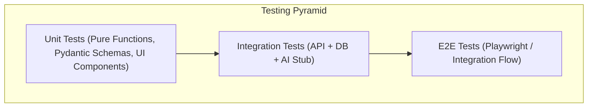

# Testing Strategy — Deadline Radar

## Overview
Quality and reliability in **Deadline Radar** are guaranteed through a multi-tier testing strategy. Because this platform is responsible for critical user deadlines, accuracy in time computation, data persistence, and API contracts is paramount.



---

## 1. Backend Testing

### 1.1 Unit Tests
- **Tools**: `pytest`, `pytest-asyncio`.
- **Scope**:
  - Pydantic schema validation (verifying valid and invalid ISO 8601 timestamps, email formats, URL constraints).
  - Business logic calculations: Urgency bucket assignment (<24h, <3d, <7d, overdue) across various timezones and edge dates.
  - Authentication utilities: Password hashing, token encoding and decoding, expiration checks.

### 1.2 API Route Tests
- **Tools**: `httpx.AsyncClient` + `pytest`.
- **Scope**:
  - Request/response contracts for every endpoint defined in `docs/api-contract.md`.
  - HTTP status codes, error payload validation, and pagination parameters.
  - Role-based authorization and unauthenticated request rejection (401 Unauthorized).

### 1.3 Database & ORM Tests
- **Tools**: `pytest` running against a test PostgreSQL instance (or SQLite in-memory test runner if isolated).
- **Scope**:
  - ForeignKey constraints and cascade deletions (e.g., deleting a user deletes their tracking records).
  - Unique constraint violations (e.g., duplicate user tracking on the same opportunity).
  - Alembic migrations: Verifying `alembic upgrade head` and `alembic downgrade -1` run without errors.

---

## 2. Frontend Testing

### 2.1 Component Tests
- **Tools**: Vitest + React Testing Library.
- **Scope**:
  - `UrgencyBadge`: Correct color and label rendering based on remaining milliseconds.
  - `OpportunityCard`: Correct display of title, organization, tags, and action buttons.
  - `AIExtractorBox`: Form submission, loading state, error display on failure.

### 2.2 User Flows & State Management
- **Scope**:
  - Filter state: Selecting a category properly updates the filtered list.
  - Optimistic updates: Toggling tracking status updates UI immediately without waiting for server response.
  - Error state handling: Simulating network failure displays retry toast or inline alert.

### 2.3 End-to-End (E2E) Tests
- **Tools**: Playwright.
- **Critical Paths**:
  1. User registers -> logs in -> navigates to Discover -> saves an opportunity to Radar -> verifies opportunity appears on Dashboard with correct countdown.
  2. User opens Add Opportunity modal -> pastes announcement text -> verifies AI parsed draft -> saves opportunity.

---

## 3. AI Subsystem Testing & Evaluation

### 3.1 Dataset Validation
- Automated schema validation over the evaluation benchmark dataset (`ai-model/tests/eval_dataset.jsonl`).
- Verifies that all benchmark ground-truth records have valid UTC ISO strings and non-empty categories.

### 3.2 Preprocessing & Sanitization Tests
- Stripping raw HTML tags, normalizing whitespace, removing tracking URL query strings (`?utm_source=...`).
- Preserving critical date tokens within text chunks.

### 3.3 Model Evaluation Suite
- Runs automatically when prompt templates or extraction logic are modified.
- **Metrics Tracked**:
  - Exact Date Accuracy: % of extractions where deadline matches ground truth down to the minute.
  - Category Accuracy: Macro-F1 across the 8 standard opportunity categories.
  - Pydantic Validation Pass Rate: Must be 100%.

### 3.4 Edge Case Testing
- Announcements with no deadline: Verifies model returns `deadline: null` rather than hallucinating a future date.
- Ambiguous date formats (e.g., "04/05/2026" — US vs. UK): Verifies extraction behavior and uncertainty flags.
- Extreme length inputs (> 10,000 characters): Verifies clean truncation without server timeouts or crashes.

---

## 4. End-to-End Integration Flow

```text
Frontend Client
      │
      ▼ (HTTP POST /api/v1/ai/extract)
FastAPI Backend
      │
      ▼ (Internal Service Call / AI Provider)
AI Extraction Engine
      │
      ▼ (Validated Pydantic Payload)
FastAPI Backend
      │
      ▼ (SQLAlchemy Async Commit)
PostgreSQL Database
```

### Integration Test Scenarios:
1. **Full Opportunity Lifecycle**:
   - Ingest opportunity -> Persist to DB -> Query via `/dashboard/overview` -> Check notification schedule generated -> Transition status to `Applied` -> Verify status update in DB.
2. **AI Failure Resilience**:
   - Mock AI provider timeout -> Call `/api/v1/ai/extract` -> Assert 200 OK with `extracted: null` and `warnings: ["Extraction timed out"]` -> Verify frontend falls back to manual entry gracefully.

---

## 5. Continuous Testing Commands

```bash
# Run Backend Unit & API Tests
cd backend && pytest -v --cov=app tests/

# Run Frontend Component & Unit Tests
cd frontend && npm run test

# Run AI Evaluation Suite
cd ai-model && python -m pytest tests/test_extraction_eval.py

# Run Linters and Type Checkers
cd backend && ruff check . && mypy app
cd frontend && npm run lint && npx tsc --noEmit
```
