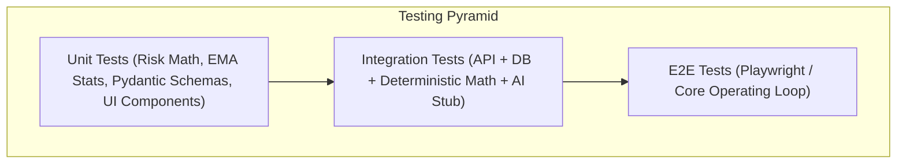

# Testing Strategy — Deadline Radar

## 1. Overview

Quality and reliability in **Deadline Radar** are guaranteed through a multi-tier testing strategy. Because this platform is responsible for critical user deadlines, accuracy in time computation, deterministic risk scoring, personal pace learning, and API contracts is paramount.



---

## 2. Backend Testing

### 2.1 Unit Tests (Pure Calculations & Domain Logic)
- **Tools**: `pytest`, `pytest-asyncio`.
- **Scope**:
  - **Deterministic Risk Ratio**: Verifying $R = \text{RemainingEffort} / \text{AvailableHours}$ across edge cases (0 available hours $\to$ Critical/Infinity, 0 remaining effort $\to$ Safe, boundary conditions at 0.5, 0.85, 1.15).
  - **Dynamic Priority Scoring**: Verifying multi-factor weighting formula ($S \in [0, 100]$), exponential proximity decay, and urgency bump when competing tasks overlap.
  - **Pace Factor Learning (EMA)**: Verifying Exponential Moving Average update formula ($P_{t} = 0.2 \cdot \text{Ratio} + 0.8 \cdot P_{t-1}$) and clamping boundaries ($[0.5, 3.0]$).
  - **Availability & Capacity Subtraction**: Verifying recurring weekly available slots correctly subtract overlapping one-off schedule blocks and protected interest windows.
  - **Authentication & Security**: Password hashing with Argon2id, JWT token signing/verification, expiration enforcement.

### 2.2 API Route Tests
- **Tools**: `httpx.AsyncClient` + `pytest`.
- **Scope**:
  - Request/response contracts for every endpoint defined in `docs/api-contract.md`.
  - HTTP status codes, error envelope structures, and pagination validation.
  - Row-level isolation: ensuring User A cannot access or mutate User B's work items, time entries, or schedule blocks (`HTTP 404 Not Found` or `403 Forbidden`).
  - Active session conflict: starting a second stopwatch while one is active returns `HTTP 409 Conflict`.

### 2.3 Database & ORM Tests
- **Tools**: `pytest` running against a test PostgreSQL instance.
- **Scope**:
  - ForeignKey constraints and cascade behavior (deleting a work item cascades to units and estimates, while preserving time entries for telemetry).
  - Unique constraint enforcement (only one active session per user, unique schedule block times).
  - Alembic migrations: verifying `alembic upgrade head` and `alembic downgrade -1` run deterministically without data corruption.

---

## 3. Frontend Testing

### 3.1 Component Tests
- **Tools**: Vitest + React Testing Library.
- **Scope**:
  - `RiskBadge`: Correct label and styling for `SAFE`, `WATCH`, `AT RISK`, `CRITICAL`, `OVERDUE`.
  - `ActiveSessionWidget`: Running timer ticking accuracy, start/stop action triggers.
  - `WorkItemCard`: Rendering title, category, deadline countdown, remaining effort, and progress indicator.
  - `WorkDecompositionEditor`: Adding, deleting, reordering, and editing subtask duration inputs.
  - `CapacityBar`: Visual bar allocation percentage, overbooked alert rendering.

### 3.2 State Management & User Flows
- **Scope**:
  - Optimistic updates: Toggling subtask completion updates UI immediately; rolls back on API error.
  - Stopwatch store: Synchronizing local stopwatch tick with server `started_at` timestamp.
  - Error state handling: Simulating network disconnection shows non-intrusive offline notification banner.

### 3.3 End-to-End (E2E) Tests
- **Tools**: Playwright.
- **Critical Path 1 — The Core Operating Loop**:
  1. User registers and completes onboarding (sets weekly available hours and protected gym interest).
  2. User navigates to `/work/new`, inputs project title and deadline, and triggers "Decompose with AI".
  3. User reviews decomposed units, edits one estimate, and saves work item.
  4. System redirects to `/today` displaying the new top NOW recommendation.
  5. User starts stopwatch session, lets it run, and clicks "Stop Session".
  6. Verify logged time entry is persisted and work item remaining effort and risk ratio update automatically.

---

## 4. AI Subsystem Testing & Evaluation

### 4.1 Decomposition Benchmark Evaluation
- Automated schema validation over benchmark prompt test cases (`ai-model/tests/eval_decomposition.jsonl`).
- **Metrics Tracked**:
  - **Pydantic Validation Pass Rate**: Must be 100% (valid structured JSON conforming to `DecompositionResult`).
  - **Subtask Count Distribution**: Must produce between 3 and 8 subtasks per complex work item.
  - **Duration Plausibility**: All individual subtasks must be bounded between 0.5h and 3.0h.
  - **Latency**: Provider responses must return within 4.0 seconds on standard broadband.

### 4.2 Edge Case Testing
- Inputs with no explicit deadline: Verifies model returns `detected_deadline_utc: null` rather than hallucinating dates.
- Minimal or vague inputs (e.g., "Report"): Verifies model generates conservative generic units and flags missing information.
- Extreme length descriptions (> 5,000 characters): Verifies clean truncation and processing without timeouts.

### 4.3 Resilience & Fallback Testing
- Mock AI provider timeout: Call `/api/v1/ai/decompose` with mocked timeout $\to$ Assert `HTTP 200 OK` with `fallback_used: true`, confidence `0.0`, and empty units $\to$ Verify frontend displays manual entry fallback cleanly without losing input text.

---

## 5. End-to-End Integration Flow

```text
Frontend Client
      │
      ▼ (HTTP POST /api/v1/ai/decompose)
FastAPI Backend
      │
      ▼ (Internal Facade Call)
AI Intelligence Layer (Gemini / Claude / Mock)
      │
      ▼ (Validated Pydantic Decomposition)
FastAPI Backend
      │
      ▼ (User Review & Save: POST /api/v1/work)
PostgreSQL Database
      │
      ▼ (Triggers Recalculation)
Deterministic Risk & Priority Engines
      │
      ▼ (Updated Telemetry & Dashboard Summary)
Frontend Client Radar
```

---

## 6. Continuous Testing Commands

```bash
# Run Backend Unit, Risk Engine, & API Tests
cd backend && pytest -v --cov=app tests/

# Run Frontend Component & State Tests
cd frontend && npm run test

# Run AI Decomposition Evaluation Suite (Using Mock or Test Provider)
cd ai-model && python -m pytest tests/test_decomposition_eval.py

# Run Playwright End-to-End Tests
cd frontend && npx playwright test

# Run Linters and Type Checkers
cd backend && ruff check . && mypy app
cd frontend && npm run lint && npx tsc --noEmit
```
